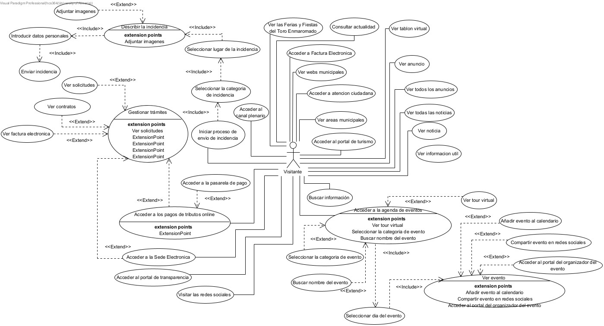
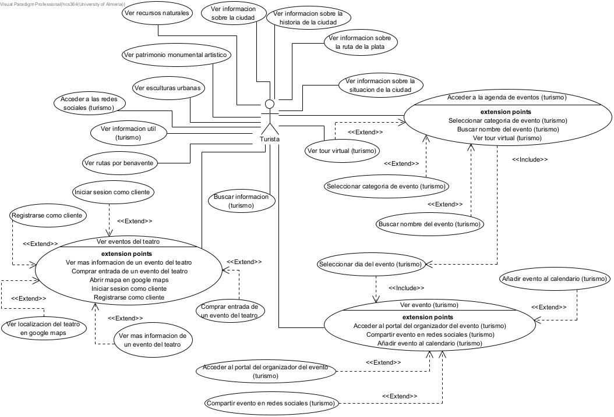
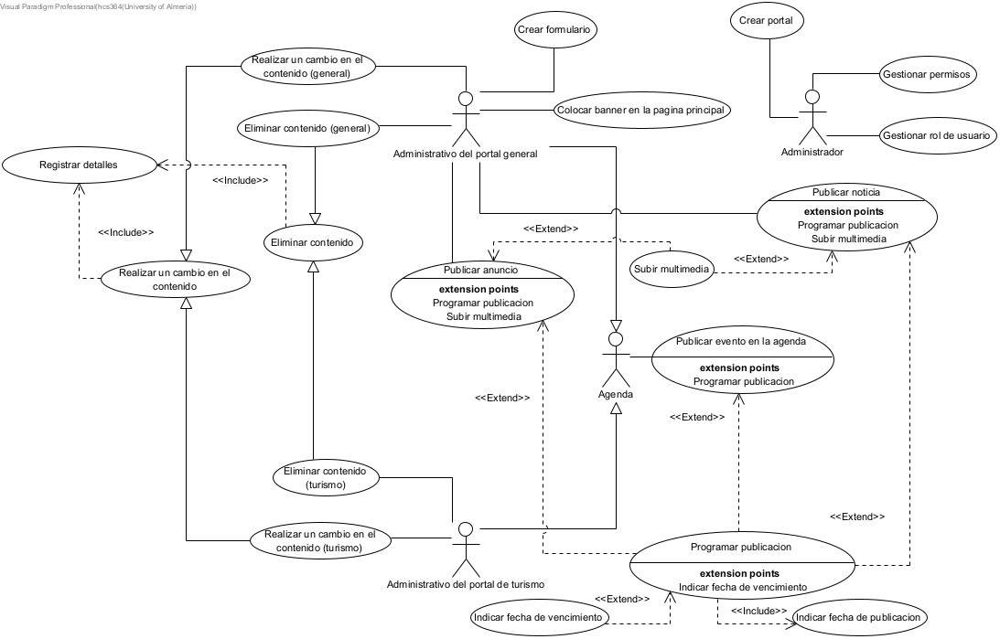

## **PROYECTO INRE EQUIPO AZUL**
## 1. Introducción:
El presente documento especifica la solución técnica y funcional para la transformación digital del ecosistema turístico de Benavente, un proyecto estratégico impulsado por el Plan de Sostenibilidad Turística en Destino y los fondos Next Generation EU. El propósito fundamental no es solo la renovación estética de los portales web, sino la implantación de una arquitectura de información centralizada que dinamice la promoción del destino y agilice la gestión interna de sus recursos culturales.

El núcleo de la intervención reside en el desarrollo del nuevo Portal de Turismo y Cultura, concebido como una plataforma de servicios interactivos para el visitante y no como un mero escaparate estático. Esta herramienta permitirá la geolocalización de recursos, la planificación de visitas y la gestión integral de la agenda cultural, integrando capacidades transaccionales para la venta de entradas mediante pasarelas externas. De forma paralela, se digitalizan procesos críticos para el tejido social del municipio, como la gestión de solicitudes y reservas de espacios por parte de las asociaciones locales, automatizando flujos que actualmente requieren intervención manual.

Para sostener este ecosistema, la solución abarca también la actualización tecnológica del Portal Web Oficial y la normalización de la Identidad Corporativa. Aunque el foco prioritario es la proyección turística, el portal institucional actuará como garante de la unicidad del dato, asegurando que la información de eventos y noticias se sincronice bidireccionalmente entre departamentos, evitando duplicidades y garantizando el cumplimiento de los esquemas de seguridad y accesibilidad vigentes.

## 2.	Información del Dominio del problema:

### 2.1 Organigrama
### 2.2 Glosario de terminos

El desarrollo de software para la gestión de un destino turístico requiere una alineación precisa entre los procesos administrativos del Ayuntamiento y la lógica técnica de la plataforma. Para garantizar que la solución responda a la realidad operativa del área de Turismo, se ha modelado el dominio del problema atendiendo a dos dimensiones críticas: la estructura de roles y la semántica del negocio.

En primer lugar, la definición del Modelo Organizativo es indispensable para trasladar la jerarquía administrativa al sistema de permisos del software. A través de la representación visual de los actores, se delimitan las fronteras de responsabilidad entre los distintos perfiles intervinientes: desde los administrativos encargados de la redacción y carga de eventos, pasando por los responsables de validación que autorizan la publicación, hasta las entidades externas (asociaciones) que interactúan con el sistema para gestionar recursos. Este mapeo es vital para configurar los flujos de trabajo (workflows) de aprobación y publicación de contenidos.

Complementariamente, se establece un Diccionario de Conceptos (Glosario) que unifica el lenguaje entre el equipo técnico y los gestores municipales. Dada la naturaleza específica del sector, es necesario desambiguar términos operativos como "evento recurrente", "recurso visitable", "bloqueo de agenda" o "itinerario". Esta base terminológica asegura que las reglas de negocio implementadas —por ejemplo, cómo se comporta una reserva o cuándo caduca una noticia— coincidan exactamente con las expectativas de gestión del servicio de Turismo.

A continuación, se detallan estos artefactos de análisis para sentar las bases del diseño funcional.

## 3. Necesidades del negocio
### 3.1 Objetivos del negocio
### 3.2 Modelos de Proceso de Negocio
#### 3.2.1 Procesos
##### Diagrama BPMN 1:

###### Parte 1: Proceso de creación y contratación de eventos

  

###### Parte 2: Proceso de eliminación de eventos finalizados

  

###### Diagrma BPMN 2: Gestion de reservas para asociaciones.

  

#### 3.2.2 Tareas
##### Tareas de la parte 1 del diagrama 1: Proceso de creación y contratación de eventos:
| *Código de tarea* | *Nombre* | *Descripción* |
| :--- | :--- | :--- |
| *T-01* | **El administrativo da de alta el evento en la agenda** | El administrativo del departamento de turismo inicia el proceso de creación de un nuevo registro en la agenda. |
| *T-02* | **Introduce la información del evento** | Se completan los detalles necesarios como fecha, hora, sinopsis y cartel promocional. |
| *T-03* | **Pone un enlace externo a la pasarela de pago** | Al ser un evento de pago, se configura la redirección hacia la plataforma de venta. |
| *T-04* | **Cuando un turista entra, la pasarela le solicita sus datos personales y bancarios** | El sistema externo solicita al usuario la información necesaria para la transacción. |
| *T-05* | **Recibe la solicitud de datos** | El usuario visualiza el formulario donde se le requieren sus datos para la compra. |
| *T-06* | **Es devuelto al portal web** | En caso de no querer aceptar el pago, el usuario es redirigido de vuelta a la página de turismo. |
| *T-07* | **Relena y manda los datos soicitados** | En caso de estar dispuesto a realizar el pago, el usuario introduce su información personal y bancaria y confirma la compra. |
| *T-08* | **Recibe los datos del comprador** | La pasarela de pago recepciona la información introducida por el usuario. |
| *T-09* | **Procesa el pago** | El sistema bancario valida la operación y confirma si es aceptada o rechazada. |
| *T-10* | **Envia la información de la entrada y el recibo al comprador** | Tras el pago exitoso, la pasarela emite y manda los documentos al usuario. |
| *T-11* | **Recibe la entrada y el recibo de la compra** | El usuario obtiene en su correo o pantalla los tickets y el justificante de pago. |

##### Tareas de la parte 2 del diagrama 2: Proceso de eliminación de eventos finalizados
| *Código de tarea* | *Nombre* | *Descripción* |
| :--- | :--- | :--- |
| *T-01* | **Elimina el evento de la agenda** | Una vez que este proceso se activa al haber finalizado el evento, y transcurren 5 días desde su finalización, el sistema elimina dicho evento de la agenda turística. |

##### Tareas del diagrma 2: Gestion de reservas para asociaciones.
| *Código de tarea* | *Nombre* | *Descripción* |
| :--- | :--- | :--- |
| *T-01* | **Adjunta los datos necesarios para hacer la reserva** | El personal correspondiente de una asociación local, desde el formulario de la página de turismo del ayuntamiento, adjunta un correo electrónico y la fecha de reserva de un lugar determinado. |
| *T-02* | **Completa el formulario de reserva y se envía al sistema** | El formulario es completado y enviado al sistema de gestión de reservas. |
| *T-03* | **Recibe la solicitud de la reserva** | El sistema de gestión de reservas recibe la petición. |
| *T-04* | **Rechazar la solicitud de reserva y enviar sugerencias disponibles** | En caso de conflicto de disponibilidad, el sistema deniega la petición y propone alternativas disponibles. |
| *T-05* | **Recibir rechazo y sugerencias disponibles** | La asociación es notificada de la no aceptación de su reserva y visualiza las opciones sugeridas. En caso de que quiera aceptar alguna de las sugerencias volvería a pasar por la tarea ´T-01´, si ninguna sugerencia le viene bien entonces terminaría el proceso. |
| *T-06* | **Bloquear franja horaria seleccionada** | Si no hay ningún problema de disponibilidad, el sistema marca el espacio seleccionado por la asociación como ocupado en la agenda oficial. |
| *T-07* | **Mandar datos de la reserva** | El sistema genera y envía la confirmación con los detalles finales de la reserva aceptada. |
| *T-08* | **Recibir datos de la reserva** | La asociación recibe la información definitiva de su reserva confirmada. |

## 4. Requisitos del sistema a desarrollar

El proyecto tiene como objetivo principal la modernización de la presencia digital del Ayuntamiento de Benavente mediante la actualización de su imagen corporativa, la creación de un Portal de Turismo y Cultura unificado, y la renovación del Portal Web Oficial.

El sistema debe basarse en un Gestor de Contenidos (CMS), preferiblemente Wordpress, que permita una gestión descentralizada y ágil por parte del personal municipal, sin requerir conocimientos técnicos avanzados. El alcance no es solo estético (diseño responsive y moderno), sino técnico, exigiendo cumplimiento de estándares de seguridad (ENS nivel medio), accesibilidad (UNE-EN 301549:2022) y optimización SEO.

## 4.1 Requisitos

### 4.1.1 Requisitos funcionales

| Código | Nombre |
| :--- | :--- |
| RF-01 | Gestión de Usuarios y Roles: El CMS debe permitir crear usuarios y asignar permisos diferenciados (ej. administradores vs. departamentos específicos) para que cada área gestione solo su contenido.  CU: CU-101, CU-102 |
| RF-02 | Gestión de Contenidos: Creación, edición y eliminación de contenidos de forma dinámica e intuitiva. Debe incluir versionado automático para revertir cambios.  CU: CU-119, CU-118, CU-105. |
| RF-03 | Programación de Publicaciones: El sistema debe permitir programar la fecha de publicación y la fecha de caducidad (despublicación automática) de los contenidos.  CU: CU-110, CU-111 |
| RF-04 | Gestión Multimedia: Capacidad para subir imágenes y vídeos o enlazarlos desde sitios externos, así como gestionar archivos para compartir mediante enlace.  CU: CU-114 |
| RF-05 | Creación de Formularios: El CMS debe permitir a los técnicos crear formularios personalizados (contacto, quejas) con sistemas antispam.  CU: CU-104 |
| RF-06 | Gestión de Banners: Posibilidad de colocar y gestionar banners en la página principal para redirigir a otros servicios.  CU: CU-103 |
| RF-07 | Agenda y Eventos: Visualización de eventos mediante calendario, con sincronización para evitar duplicidades entre portales.  CU: CU-220, CU-332, CU-338 |
| RF-08 | Buscador Interno: Motor de búsqueda capaz de indexar toda la información para facilitar la localización de contenidos.  CU: CU-333, CU-337 |
| RF-09 | Integración con Redes Sociales: Botones visibles para compartir contenidos y acceso a los perfiles oficiales (Twitter, Facebook, Instagram, etc.).  CU:  CU-330, CU-339 |
| RF-10 | Formularios de Incidencias: El usuario debe poder enviar incidencias (ej. vía formulario).  CU: CU-316, CU-323 y CU-325. |
| RF-11 | Enlaces a Servicios Externos: Redirección clara a servicios fuera del alcance como la Sede Electrónica, Venta de Entradas o Perfil del Contratante.  CU: CU-328, CU-319, CU-326 |
| RF-12 | Catálogo de Recursos: Mostrar información sobre recursos naturales, patrimonio, historia, rutas, etc.  CU: CU-203, CU-204, CU-211. |
| RF-13 | Venta de Entradas (Exclusión/Redirección): La web NO gestionará la venta directa, sino que debe redirigir a la plataforma de venta de entradas existente desde la sección de teatro.  CU: CU-212 |

### 4.1.2 Requisitos no funcionales

| Código | Nombre |
| :--- | :--- |
| RNF-01 | Diseño Responsive: Adaptabilidad total a dispositivos móviles (smartphones, tablets) y diferentes resoluciones mediante maquetación flexible (HTML5/CSS3). |
| RNF-02 | Identidad Corporativa: El diseño debe basarse estrictamente en el nuevo Manual de Identidad Corporativa y Guía de Estilo. |
| RNF-03 | Accesibilidad: Cumplimiento de las pautas WCAG según la norma UNE-EN 301549:2022 y validación mediante el modelo IRA. |
| RNF-04 | Experiencia de Usuario (UX): Análisis mediante mapas de calor (heatmaps) y reestructuración basada en analíticas tras los primeros meses de uso. |
| RNF-05 | Caché y Estáticos: Generación de versiones estáticas de las páginas y sistema avanzado de caché para maximizar velocidad. |
| RNF-06 | Disponibilidad (SLA): Servicio accesible 24x7x365. Penalizaciones si la resolución de incidencias críticas supera las 6 horas. |
| RNF-07 | Hosting: Alojamiento en tecnología 'Cloud' asumido por el licitador durante el primer año. |
| RNF-08 | Esquema Nacional de Seguridad (ENS): Cumplimiento de medidas para un sistema de nivel medio. |
| RNF-09 | Copias de Seguridad: Backup diario sin pérdida de datos y con tiempo de recuperación menor de 4 horas. |
| RNF-10 | Protección: Sistemas anti-DDoS, control de IPs, y Hardening periódico de sistemas. |
| RNF-11 | Protección de Datos: Cumplimiento del Reglamento (UE) 2016/679 y LOPD 3/2018 (política de cookies, privacidad, avisos legales). |
| RNF-12 | Posicionamiento SEO: Generación de URLs amigables, gestión de metadatos y mantenimiento del posicionamiento adquirido. |
| RNF-13 | Analítica Web: Integración con Google Analytics (o similar) para medir accesos, tiempos de navegación y páginas vistas. |

## 4.2 Casos de Uso

### 4.2.1 Lista de diagramas de casos de uso del modelo

  

  

  

#### 4.2.2 Lista general de casos de uso

| Código | Nombre |
| :--- | :--- |
| CU-101 | Gestionar permisos |
| CU-102 | Gestionar rol de usuario |
| CU-103 | Colocar banner en la pagina principal |
| CU-104 | Crear formulario |
| CU-105 | Publicar noticia |
| CU-106 | Publicar anuncio |
| CU-107 | Publicar evento en la agenda |
| CU-108 | Realizar un cambio en el contenido general |
| CU-109 | Eliminar contenido |
| CU-110 | Programar publicacion |
| CU-111 | Indicar fecha de vencimiento |
| CU-112 | Indicar fecha de publicacion |
| CU-113 | Realizar un cambio en el contenido turismo |
| CU-114 | Subir multimedia |
| CU-115 | Registrar detalles |
| CU-116 | Crear portal |
| CU-117 | Eliminar contenido (general) |
| CU-118 | Eliminar contenido (turismo) |
| CU-119 | Realizar un cambio en el contenido |
| CU-201 | Ver informacion sobre la ciudad |
| CU-202 | Ver informacion sobre la historia de la ciudad |
| CU-203 | Ver recursos naturales |
| CU-204 | Ver patrimonio monumental artistico |
| CU-205 | Ver esculturas urbanas |
| CU-206 | Ver informacion sobre la ruta de la plata |
| CU-207 | Ver informacion sobre la situacion de la ciudad |
| CU-208 | Buscar informacion turismo |
| CU-209 | Acceder a las redes sociales turismo |
| CU-210 | Ver informacion util turismo |
| CU-211 | Ver rutas por Benavente |
| CU-212 | Comprar entrada de un evento del teatro |
| CU-213 | Registrarse como cliente |
| CU-214 | Iniciar sesion como cliente |
| CU-215 | Ver eventos del teatro |
| CU-216 | Añadir evento al calendario turismo |
| CU-217 | Ver mas informacion de un evento del teatro |
| CU-218 | Abrir mapa en google maps |
| CU-219 | Ver localizacion del teatro en google maps |
| CU-220 | Acceder a la agenda de eventos turismo |
| CU-221 | Seleccionar dia del evento turismo |
| CU-222 | Ver evento turismo |
| CU-223 | Buscar nombre del evento turismo |
| CU-224 | Seleccionar categoria de evento turismo |
| CU-225 | Ver tour virtual turismo |
| CU-226 | Acceder al portal del organizador del evento turismo |
| CU-227 | Compartir evento en redes sociales turismo |
| CU-301 | Ver las Ferias y Fiestas del Toro Enmaromado |
| CU-302 | Consultar actualidad |
| CU-303 | Ver todas las noticias |
| CU-304 | Ver noticia |
| CU-305 | Ver todos los anuncios |
| CU-306 | Ver anuncio |
| CU-307 | Ver informacion util |
| CU-308 | Ver tablon virtual |
| CU-309 | Acceder a Factura Electronica |
| CU-310 | Ver webs municipales |
| CU-311 | Acceder a atencion ciudadana |
| CU-312 | Ver areas municipales |
| CU-313 | Acceder al portal de turismo |
| CU-314 | Acceder al canal plenario |
| CU-315 | Gestionar tramites |
| CU-316 | Iniciar proceso de envio de incidencia |
| CU-317 | Ver solicitudes |
| CU-318 | Ver contratos |
| CU-319 | Ver factura electronica |
| CU-320 | Seleccionar la categoria de incidencia |
| CU-321 | Seleccionar lugar de la incidencia |
| CU-322 | Describir la incidencia |
| CU-323 | Adjuntar imagenes |
| CU-324 | Introducir datos personales |
| CU-325 | Enviar incidencia |
| CU-326 | Acceder a la pasarela de pago |
| CU-327 | Acceder a los pagos de tributos online |
| CU-328 | Acceder a la Sede Electronica |
| CU-329 | Acceder al portal de transparencia |
| CU-330 | Visitar las redes sociales |
| CU-331 | Acceder a la agenda de eventos |
| CU-332 | Ver evento |
| CU-333 | Buscar información |
| CU-334 | Ver tour virtual |
| CU-335 | Seleccionar día del evento |
| CU-336 | Seleccionar categoría de evento |
| CU-337 | Buscar nombre del evento |
| CU-338 | Añadir evento al calendario |
| CU-339 | Compartir evento en redes sociales |
| CU-340 | Acceder al portal del organizador del evento |

#### 4.2.3 Detalles de los casos de uso

### DCU - CMS

### Gestionar permisos

| **Nombre:** | Gestionar permisos |
| :--- | :--- |
| **Codigo:** | CU-101 |
| **Autor:** | INRE Equipo Azul |
| **Fecha:** | 08/12/2025 |
| **Descripción:** | Permite definir qué acciones pueden realizar los diferentes roles dentro del sistema. |
| **Actores:** | Administrador |
| **Precondiciones:**| El Administrador debe estar autenticado en el sistema con privilegios de superusuario. |
| **Flujo Normal:** | 1.- El Administrador accede al panel de gestión de permisos.  2.- El Administrador busca y selecciona el rol a modificar.  3.- El Administrador marca o desmarca las casillas de permisos correspondientes.  4.- El Administrador guarda los cambios realizados. |
| **Flujo Alternativo:** | N/A |
| **Poscondiciones:**| Los permisos del usuario o rol quedan actualizados en la base de datos. |
| **Artefactos relacionados:**| N/A |

---

### Gestionar rol de usuario

| **Nombre:** | Gestionar rol de usuario |
| :--- | :--- |
| **Codigo:** | CU-102 |
| **Autor:** | INRE Equipo Azul |
| **Fecha:** | 08/12/2025 |
| **Descripción:** | Permite al Administrador asignar o modificar el rol funcional de un usuario (ej. cambiar de editor a administrador). |
| **Actores:** | Administrador |
| **Precondiciones:**| El Administrador debe estar logueado y el usuario destino debe existir. |
| **Flujo Normal:** | 1.- El Administrador entra en la configuración de cuentas de usuario.  2.- El Administrador selecciona una cuenta de la lista.  3.- El Administrador asigna un nuevo rol desplegando la lista de roles disponibles.  4.- El Administrador confirma la operación. |
| **Flujo Alternativo:** | N/A |
| **Poscondiciones:**| El usuario tiene asignado su nuevo rol y las capacidades asociadas al mismo. |
| **Artefactos relacionados:**| N/A |

---

### Colocar banner en la pagina principal

| **Nombre:** | Colocar banner en la pagina principal |
| :--- | :--- |
| **Codigo:** | CU-103 |
| **Autor:** | INRE Equipo Azul |
| **Fecha:** | 08/12/2025 |
| **Descripción:** | Permite situar una imagen destacada o aviso en la home del portal general. |
| **Actores:** | Administrativo del portal general |
| **Precondiciones:**| El actor debe tener la imagen del banner preparada. |
| **Flujo Normal:** | 1.- El administrativo accede al gestor de contenidos de la página principal.  2.- El administrativo selecciona la zona de banners.  3.- El administrativo sube la imagen y asigna un enlace de destino.  4.- El administrativo publica los cambios. |
| **Flujo Alternativo:** | N/A |
| **Poscondiciones:**| El banner aparece visible para todos los visitantes de la página principal. |
| **Artefactos relacionados:**| N/A |

---

### Crear formulario

| **Nombre:** | Crear formulario |
| :--- | :--- |
| **Codigo:** | CU-104 |
| **Autor:** | INRE Equipo Azul |
| **Fecha:** | 08/12/2025 |
| **Descripción:** | Herramienta para generar formularios de contacto o encuestas dinámicas. |
| **Actores:** | Administrativo del portal general |
| **Precondiciones:**| El actor debe estar autenticado. |
| **Flujo Normal:** | 1.- El administrativo inicia el constructor de formularios.  2.- El administrativo arrastra y suelta los campos necesarios (texto, fecha, selección).  3.- El administrativo configura el correo de recepción de datos.  4.- El administrativo guarda y obtiene el código para insertar el formulario. |
| **Flujo Alternativo:** | N/A |
| **Poscondiciones:**| El formulario queda guardado y listo para usarse en una página. |
| **Artefactos relacionados:**| N/A |

---

### Publicar noticia

| **Nombre:** | Publicar noticia |
| :--- | :--- |
| **Codigo:** | CU-105 |
| **Autor:** | INRE Equipo Azul |
| **Fecha:** | 08/12/2025 |
| **Descripción:** | Permite redactar y lanzar una noticia en el portal. |
| **Actores:** | Administrativo del portal general |
| **Precondiciones:**| El usuario está en el dashboard de noticias. |
| **Flujo Normal:** | 1.- El actor accede al editor de noticias.  2.- El actor escribe el titular, entradilla y cuerpo.  3.- El actor extiende el proceso para subir multimedia si es necesario.  4.- El actor pulsa el botón de publicar.  5.- El sistema valida los campos obligatorios.  6.- La noticia se hace visible inmediatamente. |
| **Flujo Alternativo:** | 3a. Subir multimedia:  1.- El actor selecciona "Adjuntar imagen/video".  2.- El sistema abre el explorador de archivos.  3.- El actor selecciona el archivo y el sistema lo carga al servidor.  4.- El archivo se asocia a la noticia.  5.- Retorna al paso 4 del flujo normal.  4a. Programar publicación:  1.- En lugar de "Publicar", el actor selecciona "Programar".  2.- El sistema solicita la fecha de publicación.  3.- El actor introduce la fecha futura.  4.- El sistema guarda la noticia en estado "Pendiente". |
| **Poscondiciones:**| La noticia es pública en el listado de actualidad. |
| **Artefactos relacionados:**| CU-110, CU-114 |

---

### Publicar anuncio

| **Nombre:** | Publicar anuncio |
| :--- | :--- |
| **Codigo:** | CU-106 |
| **Autor:** | INRE Equipo Azul |
| **Fecha:** | 08/12/2025 |
| **Descripción:** | Publicación de anuncios breves o destacados. Similar a noticias pero con formato distinto. |
| **Actores:** | Administrativo del portal general |
| **Precondiciones:**| Acceso al módulo de anuncios. |
| **Flujo Normal:** | 1.- El actor selecciona crear nuevo anuncio.  2.- El actor introduce la información relevante.  3.- El actor pulsa "Publicar"  4.- El sistema actualiza el portal. |
| **Flujo Alternativo:** | 3a. Subir multimedia:  1.- El actor decide añadir un banner gráfico.  2.- Sube la imagen al servidor.  3.- Asocia la imagen al anuncio.  4.- Retorna al flujo normal.  4a. Programar publicación:  1.- El actor elige diferir la publicación.  2.- Define fecha de inicio y opcionalmente fin.  3.- El anuncio queda en espera. |
| **Poscondiciones:**| El anuncio es visible o queda programado. |
| **Artefactos relacionados:**| CU-110, CU-114 |

---

### Publicar evento en la agenda

| **Nombre:** | Publicar evento en la agenda |
| :--- | :--- |
| **Codigo:** | CU-107 |
| **Autor:** | INRE Equipo Azul |
| **Fecha:** | 08/12/2025 |
| **Descripción:** | Creación de eventos en el calendario. |
| **Actores:** | Agenda |
| **Precondiciones:**| El evento debe tener fecha y hora confirmadas. |
| **Flujo Normal:** | 1.- El actor accede a la gestión de la agenda.  2.- El actor crea una nueva entrada con fecha, hora y lugar.  3.- El actor guarda el evento en el sistema. |
| **Flujo Alternativo:** | 3a. Programar publicación:  1.- En lugar de "Publicar", el actor selecciona "Programar".  2.- El sistema solicita la fecha de publicación.  3.- El actor introduce la fecha futura.  4.- El sistema guarda la noticia en estado "Pendiente". |
| **Poscondiciones:**| El evento es visible en el calendario para los visitantes. |
| **Artefactos relacionados:**| CU-110 |

---

### Realizar un cambio en el contenido (General)

| **Nombre:** | Realizar un cambio en el contenido (General) |
| :--- | :--- |
| **Codigo:** | CU-108 |
| **Autor:** | INRE Equipo Azul |
| **Fecha:** | 08/12/2025 |
| **Descripción:** | Edición de contenidos existentes en el portal general. |
| **Actores:** | Administrativo del portal general |
| **Precondiciones:**| El contenido a editar debe existir. |
| **Flujo Normal:** | 1.- El administrativo localiza el contenido que desea cambiar.  2.- El administrativo edita el texto o las opciones.  3.- El sistema captura automáticamente la fecha, hora y ID del usuario.  4.- El sistema almacena el registro en el log de auditoría.   5.- El sistema confirma que el contenido ha sido actualizado y registrado. |
| **Flujo Alternativo:** | N/A |
| **Poscondiciones:**| El contenido queda actualizado. |
| **Artefactos relacionados:**| CU-119 |

---

### Eliminar contenido

| **Nombre:** | Eliminar contenido |
| :--- | :--- |
| **Codigo:** | CU-109 |
| **Autor:** | INRE Equipo Azul |
| **Fecha:** | 08/12/2025 |
| **Descripción:** | Acción de borrar un elemento del sistema. Incluida en los flujos de cambio de contenido. |
| **Actores:** | Administrativo del portal de turismo o Administrativo del portal general |
| **Precondiciones:**| El actor tiene permisos de borrado. |
| **Flujo Normal:** | 1.- El Administrativo selecciona el contenido a eliminar.  2.- El actor confirma la acción en el mensaje de advertencia.  3.- El sistema captura automáticamente la fecha, hora y ID del usuario.  4.- El sistema almacena el registro en el log de auditoría.   5.- El sistema confirma que el contenido ha sido actualizado y registrado.  6.- El sistema marca el contenido como eliminado (borrado lógico) o lo elimina físicamente. |
| **Flujo Alternativo:** | N/A |
| **Poscondiciones:**| El contenido deja de existir en el portal. |
| **Artefactos relacionados:**| CU-115 |

---

### Programar publicacion

| **Nombre:** | Programar publicacion |
| :--- | :--- |
| **Codigo:** | CU-110 |
| **Autor:** | INRE Equipo Azul |
| **Fecha:** | 08/12/2025 |
| **Descripción:** | Permite diferir la publicación de un contenido a una fecha futura. |
| **Actores:** | Sistema (invocado por los administradores) |
| **Precondiciones:**| El contenido está listo pero no se desea publicar ya. |
| **Flujo Normal:** | 1.- En lugar de "Publicar", el actor selecciona "Programar".  2.- El sistema solicita la fecha de publicación.  3.- El actor introduce la fecha futura.  4.- El sistema guarda la noticia en estado "Pendiente". |
| **Flujo Alternativo:** | 2a. Indicar fecha de vencimiento:  1.- El usuario indica que el contenido es temporal.  2.- El sistema solicita fecha de fin.  3.- El usuario selecciona una fecha posterior a la de publicación.  4.- El sistema programa la despublicación automática.  5.- Retorna al flujo normal. |
| **Poscondiciones:**| El contenido se publicará automáticamente cuando llegue la fecha. |
| **Artefactos relacionados:**| CU-105, CU-106, CU-107, CU-111, CU-112 |

---

### Indicar fecha de vencimiento

| **Nombre:** | Indicar fecha de vencimiento |
| :--- | :--- |
| **Codigo:** | CU-111 |
| **Autor:** | INRE Equipo Azul |
| **Fecha:** | 08/12/2025 |
| **Descripción:** | Establece cuándo un contenido debe dejar de ser visible. |
| **Actores:** | Sistema (invocado por los administrativos) |
| **Precondiciones:**| Se está programando una publicación y ya se ha definido una fecha de inicio. |
| **Flujo Normal:** | 1.- El usuario indica que el contenido es temporal.  2.- El sistema solicita fecha de fin.  3.- El usuario selecciona una fecha posterior a la de publicación.  |
| **Flujo Alternativo:** | N/A |
| **Poscondiciones:**| El contenido se despublicará en la fecha indicada. |
| **Artefactos relacionados:**| CU-110 |

---

### Indicar fecha de publicacion

| **Nombre:** | Indicar fecha de publicacion |
| :--- | :--- |
| **Codigo:** | CU-112 |
| **Autor:** | INRE Equipo Azul |
| **Fecha:** | 08/12/2025 |
| **Descripción:** | Acción de seleccionar el día de inicio de visibilidad. Incluido en programar publicación. |
| **Actores:** | Sistema (invocado por los administrativos) |
| **Precondiciones:**| Se esta ejecutando el flujo de "Programar publicacion" |
| **Flujo Normal:** | 1.- El sistema solicita la fecha de publicación.  2.- El actor introduce la fecha futura. |
| **Flujo Alternativo:** | N/A |
| **Poscondiciones:**| La fecha de inicio queda registrada. |
| **Artefactos relacionados:**| CU-110 |

---

### Realizar un cambio en el contenido (turismo)

| **Nombre:** | Realizar un cambio en el contenido turismo |
| :--- | :--- |
| **Codigo:** | CU-113 |
| **Autor:** | INRE Equipo Azul |
| **Fecha:** | 08/12/2025 |
| **Descripción:** | Gestión de contenidos específica para el portal de turismo. |
| **Actores:** | Administrativo del portal de turismo |
| **Precondiciones:**| El actor debe estar autenticado en el área de turismo. |
| **Flujo Normal:** | 1.- El administrativo selecciona un recurso turístico.  2.- El administrativo modifica la descripción o fotos.  3.- El sistema captura automáticamente la fecha, hora y ID del usuario.  4.- El sistema almacena el registro en el log de auditoría.   5.- El sistema confirma que el contenido ha sido actualizado y registrado. |
| **Flujo Alternativo:** | N/A |
| **Poscondiciones:**| La información turística queda actualizada. |
| **Artefactos relacionados:**| CU-119 |

---

### Subir multimedia

| **Nombre:** | Subir multimedia |
| :--- | :--- |
| **Codigo:** | CU-114 |
| **Autor:** | INRE Equipo Azul |
| **Fecha:** | 08/12/2025 |
| **Descripción:** | Proceso de carga de archivos al servidor. |
| **Actores:** | Administrativo del portal general |
| **Precondiciones:**| El usuario debe estar en un formulario de creación/edición de contenido. |
| **Flujo Normal:** | 1.- El actor decide añadir un banner gráfico.  2.- Sube la imagen al servidor.  3.- Asocia la imagen al anuncio. |
| **Flujo Alternativo:** | N/A |
| **Poscondiciones:**| El archivo se encuentra en el servidor y en el contenido al que ha sido adjunto. |
| **Artefactos relacionados:**| CU-105, CU-106 |

---

### Registrar detalles

| **Nombre:** | Registrar detalles |
| :--- | :--- |
| **Codigo:** | CU-115 |
| **Autor:** | INRE Equipo Azul |
| **Fecha:** | 08/12/2025 |
| **Descripción:** | Funcionalidad de sistema para capturar y almacenar la traza de quién hizo qué cambio y cuándo (Log de auditoría). |
| **Actores:** | Sistema (invocado automáticamente por los administrativos) |
| **Precondiciones:**| Se debe haber realizado una acción de modificación. |
| **Flujo Normal:** | 1.- El sistema captura automáticamente la fecha, hora y ID del usuario.  2.- El sistema almacena el registro en el log de auditoría.   3.- El sistema confirma que el contenido ha sido actualizado y registrado. |
| **Flujo Alternativo:** | N/A |
| **Poscondiciones:**| La acción queda trazada para seguridad. |

| **Artefactos relacionados:**| CU-119, CU-109 |

---

### Crear portal

| **Nombre:** | Crear portal |
| :--- | :--- |
| **Codigo:** | CU-116 |
| **Autor:** | INRE Equipo Azul |
| **Fecha:** | 08/12/2025 |
| **Descripción:** | Permite al Administrador dar de alta un nuevo portal dentro del sistema. |
| **Actores:** | Administrador |
| **Precondiciones:**| El Administrador debe estar autenticado. |
| **Flujo Normal:** | 1.- El Administrador selecciona la opción de crear nuevo portal.  2.- El Administrador define el nombre, la URL y selecciona una plantilla base.  3.- El sistema valida que la URL no exista.  4.- El sistema crea la estructura de base de datos y archivos.  5.- El sistema confirma la creación del portal. |
| **Flujo Alternativo:** | 4a. La URL ya existe:  1.- El sistema muestra un error indicando duplicidad.  2.- El sistema solicita una nueva URL.  3.- Vuelve al paso 3 del flujo normal. |
| **Poscondiciones:**| El nuevo portal está activo y listo para ser configurado. |
| **Artefactos relacionados:**| N/A |

---

### Eliminar contenido (general)

| **Nombre:** | Eliminar contenido (general) |
| :--- | :--- |
| **Codigo:** | CU-117 |
| **Autor:** | INRE Equipo Azul |
| **Fecha:** | 08/12/2025 |
| **Descripción:** | Permite borrar contenido del portal general. Es una especialización de la acción genérica de eliminar. |
| **Actores:** | Administrativo del portal general |
| **Precondiciones:**| El contenido debe existir y no estar bloqueado. |
| **Flujo Normal:** | 1.- El Administrativo selecciona el contenido a eliminar.  2.- El actor confirma la acción en el mensaje de advertencia.  3.- El sistema captura automáticamente la fecha, hora y ID del usuario.  4.- El sistema almacena el registro en el log de auditoría.   5.- El sistema confirma que el contenido ha sido actualizado y registrado.  6.- El sistema marca el contenido como eliminado (borrado lógico) o lo elimina físicamente. |
| **Flujo Alternativo:** | N/A |
| **Poscondiciones:**| El contenido deja de existir en el portal. |
| **Artefactos relacionados:**| CU-109 |

---

### Eliminar contenido (turismo)

| **Nombre:** | Eliminar contenido (turismo) |
| :--- | :--- |
| **Codigo:** | CU-118 |
| **Autor:** | INRE Equipo Azul |
| **Fecha:** | 08/12/2025 |
| **Descripción:** | Eliminación de contenidos dentro del ámbito turístico. |
| **Actores:** | Administrativo del portal de turismo |
| **Precondiciones:**| El actor tiene permisos de borrado. |
| **Flujo Normal:** | 1.- El Administrativo selecciona el contenido a eliminar.  2.- El actor confirma la acción en el mensaje de advertencia.  3.- El sistema captura automáticamente la fecha, hora y ID del usuario.  4.- El sistema almacena el registro en el log de auditoría.   5.- El sistema confirma que el contenido ha sido actualizado y registrado.  6.- El sistema marca el contenido como eliminado (borrado lógico) o lo elimina físicamente. |
| **Flujo Alternativo:** | N/A |
| **Poscondiciones:**| El contenido deja de existir en el portal. |
| **Artefactos relacionados:**| CU-109 |

---

### Realizar un cambio en el contenido

| **Nombre:** | Realizar un cambio en el contenido |
| :--- | :--- |
| **Codigo:** | CU-119 |
| **Autor:** | INRE Equipo Azul |
| **Fecha:** | 08/12/2025 |
| **Descripción:** | Caso de uso general que encapsula la lógica común de edición de contenidos. |
| **Actores:** | Administrativo del portal de turismo o Administrativo del portal general |
| **Precondiciones:**| Usuario autenticado con permisos de edición. |
| **Flujo Normal:** | 1.- El administrativo modifica la descripción o fotos.  2.- El sistema captura automáticamente la fecha, hora y ID del usuario.  3.- El sistema almacena el registro en el log de auditoría.   4.- El sistema confirma que el contenido ha sido actualizado y registrado. |
| **Flujo Alternativo:** | N/A |
| **Poscondiciones:**| Contenido modificado. |
| **Artefactos relacionados:**| CU-109, CU-111 |

---

### DCU - Portal de turismo del ayuntamiento

### Ver informacion sobre la ciudad

| **Nombre:** | Ver informacion sobre la ciudad |
| :--- | :--- |
| **Codigo:** | CU-201 |
| **Autor:** | INRE Equipo Azul |
| **Fecha:** | 07/12/2025 |
| **Descripción:** | Permite al turista acceder a datos generales y presentación de la ciudad. |
| **Actores:** | Turista |
| **Precondiciones:**| El portal de turismo es accesible. |
| **Flujo Normal:** | 1.- El turista selecciona el menú de información de la ciudad.  2.- El turista visualiza la página de bienvenida y datos generales. |
| **Flujo Alternativo:** | N/A |
| **Poscondiciones:**| El turista obtiene la información general. |
| **Artefactos relacionados:**| CU-202, CU-203, CU-204, CU-206 |

---

### Ver informacion sobre la historia de la ciudad

| **Nombre:** | Ver informacion sobre la historia de la ciudad |
| :--- | :--- |
| **Codigo:** | CU-202 |
| **Autor:** | INRE Equipo Azul |
| **Fecha:** | 07/12/2025 |
| **Descripción:** | Muestra el recorrido histórico y fechas clave de la localidad. |
| **Actores:** | Turista |
| **Precondiciones:**| N/A |
| **Flujo Normal:** | 1.- El turista elige la sección de historia.  2.- El turista lee los textos históricos presentados. |
| **Flujo Alternativo:** | N/A |
| **Poscondiciones:**| El turista conoce la historia local. |
| **Artefactos relacionados:**| CU-201 |

---

### Ver recursos naturales

| **Nombre:** | Ver recursos naturales |
| :--- | :--- |
| **Codigo:** | CU-203 |
| **Autor:** | INRE Equipo Azul |
| **Fecha:** | 07/12/2025 |
| **Descripción:** | Información sobre parques, ríos y entornos naturales visitables. |
| **Actores:** | Turista |
| **Precondiciones:**| N/A |
| **Flujo Normal:** | 1.- El turista navega a la categoría de naturaleza.  2.- El turista revisa la lista de parajes naturales. |
| **Flujo Alternativo:** | N/A |
| **Poscondiciones:**| El turista visualiza la oferta natural. |
| **Artefactos relacionados:**| CU-201 |

---

### Ver patrimonio monumental artistico

| **Nombre:** | Ver patrimonio monumental artistico |
| :--- | :--- |
| **Codigo:** | CU-204 |
| **Autor:** | INRE Equipo Azul |
| **Fecha:** | 07/12/2025 |
| **Descripción:** | Catálogo de monumentos y edificios de interés artístico. |
| **Actores:** | Turista |
| **Precondiciones:**| N/A |
| **Flujo Normal:** | 1.- El turista accede a la sección de patrimonio.  2.- El turista explora las fichas de los monumentos. |
| **Flujo Alternativo:** | N/A |
| **Poscondiciones:**| El turista conoce los monumentos disponibles. |
| **Artefactos relacionados:**| CU-201, CU-205 |

---

### Ver esculturas urbanas

| **Nombre:** | Ver esculturas urbanas |
| :--- | :--- |
| **Codigo:** | CU-205 |
| **Autor:** | INRE Equipo Azul |
| **Fecha:** | 07/12/2025 |
| **Descripción:** | Detalle sobre el arte urbano y estatuas en la vía pública. |
| **Actores:** | Turista |
| **Precondiciones:**| N/A |
| **Flujo Normal:** | 1.- El turista selecciona el apartado de esculturas.  2.- El turista ve la ubicación y descripción de las obras. |
| **Flujo Alternativo:** | N/A |
| **Poscondiciones:**| El turista visualiza la información de esculturas. |
| **Artefactos relacionados:**| CU-204 |

---

### Ver informacion sobre la ruta de la plata

| **Nombre:** | Ver informacion sobre la ruta de la plata |
| :--- | :--- |
| **Codigo:** | CU-206 |
| **Autor:** | INRE Equipo Azul |
| **Fecha:** | 07/12/2025 |
| **Descripción:** | Información específica para peregrinos o interesados en esta ruta. |
| **Actores:** | Turista |
| **Precondiciones:**| N/A |
| **Flujo Normal:** | 1.- El turista entra en la sección de la Ruta de la Plata.  2.- El turista consulta mapas y etapas que pasan por la ciudad. |
| **Flujo Alternativo:** | N/A |
| **Poscondiciones:**| El turista obtiene información de la ruta. |
| **Artefactos relacionados:**| CU-207, CU-201 |

---

### Ver informacion sobre la situacion de la ciudad

| **Nombre:** | Ver informacion sobre la situacion de la ciudad |
| :--- | :--- |
| **Codigo:** | CU-207 |
| **Autor:** | INRE Equipo Azul |
| **Fecha:** | 07/12/2025 |
| **Descripción:** | Datos sobre ubicación geográfica, accesos y clima. |
| **Actores:** | Turista |
| **Precondiciones:**| N/A |
| **Flujo Normal:** | 1.- El turista busca cómo llegar o dónde está la ciudad.  2.- El turista visualiza los mapas de situación. |
| **Flujo Alternativo:** | N/A |
| **Poscondiciones:**| El turista se ubica geográficamente. |
| **Artefactos relacionados:**| CU-206 |

---

### Buscar informacion (turismo)

| **Nombre:** | Buscar informacion (turismo) |
| :--- | :--- |
| **Codigo:** | CU-208 |
| **Autor:** | INRE Equipo Azul |
| **Fecha:** | 07/12/2025 |
| **Descripción:** | Uso del buscador interno para localizar contenidos en el portal de turismo. |
| **Actores:** | Turista |
| **Precondiciones:**| N/A |
| **Flujo Normal:** | 1.- El turista introduce palabras clave en la barra de búsqueda.  2.- El turista examina los resultados que devuelve el sistema. |
| **Flujo Alternativo:** | N/A |
| **Poscondiciones:**| El turista encuentra el contenido deseado. |
| **Artefactos relacionados:**| N/A |

---

### Acceder a las redes sociales (turismo)

| **Nombre:** | Acceder a las redes sociales (turismo) |
| :--- | :--- |
| **Codigo:** | CU-209 |
| **Autor:** | INRE Equipo Azul |
| **Fecha:** | 07/12/2025 |
| **Descripción:** | Enlace a los perfiles sociales promocionales de turismo. |
| **Actores:** | Turista |
| **Precondiciones:**| N/A |
| **Flujo Normal:** | 1.- El turista hace clic en los iconos de redes sociales.  2.- El sistema abre la red social externa. |
| **Flujo Alternativo:** | N/A |
| **Poscondiciones:**| El turista visita el perfil social. |
| **Artefactos relacionados:**| N/A |

---

### Ver informacion util (turismo)

| **Nombre:** | Ver informacion util (turismo) |
| :--- | :--- |
| **Codigo:** | CU-210 |
| **Autor:** | INRE Equipo Azul |
| **Fecha:** | 07/12/2025 |
| **Descripción:** | Datos prácticos para el visitante (oficina de turismo, horarios museos). |
| **Actores:** | Turista |
| **Precondiciones:**| N/A |
| **Flujo Normal:** | 1.- El turista accede al apartado de info útil.  2.- El turista consulta los horarios y teléfonos. |
| **Flujo Alternativo:** | N/A |
| **Poscondiciones:**| El turista obtiene datos prácticos. |
| **Artefactos relacionados:**| N/A |

---

### Ver rutas por benavente

| **Nombre:** | Ver rutas por benavente |
| :--- | :--- |
| **Codigo:** | CU-211 |
| **Autor:** | INRE Equipo Azul |
| **Fecha:** | 07/12/2025 |
| **Descripción:** | Propuestas de itinerarios dentro de la localidad. |
| **Actores:** | Turista |
| **Precondiciones:**| N/A |
| **Flujo Normal:** | 1.- El turista explora las rutas sugeridas.  2.- El turista selecciona una para ver el detalle del recorrido. |
| **Flujo Alternativo:** | N/A |
| **Poscondiciones:**| El turista planifica su recorrido. |
| **Artefactos relacionados:**| N/A |

---

### Comprar entrada de un evento del teatro

| **Nombre:** | Comprar entrada de un evento del teatro |
| :--- | :--- |
| **Codigo:** | CU-212 |
| **Autor:** | INRE Equipo Azul |
| **Fecha:** | 07/12/2025 |
| **Descripción:** | Proceso de adquisición de tickets. |
| **Actores:** | Turista, Cliente |
| **Precondiciones:**| El evento debe tener entradas a la venta. |
| **Flujo Normal:** | 1.- El turista selecciona las butacas y confirma la compra.  2.- El turista realiza el pago.  3.- El sistema envía las entradas. |
| **Flujo Alternativo:** | 1.- El turista introduce sus datos personales y contraseña.  2.- El sistema crea la cuenta de usuario.   1.- El turista introduce email y contraseña.  2.- El sistema valida el acceso. |
| **Poscondiciones:**| El turista obtiene sus entradas. |
| **Artefactos relacionados:**| CU-213, CU-214, CU-215 |

---

### Registrarse como cliente

| **Nombre:** | Registrarse como cliente |
| :--- | :--- |
| **Codigo:** | CU-213 |
| **Autor:** | INRE Equipo Azul |
| **Fecha:** | 07/12/2025 |
| **Descripción:** | Creación de cuenta para compras en el teatro. |
| **Actores:** | Turista |
| **Precondiciones:**| No tener cuenta previa. |
| **Flujo Normal:** | 1.- El turista introduce sus datos personales y contraseña.  2.- El sistema crea la cuenta de usuario. |
| **Flujo Alternativo:** | N/A |
| **Poscondiciones:**| El turista es ahora un cliente registrado. |
| **Artefactos relacionados:**| CU-212 |

---

### Iniciar sesion como cliente

| **Nombre:** | Iniciar sesion como cliente |
| :--- | :--- |
| **Codigo:** | CU-214 |
| **Autor:** | INRE Equipo Azul |
| **Fecha:** | 07/12/2025 |
| **Descripción:** | Identificación de usuario recurrente. |
| **Actores:** | Turista |
| **Precondiciones:**| Tener cuenta activa. |
| **Flujo Normal:** | 1.- El turista introduce email y contraseña.  2.- El sistema valida el acceso. |
| **Flujo Alternativo:** | N/A |
| **Poscondiciones:**| El turista está logueado. |
| **Artefactos relacionados:**| CU-212 |

---

### Ver eventos del teatro

| **Nombre:** | Ver eventos del teatro |
| :--- | :--- |
| **Codigo:** | CU-215 |
| **Autor:** | INRE Equipo Azul |
| **Fecha:** | 07/12/2025 |
| **Descripción:** | Cartelera de espectáculos disponibles. |
| **Actores:** | Turista, Cliente |
| **Precondiciones:**| N/A |
| **Flujo Normal:** | 1.- El turista entra en la sección de teatro.  2.- El turista visualiza la lista de obras. |
| **Flujo Alternativo:** | 1.- El turista clica en un cartel de obra.  2.- El turista lee la ficha técnica y artística.   1.- El turista selecciona las butacas y confirma la compra.  2.- El turista realiza el pago.  3.- El sistema envía las entradas.   1.- El turista consulta la ubicación del teatro.  2.- El turista ve el pin en el mapa. |
| **Poscondiciones:**| El turista conoce la programación. |
| **Artefactos relacionados:**| CU-212, CU-217, CU-219 |

---

### Añadir evento al calendario (turismo)

| **Nombre:** | Añadir evento al calendario (turismo) |
| :--- | :--- |
| **Codigo:** | CU-216 |
| **Autor:** | INRE Equipo Azul |
| **Fecha:** | 07/12/2025 |
| **Descripción:** | Exportar cita a la agenda personal. |
| **Actores:** | N/A (Caso de uso extendido) |
| **Precondiciones:**| N/A |
| **Flujo Normal:** | 1.- El turista selecciona guardar en calendario.  2.- El sistema descarga el archivo .ics. |
| **Flujo Alternativo:** | N/A |
| **Poscondiciones:**| El evento queda agendado en el dispositivo del usuario. |
| **Artefactos relacionados:**| CU-222 |

---

### Ver mas informacion de un evento del teatro

| **Nombre:** | Ver mas informacion de un evento del teatro |
| :--- | :--- |
| **Codigo:** | CU-217 |
| **Autor:** | INRE Equipo Azul |
| **Fecha:** | 07/12/2025 |
| **Descripción:** | Ficha detallada de una obra (sinopsis, reparto). |
| **Actores:** | Turista, Cliente |
| **Precondiciones:**| N/A |
| **Flujo Normal:** | 1.- El turista clica en un cartel de obra.  2.- El turista lee la ficha técnica y artística. |
| **Flujo Alternativo:** | N/A |
| **Poscondiciones:**| El turista tiene detalles para decidir la compra. |
| **Artefactos relacionados:**| CU-215 |

---

### Ver localizacion del teatro en google maps

| **Nombre:** | Ver localizacion del teatro en google maps |
| :--- | :--- |
| **Codigo:** | CU-219 |
| **Autor:** | INRE Equipo Azul |
| **Fecha:** | 07/12/2025 |
| **Descripción:** | Mostrar dónde está el teatro específicamente. |
| **Actores:** | Turista, Cliente |
| **Precondiciones:**| N/A |
| **Flujo Normal:** | 1.- El turista consulta la ubicación del teatro.  2.- El turista ve el pin en el mapa. |
| **Flujo Alternativo:** | N/A |
| **Poscondiciones:**| El turista sabe dónde está el teatro. |
| **Artefactos relacionados:**| CU-215 |

---

### Acceder a la agenda de eventos (turismo)

| **Nombre:** | Acceder a la agenda de eventos (turismo) |
| :--- | :--- |
| **Codigo:** | CU-220 |
| **Autor:** | INRE Equipo Azul |
| **Fecha:** | 07/12/2025 |
| **Descripción:** | Calendario general de actividades turísticas. |
| **Actores:** | Turista |
| **Precondiciones:**| N/A |
| **Flujo Normal:** | 1.- El turista abre la agenda.  2.- El turista ve los eventos del mes.  3.- El turista elige un día específico.  4.- El sistema muestra solo eventos de ese día.  5.- El turista selecciona una actividad.  6.- El turista revisa toda la información asociada. |
| **Flujo Alternativo:** | 1.- El turista escribe el nombre del evento.  2.- El sistema devuelve coincidencias.   1.- El turista marca una categoría.  2.- El sistema actualiza la lista.   1.- El turista inicia el tour virtual.  2.- El turista navega interactivamente por las imágenes. |
| **Poscondiciones:**| El turista consulta la oferta de ocio y detalla un evento. |
| **Artefactos relacionados:**| CU-224, CU-225, CU-221, CU-223 |

---

### Seleccionar dia del evento (turismo)

| **Nombre:** | Seleccionar dia del evento (turismo) |
| :--- | :--- |
| **Codigo:** | CU-221 |
| **Autor:** | INRE Equipo Azul |
| **Fecha:** | 07/12/2025 |
| **Descripción:** | Filtrado de agenda por fecha. |
| **Actores:** | Turista |
| **Precondiciones:**| N/A |
| **Flujo Normal:** | 1.- El turista elige un día específico.  2.- El sistema muestra solo eventos de ese día.  3.- El turista selecciona una actividad.  4.- El turista revisa toda la información asociada. |
| **Flujo Alternativo:** | N/A |
| **Poscondiciones:**| El turista filtra los resultados y ve el detalle. |
| **Artefactos relacionados:**| CU-220, CU-222 |

---

### Ver evento (turismo)

| **Nombre:** | Ver evento (turismo) |
| :--- | :--- |
| **Codigo:** | CU-222 |
| **Autor:** | INRE Equipo Azul |
| **Fecha:** | 07/12/2025 |
| **Descripción:** | Detalle de una actividad turística concreta. |
| **Actores:** | Turista |
| **Precondiciones:**| N/A |
| **Flujo Normal:** | 1.- El turista selecciona una actividad.  2.- El turista revisa toda la información asociada. |
| **Flujo Alternativo:** | 1.- El turista selecciona guardar en calendario.  2.- El sistema descarga el archivo .ics.   1.- El turista clica en la web del organizador.  2.- El navegador abre el sitio externo.   1.- El turista pulsa el botón de compartir.  2.- El turista elige la red social.  3.- El sistema prepara la publicación. |
| **Poscondiciones:**| El turista se informa del evento. |
| **Artefactos relacionados:**| CU-216, CU-227, CU-226, CU-221 |

---

### Buscar nombre del evento (turismo)

| **Nombre:** | Buscar nombre del evento (turismo) |
| :--- | :--- |
| **Codigo:** | CU-223 |
| **Autor:** | INRE Equipo Azul |
| **Fecha:** | 07/12/2025 |
| **Descripción:** | Búsqueda textual en la agenda. |
| **Actores:** | Turista |
| **Precondiciones:**| N/A |
| **Flujo Normal:** | 1.- El turista escribe el nombre del evento.  2.- El sistema devuelve coincidencias. |
| **Flujo Alternativo:** | N/A |
| **Poscondiciones:**| El turista encuentra el evento específico. |
| **Artefactos relacionados:**| CU-220 |

---

### Seleccionar categoria de evento (turismo)

| **Nombre:** | Seleccionar categoria de evento (turismo) |
| :--- | :--- |
| **Codigo:** | CU-224 |
| **Autor:** | INRE Equipo Azul |
| **Fecha:** | 07/12/2025 |
| **Descripción:** | Filtrado por tipo (concierto, exposición, etc.). |
| **Actores:** | Turista |
| **Precondiciones:**| N/A |
| **Flujo Normal:** | 1.- El turista marca una categoría.  2.- El sistema actualiza la lista. |
| **Flujo Alternativo:** | N/A |
| **Poscondiciones:**| El turista ve eventos temáticos. |
| **Artefactos relacionados:**| CU-220 |

---

### Ver tour virtual (turismo)

| **Nombre:** | Ver tour virtual (turismo) |
| :--- | :--- |
| **Codigo:** | CU-225 |
| **Autor:** | INRE Equipo Azul |
| **Fecha:** | 07/12/2025 |
| **Descripción:** | Visita 360 grados online. |
| **Actores:** | Turista |
| **Precondiciones:**| El evento dispone de tour virtual. |
| **Flujo Normal:** | 1.- El turista inicia el tour virtual.  2.- El turista navega interactivamente por las imágenes. |
| **Flujo Alternativo:** | N/A |
| **Poscondiciones:**| El turista realiza la visita virtual. |
| **Artefactos relacionados:**| CU-220 |

---

### Acceder al portal del organizador del evento (turismo)

| **Nombre:** | Acceder al portal del organizador del evento (turismo) |
| :--- | :--- |
| **Codigo:** | CU-226 |
| **Autor:** | INRE Equipo Azul |
| **Fecha:** | 07/12/2025 |
| **Descripción:** | Redirección a la web oficial del promotor. |
| **Actores:** | Turista |
| **Precondiciones:**| N/A |
| **Flujo Normal:** | 1.- El turista clica en la web del organizador.  2.- El navegador abre el sitio externo. |
| **Flujo Alternativo:** | N/A |
| **Poscondiciones:**| El turista sale del portal hacia la web externa. |
| **Artefactos relacionados:**| CU-222 |

---

### Compartir evento en redes sociales (turismo)

| **Nombre:** | Compartir evento en redes sociales (turismo) |
| :--- | :--- |
| **Codigo:** | CU-227 |
| **Autor:** | INRE Equipo Azul |
| **Fecha:** | 07/12/2025 |
| **Descripción:** | Publicar el evento en perfiles personales. |
| **Actores:** | Turista |
| **Precondiciones:**| N/A |
| **Flujo Normal:** | 1.- El turista pulsa el botón de compartir.  2.- El turista elige la red social.  3.- El sistema prepara la publicación. |
| **Flujo Alternativo:** | N/A |
| **Poscondiciones:**| El evento se comparte socialmente. |
| **Artefactos relacionados:**| CU-222 |

---

### DCU - Portal general del ayuntamiento

### Ver las Ferias y Fiestas del Toro Enmaromado

| Nombre: | Ver las Ferias y Fiestas del Toro Enmaromado |
| :--- | :--- |
| Codigo: | CU-301 |
| Autor: | INRE Equipo Azul |
| Fecha: | 08/12/2025 |
| Descripción: | Permite al visitante acceder a la información específica sobre las festividades locales. |
| Actores: | Visitante |
| Precondiciones: | El portal debe estar operativo y la sección de festejos publicada. |
| Flujo Normal: | 1.- El visitante pulsa en la sección de ferias y fiestas del menú.  2.- El sistema carga la agenda festiva, el programa de mano y la galería multimedia histórica. |
| Flujo Alternativo: |  |
| Poscondiciones: | El usuario visualiza los contenidos culturales de las fiestas locales. |
| Artefactos relacionados: | N/A |

---

### Consultar actualidad

| Nombre: | Consultar actualidad |
| :--- | :--- |
| Codigo: | CU-302 |
| Autor: | INRE Equipo Azul |
| Fecha: | 08/12/2025 |
| Descripción: | Actúa como el centro de noticias y boletines informativos del ayuntamiento. |
| Actores: | Visitante |
| Precondiciones: | El servidor de contenidos debe tener noticias recientes publicadas. |
| Flujo Normal: | 1.- El visitante selecciona el apartado de actualidad en la página de inicio.  2.- El sistema muestra un resumen visual de las últimas noticias, bandos e informaciones de interés. |
| Flujo Alternativo: |  |
| Poscondiciones: | El ciudadano accede al resumen informativo del día. |
| Artefactos relacionados: |  |

---

### Ver todas las noticias

| Nombre: | Ver todas las noticias |
| :--- | :--- |
| Codigo: | CU-303 |
| Autor: | INRE Equipo Azul |
| Fecha: | 08/12/2025 |
| Descripción: | Permite navegar por el archivo histórico de prensa municipal. |
| Actores: | Visitante |
| Precondiciones: | Haber entrado previamente en el hub de actualidad. |
| Flujo Normal: | 1.- El visitante clica sobre el enlace de ver archivo de noticias.  2.- El sistema lista de forma cronológica los titulares y entradillas de toda la hemeroteca. |
| Flujo Alternativo: |  |
| Poscondiciones: | El visitante visualiza el listado completo de prensa municipal. |
| Artefactos relacionados: |  |

---

### Ver noticia

| Nombre: | Ver noticia |
| :--- | :--- |
| Codigo: | CU-304 |
| Autor: | INRE Equipo Azul |
| Fecha: | 08/12/2025 |
| Descripción: | Lectura detallada del contenido de un artículo de prensa local. |
| Actores: | Visitante |
| Precondiciones: | La noticia debe haber sido recuperada por el sistema. |
| Flujo Normal: | 1.- El visitante pulsa en un titular específico de la lista.  2.- El sistema abre el artículo mostrando texto, autor, fecha y fotos asociadas. |
| Flujo Alternativo: |  |
| Poscondiciones: | El usuario lee el artículo informativo completo. |
| Artefactos relacionados: |  |

---

### Ver todos los anuncios

| Nombre: | Ver todos los anuncios |
| :--- | :--- |
| Codigo: | CU-305 |
| Autor: | INRE Equipo Azul |
| Fecha: | 08/12/2025 |
| Descripción: | Consulta de los avisos y comunicados oficiales vigentes para la ciudadanía. |
| Actores: | Visitante |
| Precondiciones: | Acceso general al portal. |
| Flujo Normal: | 1.- El usuario selecciona la opción de ver anuncios oficiales.  2.- El sistema muestra un listado de comunicados breves ordenados por relevancia. |
| Flujo Alternativo: |  |
| Poscondiciones: | El ciudadano consulta los avisos municipales. |
| Artefactos relacionados: |  |

---

### Ver anuncio

| Nombre: | Ver anuncio |
| :--- | :--- |
| Codigo: | CU-306 |
| Autor: | INRE Equipo Azul |
| Fecha: | 08/12/2025 |
| Descripción: | Visualización individualizada de un aviso municipal. |
| Actores: | Visitante |
| Precondiciones: | Estar en el listado global de anuncios. |
| Flujo Normal: | 1.- El visitante elige un anuncio específico.  2.- El sistema presenta el texto íntegro del aviso en pantalla. |
| Flujo Alternativo: |  |
| Poscondiciones: | Consulta terminada del contenido del anuncio. |
| Artefactos relacionados: |  |

---

### Ver informacion util

| Nombre: | Ver informacion util |
| :--- | :--- |
| Codigo: | CU-307 |
| Autor: | INRE Equipo Azul |
| Fecha: | 08/12/2025 |
| Descripción: | Acceso rápido a teléfonos de emergencia, farmacias y transportes. |
| Actores: | Visitante |
| Precondiciones: | Servicio de información habilitado en el portal. |
| Flujo Normal: | 1.- El visitante accede al apartado de teléfonos y servicios de interés.  2.- El sistema organiza visualmente los datos de contacto y horarios de servicio público. |
| Flujo Alternativo: |  |
| Poscondiciones: | El ciudadano obtiene la información de primera necesidad municipal. |
| Artefactos relacionados: |  |

---

### Ver tablon virtual

| Nombre: | Ver tablon virtual |
| :--- | :--- |
| Codigo: | CU-308 |
| Autor: | INRE Equipo Azul |
| Fecha: | 08/12/2025 |
| Descripción: | Visualización digital de edictos y avisos oficiales con validez legal. |
| Actores: | Visitante |
| Precondiciones: |  |
| Flujo Normal: | 1.- El ciudadano abre el tablón virtual.  2.- El sistema permite navegar por los PDF de edictos firmados digitalmente por el ayuntamiento. |
| Flujo Alternativo: |  |
| Poscondiciones: |  |
| Artefactos relacionados: | N/A |

---

### Acceder a Factura Electronica

| Nombre: | Acceder a Factura Electronica |
| :--- | :--- |
| Codigo: | CU-309 |
| Autor: | INRE Equipo Azul |
| Fecha: | 08/12/2025 |
| Descripción: | Redirección a los sistemas de facturación digital para proveedores y usuarios. |
| Actores: | Visitante |
| Precondiciones: | Tener contratado el servicio con el municipio. |
| Flujo Normal: | 1.- El visitante selecciona el enlace de facturación.  2.- El sistema deriva al portal especializado FACE o equivalente bancario local. |
| Flujo Alternativo: |  |
| Poscondiciones: | El usuario se encuentra en la plataforma de gestión de recibos digitales. |
| Artefactos relacionados: | N/A |

---

### Ver webs municipales

| Nombre: | Ver webs municipales |
| :--- | :--- |
| Codigo: | CU-310 |
| Autor: | INRE Equipo Azul |
| Fecha: | 08/12/2025 |
| Descripción: | Guía de portales vinculados al ayuntamiento (bibliotecas, deportes, etc.). |
| Actores: | Visitante |
| Precondiciones: | Navegar en el portal municipal. |
| Flujo Normal: | 1.- El usuario consulta el listado de portales amigos y webs oficiales de la ciudad.  2.- Al pulsar un enlace, el sistema abre la web correspondiente en una pestaña nueva. |
| Flujo Alternativo: |  |
| Poscondiciones: | Navegación iniciada a una página externa vinculada. |
| Artefactos relacionados: | N/A |

---

### Acceder a atencion ciudadana

| Nombre: | Acceder a atencion ciudadana |
| :--- | :--- |
| Codigo: | CU-311 |
| Autor: | INRE Equipo Azul |
| Fecha: | 08/12/2025 |
| Descripción: | Permite localizar canales de soporte, quejas y contacto directo. |
| Actores: | Visitante |
| Precondiciones: | Identificación básica. |
| Flujo Normal: | 1.- El visitante hace clic sobre atención al ciudadano.  2.- El sistema presenta formularios de contacto, teléfonos y un chat de ayuda opcional. |
| Flujo Alternativo: |  |
| Poscondiciones: | El usuario establece contacto informativo con la institución. |
| Artefactos relacionados: | N/A |

---

### Ver areas municipales

| Nombre: | Ver areas municipales |
| :--- | :--- |
| Codigo: | CU-312 |
| Autor: | INRE Equipo Azul |
| Fecha: | 08/12/2025 |
| Descripción: | Consulta del organigrama institucional y las distintas concejalías. |
| Actores: | Visitante |
| Precondiciones: | Datos organizativos publicados. |
| Flujo Normal: | 1.- El visitante selecciona el organigrama político del ayuntamiento.  2.- El sistema muestra un listado con los responsables de cada área y sus funciones principales. |
| Flujo Alternativo: |  |
| Poscondiciones: | El usuario conoce la estructura departamental municipal. |
| Artefactos relacionados: | N/A |

---

### Acceder al portal de turismo

| Nombre: | Acceder al portal de turismo |
| :--- | :--- |
| Codigo: | CU-313 |
| Autor: | INRE Equipo Azul |
| Fecha: | 08/12/2025 |
| Descripción: | Puente de navegación hacia la oficina de turismo digital local. |
| Actores: | Visitante |
| Precondiciones: | Estar navegando en el portal principal. |
| Flujo Normal: | 1.- El visitante pulsa en el acceso directo de turismo del menú lateral o footer.  2.- El sistema carga la interfaz dedicada a guías de viaje y monumentos. |
| Flujo Alternativo: |  |
| Poscondiciones: | Navegación terminada en el portal turístico. |
| Artefactos relacionados: | N/A |

---

### Acceder al canal plenario

| Nombre: | Acceder al canal plenario |
| :--- | :--- |
| Codigo: | CU-314 |
| Autor: | INRE Equipo Azul |
| Fecha: | 08/12/2025 |
| Descripción: | Visualización de vídeos grabados o en directo de las sesiones del pleno. |
| Actores: | Visitante |
| Precondiciones: | Haber sesiones cargadas en el servidor de vídeo. |
| Flujo Normal: | 1.- El visitante entra en la videoteca de plenos municipales.  2.- El sistema carga el reproductor y ofrece una lista de sesiones por fecha. |
| Flujo Alternativo: |  |
| Poscondiciones: | El usuario visualiza la política local mediante contenidos audiovisuales. |
| Artefactos relacionados: | N/A |

---

### Gestionar tramites

| Nombre: | Gestionar tramites |
| :--- | :--- |
| Codigo: | CU-315 |
| Autor: | INRE Equipo Azul |
| Fecha: | 08/12/2025 |
| Descripción: | Punto de entrada general para trámites administrativos del ciudadano. |
| Actores: | Visitante |
| Precondiciones: | Uso de identificación digital según el trámite. |
| Flujo Normal: | 1.- El ciudadano gestiona sus tramites.  2.- . |
| Flujo Alternativo: | 1a. Ver solicitudes:  1.- El visitante accede a sus solicitudes pendientes o finalizadas.   1b. Ver contratos:  1.- El visitante accede a sus contratos.  1c. Ver factura electronica:  1.- El visitante accede sus facturas electronicas.  1d. Acceder a los pagos de tributos online:  1.- El visitante accede a sus pagos de tributos online.  2.- El sistema redirige a la pasarela bancaria oficial para la introducción de tarjeta.  1e. Acceder a la sede electronica:  1.- El visitante accede a la sede electronica. |
| Poscondiciones: | Gestión centralizada de trámites efectuada. |
| Artefactos relacionados: | CU-327, CU-328, CU-319, CU-318, CU-317 |

---

### Iniciar proceso de envio de incidencia

| Nombre: | Iniciar proceso de envio de incidencia |
| :--- | :--- |
| Codigo: | CU-316 |
| Autor: | INRE Equipo Azul |
| Fecha: | 08/12/2025 |
| Descripción: | Arranque del flujo guiado para notificar desperfectos públicos. |
| Actores: | Visitante |
| Precondiciones: | El ciudadano desea reportar un desperfecto urbano. |
| Flujo Normal: | 1.- El visitante selecciona la opcion de "Nueva incidencia".  2.- El visitante selecciona la categoria a la que pertenece la incidencia.  3.- El visitante selecciona el lugar donde ocurre la incidencia.  4.- El visitante describe la incidencia a reportar.  5.- El visitante introduce sus datos personales.  6.- El visitante manda la incidencia.  7.- El sistema guarda los datos y entrega un número de registro al ciudadano. |
| Flujo Alternativo: | 4a. Adjuntar imagenes:  1.- El usuario decide si adjuntar imagenes o no.  2.- El flujo de ejecucion retorna al flujo principal. |
| Poscondiciones: | Registro inicial de incidencia abierto. |
| Artefactos relacionados: | CU-320 |

---

### Ver solicitudes

| Nombre: | Ver solicitudes |
| :--- | :--- |
| Codigo: | CU-317 |
| Autor: | INRE Equipo Azul |
| Fecha: | 08/12/2025 |
| Descripción: | Permite comprobar el estado y las respuestas a escritos realizados. |
| Actores: | Visitante (Vía CU-315) |
| Precondiciones: | Sesión administrativa iniciada. |
| Flujo Normal: | 1.- El visitante accede a sus solicitudes pendientes o finalizadas. |
| Flujo Alternativo: |  |
| Poscondiciones: | Consulta de expedientes administrativos terminada. |
| Artefactos relacionados: | CU-315 |

---

### Ver contratos

| Nombre: | Ver contratos |
| :--- | :--- |
| Codigo: | CU-318 |
| Autor: | INRE Equipo Azul |
| Fecha: | 08/12/2025 |
| Descripción: | Acceso a documentos contractuales públicos asociados al perfil. |
| Actores: | Visitante (Vía CU-315) |
| Precondiciones: | Ser poseedor de un contrato firmado con el ayuntamiento. |
| Flujo Normal: | 1.- El visitante accede a sus contratos. |
| Flujo Alternativo: |  |
| Poscondiciones: | El ciudadano accede a sus contratos municipales. |
| Artefactos relacionados: | CU-315 |

---

### Ver factura electronica (tramites)

| Nombre: | Ver factura electronica |
| :--- | :--- |
| Codigo: | CU-319 |
| Autor: | INRE Equipo Azul |
| Fecha: | 08/12/2025 |
| Descripción: | Consulta de justificantes de pago internos de gestiones. |
| Actores: | Visitante (Vía CU-315) |
| Precondiciones: | Existencia de facturas emitidas al ciudadano. |
| Flujo Normal: | 1.- El visitante accede sus facturas electronicas. |
| Flujo Alternativo: |  |
| Poscondiciones: | Información de facturación municipal consultada. |
| Artefactos relacionados: | CU-315 |

---

### Seleccionar la categoria de incidencia

| Nombre: | Seleccionar la categoria de incidencia |
| :--- | :--- |
| Codigo: | CU-320 |
| Autor: | INRE Equipo Azul |
| Fecha: | 08/12/2025 |
| Descripción: | Clasificación del desperfecto (limpieza, vías, alumbrado). |
| Actores: | Visitante (Iniciado por CU-316) |
| Precondiciones: | Estar dentro del proceso de reporte. |
| Flujo Normal: | 1.- El visitante selecciona la categoria a la que pertenece la incidencia. |
| Flujo Alternativo: |  |
| Poscondiciones: | Categoría vinculada al reporte. |
| Artefactos relacionados: | CU-316, CU-321 |

---

### Seleccionar lugar de la incidencia

| Nombre: | Seleccionar lugar de la incidencia |
| :--- | :--- |
| Codigo: | CU-321 |
| Autor: | INRE Equipo Azul |
| Fecha: | 08/12/2025 |
| Descripción: | Indicar mediante mapa o dirección física la localización del problema. |
| Actores: | Visitante (Iniciado por CU-320) |
| Precondiciones: | Tener categoría seleccionada. |
| Flujo Normal: | 1.- El visitante selecciona el lugar donde ocurre la incidencia. |
| Flujo Alternativo: |  |
| Poscondiciones: | Ubicación geográfica asignada a la queja. |
| Artefactos relacionados: | CU-320, CU-322 |

---

### Describir la incidencia

| Nombre: | Describir la incidencia |
| :--- | :--- |
| Codigo: | CU-322 |
| Autor: | INRE Equipo Azul |
| Fecha: | 08/12/2025 |
| Descripción: | Explicación textual y gráfica del problema reportado. |
| Actores: | Visitante (Iniciado por CU-321) |
| Precondiciones: | Haber situado la incidencia. |
| Flujo Normal: | 1.- El visitante describe la incidencia a reportar. |
| Flujo Alternativo: | 1a. Adjuntar imagenes:  1.- El usuario decide si adjuntar imagenes o no.  2.- El flujo de ejecucion retorna al flujo principal. |
| Poscondiciones: | El reporte cuenta con una descripción detallada. |
| Artefactos relacionados: | CU-321, CU-323, CU-324 |

---

### Adjuntar imagenes

| Nombre: | Adjuntar imagenes |
| :--- | :--- |
| Codigo: | CU-323 |
| Autor: | INRE Equipo Azul |
| Fecha: | 08/12/2025 |
| Descripción: | Funcionalidad para subir fotografías desde el dispositivo personal. |
| Actores: | Visitante (Vía CU-322) |
| Precondiciones: | Permisos de cámara o acceso a archivos concedidos. |
| Flujo Normal: | 1.- El usuario decide si adjuntar imagenes o no. |
| Flujo Alternativo: |  |
| Poscondiciones: | Imágenes incorporadas al trámite administrativo. |
| Artefactos relacionados: | CU-322 |

---

### Introducir datos personales

| Nombre: | Introducir datos personales |
| :--- | :--- |
| Codigo: | CU-324 |
| Autor: | INRE Equipo Azul |
| Fecha: | 08/12/2025 |
| Descripción: | Recopilación de información de contacto para informar al ciudadano. |
| Actores: | Visitante (Iniciado por CU-322) |
| Precondiciones: | Descripción de queja finalizada. |
| Flujo Normal: | 1.- El visitante introduce sus datos personales.  2.- El visitante manda la incidencia.  3.- El sistema guarda los datos y entrega un número de registro al ciudadano. |
| Flujo Alternativo: |  |
| Poscondiciones: | El ciudadano ha aportado su identificación para el seguimiento. |
| Artefactos relacionados: | CU-322, CU-325 |

---

### Enviar incidencia

| Nombre: | Enviar incidencia |
| :--- | :--- |
| Codigo: | CU-325 |
| Autor: | INRE Equipo Azul |
| Fecha: | 08/12/2025 |
| Descripción: | Acción que transmite la información del ciudadano al servidor municipal. |
| Actores: | Visitante (Iniciado por CU-324) |
| Precondiciones: | Haber cumplimentado todos los pasos guiados. |
| Flujo Normal: | 1.- El visitante manda la incidencia.  2.- El sistema guarda los datos y entrega un número de registro al ciudadano. |
| Flujo Alternativo: |  |
| Poscondiciones: | Trámite de incidencia enviado satisfactoriamente. |
| Artefactos relacionados: | CU-324 |

---

### Acceder a la pasarela de pago

| Nombre: | Acceder a la pasarela de pago |
| :--- | :--- |
| Codigo: | CU-326 |
| Autor: | INRE Equipo Azul |
| Fecha: | 08/12/2025 |
| Descripción: | Entrada segura al módulo de transacciones económicas bancarias. |
| Actores: | Visitante |
| Precondiciones: | Acceso al servidor bancario disponible. |
| Flujo Normal: | 1.- El sistema redirige a la pasarela bancaria oficial para la introducción de tarjeta. |
| Flujo Alternativo: |  |
| Poscondiciones: | El usuario entra en el entorno seguro de pagos. |
| Artefactos relacionados: | CU-327 |

---

### Acceder a los pagos de tributos online

| Nombre: | Acceder a los pagos de tributos online |
| :--- | :--- |
| Codigo: | CU-327 |
| Autor: | INRE Equipo Azul |
| Fecha: | 08/12/2025 |
| Descripción: | Liquidación específica de impuestos locales (IBI, circulación). |
| Actores: | Visitante (Vía CU-326) |
| Precondiciones: | Tener tributos pendientes de pago asociados al perfil. |
| Flujo Normal: | 1.- El visitante accede a sus pagos de tributos online.  |
| Flujo Alternativo: | 1a. Acceder a la pasarela de pago:  1.- El sistema redirige a la pasarela bancaria oficial para la introducción de tarjeta. |
| Poscondiciones: | Tributo municipal pagado telemáticamente. |
| Artefactos relacionados: | CU-315, CU-326 |

---

### Acceder a la Sede Electronica

| Nombre: | Acceder a la Sede Electronica |
| :--- | :--- |
| Codigo: | CU-328 |
| Autor: | INRE Equipo Azul |
| Fecha: | 08/12/2025 |
| Descripción: | Navegación al entorno de trámites oficiales certificados. |
| Actores: | Visitante |
| Precondiciones: | Disponer de medios de identificación digital opcionalmente. |
| Flujo Normal: | 1.- El visitante accede a la sede electronica. |
| Flujo Alternativo: |  |
| Poscondiciones: | Navegación efectuada a la sede del ayuntamiento. |
| Artefactos relacionados: | CU-315 |

---

### Acceder al portal de transparencia

| Nombre: | Acceder al portal de transparencia |
| :--- | :--- |
| Codigo: | CU-329 |
| Autor: | INRE Equipo Azul |
| Fecha: | 08/12/2025 |
| Descripción: | Consulta de datos públicos abiertos municipales. |
| Actores: | Visitante |
| Precondiciones: | Información de transparencia disponible para el público. |
| Flujo Normal: | 1.- El visitante selecciona transparencia institucional.  2.- El sistema carga los datos de sueldos públicos, presupuestos y contratos abiertos. |
| Flujo Alternativo: |  |
| Poscondiciones: | Ciudadano informado mediante datos abiertos. |
| Artefactos relacionados: | N/A |

---

### Visitar las redes sociales

| Nombre: | Visitar las redes sociales |
| :--- | :--- |
| Codigo: | CU-330 |
| Autor: | INRE Equipo Azul |
| Fecha: | 08/12/2025 |
| Descripción: | Conectar con los perfiles institucionales externos del municipio. |
| Actores: | Visitante |
| Precondiciones: | Enlaces sociales cargados en el sistema. |
| Flujo Normal: | 1.- El usuario selecciona el icono de red social institucional del menú lateral.  2.- El sistema abre el perfil de Instagram o Facebook oficial en una pestaña externa. |
| Flujo Alternativo: |  |
| Poscondiciones: | Usuario navegando por los canales sociales del ayuntamiento. |
| Artefactos relacionados: | N/A |

---

### Acceder a la agenda de eventos

| Nombre: | Acceder a la agenda de eventos |
| :--- | :--- |
| Codigo: | CU-331 |
| Autor: | INRE Equipo Azul |
| Fecha: | 08/12/2025 |
| Descripción: | Visualización del calendario institucional de actividades. |
| Actores: | Visitante |
| Precondiciones: | Agenda publicada. |
| Flujo Normal: | 1.- El ciudadano abre la agenda de eventos.  2.- El sistema lista los eventos próximos por fecha y categoría.  3.- El visitante selecciona un dia de la agenda para ver los eventos.  4.- El visitante clica sobre un evento para observar sus detalles. |
| Flujo Alternativo: | 2a. Ver tour virtual:  1.- El visitante clica en el banner de ver tour virtual.  2.- Se le muestra al visitante un tour virtual por los puntos de interes de Benavente.  1b. Seleccionar la categoria del evento>  1.- El visitante filtra los eventos seleccionando una categoria.  1c. Buscar nombre del evento:  1.- El visitante filtra los eventos buscando por el nombre de uno en especifico.  4a. Añadir evento al calendario:  1.- El visitante decide añadir el evento seleccionado a su calendario.  2.- El sistema interactua con la API de google calendar y le añade un recordatorio al visitane.  4b. Compartir evento en redes sociales:  1.- El visitante decide compartir el evento en sus redes sociales.  2.- La pagina interactua con la API de las redes sociales seleccionadas por el visitante y publica un post sobre el evento.  4c. Acceder al portal del organizador del evento:  1.- El visitante clica en el enlace externo para ver el organizador del evento.  2.- El visitante es redirigido al portal web del organizador. |
| Poscondiciones: | El usuario conoce la programación cultural local. |
| Artefactos relacionados: | CU-334, CU-335, CU-336, CU-337 |

---

### Ver evento

| Nombre: | Ver evento |
| :--- | :--- |
| Codigo: | CU-332 |
| Autor: | INRE Equipo Azul |
| Fecha: | 08/12/2025 |
| Descripción: | Ficha de detalle de una actividad específica de la agenda. |
| Actores: | Visitante (Vía CU-331) |
| Precondiciones: | Evento seleccionado de la lista. |
| Flujo Normal: | 1.- El visitante clica sobre un evento para observar sus detalles. |
| Flujo Alternativo: | 1a. Añadir evento al calendario:  1.- El visitante decide añadir el evento seleccionado a su calendario.  2.- El sistema interactua con la API de google calendar y le añade un recordatorio al visitane.  1b. Compartir evento en redes sociales:  1.- El visitante decide compartir el evento en sus redes sociales.  2.- La pagina interactua con la API de las redes sociales seleccionadas por el visitante y publica un post sobre el evento.  1c. Acceder al portal del organizador del evento:  1.- El visitante clica en el enlace externo para ver el organizador del evento.  2.- El visitante es redirigido al portal web del organizador. |
| Poscondiciones: | Información detallada del evento obtenida. |
| Artefactos relacionados: | CU-340, CU-339, CU-338 |

---

### Buscar información

| Nombre: | Buscar información |
| :--- | :--- |
| Codigo: | CU-333 |
| Autor: | INRE Equipo Azul |
| Fecha: | 08/12/2025 |
| Descripción: | Motor de búsqueda general en todo el portal. |
| Actores: | Visitante |
| Precondiciones: | Conexión al servidor. |
| Flujo Normal: | 1.- El usuario introduce texto en la barra de búsqueda principal.  2.- El sistema devuelve enlaces a noticias, trámites o avisos que coincidan. |
| Flujo Alternativo: |  |
| Poscondiciones: | Contenidos localizados rápidamente. |
| Artefactos relacionados: | N/A |

---

### Ver tour virtual

| Nombre: | Ver tour virtual |
| :--- | :--- |
| Codigo: | CU-334 |
| Autor: | INRE Equipo Azul |
| Fecha: | 08/12/2025 |
| Descripción: | Experiencia inmersiva en monumentos o museos digitales. |
| Actores: | Visitante (Vía CU-313) |
| Precondiciones: | Navegador compatible con 360 grados. |
| Flujo Normal: | 1.- El visitante clica en el banner de ver tour virtual.  2.- Se le muestra al visitante un tour virtual por los puntos de interes de Benavente. |
| Flujo Alternativo: |  |
| Poscondiciones: | Interacción digital con el patrimonio local terminada. |
| Artefactos relacionados: | CU-331 |

---

### Seleccionar día del evento

| Nombre: | Seleccionar día del evento |
| :--- | :--- |
| Codigo: | CU-335 |
| Autor: | INRE Equipo Azul |
| Fecha: | 08/12/2025 |
| Descripción: | Filtrado de la agenda municipal por fechas concretas. |
| Actores: | Visitante (Vía CU-331) |
| Precondiciones: | Agenda cargada. |
| Flujo Normal: | 1.- El visitante selecciona un dia de la agenda para ver los eventos.  2.- El visitante clica sobre un evento para observar sus detalles. |
| Flujo Alternativo: |  |
| Poscondiciones: | Agenda filtrada cronológicamente. |
| Artefactos relacionados: | CU-331 |

---

### Seleccionar categoría de evento

| Nombre: | Seleccionar categoría de evento |
| :--- | :--- |
| Codigo: | CU-336 |
| Autor: | INRE Equipo Azul |
| Fecha: | 08/12/2025 |
| Descripción: | Filtrado de la agenda municipal por temáticas. |
| Actores: | Visitante (Vía CU-331) |
| Precondiciones: | Agenda cargada. |
| Flujo Normal: | 1.- El visitante filtra los eventos seleccionando una categoria. |
| Flujo Alternativo: |  |
| Poscondiciones: | Agenda filtrada temáticamente. |
| Artefactos relacionados: | CU-331 |

---

### Buscar nombre del evento

| Nombre: | Buscar nombre del evento |
| :--- | :--- |
| Codigo: | CU-337 |
| Autor: | INRE Equipo Azul |
| Fecha: | 08/12/2025 |
| Descripción: | Búsqueda directa por título dentro de la agenda. |
| Actores: | Visitante (Vía CU-331) |
| Precondiciones: | Agenda cargada. |
| Flujo Normal: | 1.- El visitante filtra los eventos buscando por el nombre de uno en especifico. |
| Flujo Alternativo: |  |
| Poscondiciones: | Actividad localizada dentro de la agenda. |
| Artefactos relacionados: | CU-331 |

---

### Añadir evento al calendario

| Nombre: | Añadir evento al calendario |
| :--- | :--- |
| Codigo: | CU-338 |
| Autor: | INRE Equipo Azul |
| Fecha: | 08/12/2025 |
| Descripción: | Exportar cita a Google Calendar o Outlook. |
| Actores: | Visitante (Vía CU-332) |
| Precondiciones: | Ficha de evento abierta. |
| Flujo Normal: | 1.- El visitante decide añadir el evento seleccionado a su calendario.  2.- El sistema interactua con la API de google calendar y le añade un recordatorio al visitane. |
| Flujo Alternativo: |  |
| Poscondiciones: | Actividad guardada en el dispositivo personal. |
| Artefactos relacionados: | CU-332 |

---

### Compartir evento en redes sociales

| Nombre: | Compartir evento en redes sociales |
| :--- | :--- |
| Codigo: | CU-339 |
| Autor: | INRE Equipo Azul |
| Fecha: | 08/12/2025 |
| Descripción: | Difusión de una actividad concreta en perfiles sociales personales. |
| Actores: | Visitante (Vía CU-332) |
| Precondiciones: | Ficha de evento abierta. |
| Flujo Normal: | 1.- 1.- El visitante decide compartir el evento en sus redes sociales.  2.- La pagina interactua con la API de las redes sociales seleccionadas por el visitante y publica un post sobre el evento. |
| Flujo Alternativo: |  |
| Poscondiciones: | Enlace difundido públicamente. |
| Artefactos relacionados: | CU-332 |

---

### Acceder al portal del organizador del evento

| Nombre: | Acceder al portal del organizador del evento |
| :--- | :--- |
| Codigo: | CU-340 |
| Autor: | INRE Equipo Azul |
| Fecha: | 08/12/2025 |
| Descripción: | Navegación al sitio externo del promotor o club deportivo. |
| Actores: | Visitante (Vía CU-332) |
| Precondiciones: | Enlace externo vinculado en la ficha. |
| Flujo Normal: | 1.- El visitante clica en el enlace externo para ver el organizador del evento.  2.- El visitante es redirigido al portal web del organizador. |
| Flujo Alternativo: |  |
| Poscondiciones: | El usuario se informa en la fuente directa del evento. |
| Artefactos relacionados: | CU-332 |

---

### 4.3 Diagramas de clases asociados a los requisitos de información

Foto base de datos

| **INF-001** | **Usuario** |
| :--- | :--- |
| **Versión** | 1.0 (Octubre-2025) |
| **Autores** | INRE Equipo Azul |
| **Fuentes** | Diagrama E-R (Visual Paradigm) |
| **Referencias** | <ul><li>Gestión de Usuarios</li><li>Autenticación en el sistema</li></ul> |
| **Descripción** | Representa a los usuarios registrados en el sistema. |
| **Datos específicos** | <ul><li>id_usuario INT (PK)</li><li>nombre VARCHAR(255)</li><li>AuthIdAuth INT (FK a Auth)</li></ul> |
| **Importancia** | Alta |
| **Estado** | Aceptado |
| **Comentarios** | Es la entidad central para relacionar roles, noticias, eventos y logs. |

---

| **INF-002** | **Auth** |
| :--- | :--- |
| **Versión** | 1.0 (Octubre-2025) |
| **Autores** | INRE Equipo Azul |
| **Fuentes** | Diagrama E-R |
| **Referencias** | <ul><li>Login / Logout</li><li>Gestión de sesiones</li></ul> |
| **Descripción** | Almacena las credenciales y tokens de sesión de los usuarios. |
| **Datos específicos** | <ul><li>idAuth INT (PK)</li><li>token INT</li><li>tokenRen INT</li><li>tiempo_expiracion INT</li></ul> |
| **Importancia** | Alta |
| **Estado** | Aceptado |
| **Comentarios** | Separado de la tabla Usuario por seguridad de datos sensibles. |

---

| **INF-003** | **Rol** |
| :--- | :--- |
| **Versión** | 1.0 (Octubre-2025) |
| **Autores** | INRE Equipo Azul |
| **Fuentes** | Diagrama E-R |
| **Referencias** | <ul><li>Gestión de permisos</li></ul> |
| **Descripción** | Define los tipos de roles disponibles (Administrador, Ciudadano, Gestor). |
| **Datos específicos** | <ul><li>id_rol INT (PK)</li><li>nombre VARCHAR(255)</li></ul> |
| **Importancia** | Media |
| **Estado** | Aceptado |
| **Comentarios** | Permite escalar el sistema de permisos basado en perfiles. |

---

| **INF-004** | **UsuarioRol** |
| :--- | :--- |
| **Versión** | 1.0 (Octubre-2025) |
| **Autores** | INRE Equipo Azul |
| **Fuentes** | Diagrama E-R |
| **Referencias** | <ul><li>Asignación de roles</li></ul> |
| **Descripción** | Tabla intermedia para la relación N:M entre Usuarios y Roles. |
| **Datos específicos** | <ul><li>Usuarioid_usuario INT (FK)</li><li>RolidRol INT (FK)</li></ul> |
| **Importancia** | Media |
| **Estado** | Aceptado |
| **Comentarios** | Permite que un usuario posea múltiples funciones dentro del portal. |

---

| **INF-005** | **LogOperacion** |
| :--- | :--- |
| **Versión** | 1.0 (Octubre-2025) |
| **Autores** | INRE Equipo Azul |
| **Fuentes** | Diagrama E-R |
| **Referencias** | <ul><li>Auditoría del sistema</li></ul> |
| **Descripción** | Registra las acciones CRUD realizadas por los usuarios. |
| **Datos específicos** | <ul><li>id_log INT (PK)</li><li>entidad_modificada VARCHAR(255)</li><li>tipo_operacion VARCHAR(255)</li><li>fecha_hora TIMESTAMP</li><li>Usuarioid_usuario INT (FK)</li></ul> |
| **Importancia** | Baja |
| **Estado** | Aceptado |
| **Comentarios** | Fundamental para la trazabilidad y seguridad legal del sistema. |

| **INF-006** | **Evento** |
| :--- | :--- |
| **Versión** | 1.0 (Octubre-2025) |
| **Autores** | INRE Equipo Azul |
| **Fuentes** | Diagrama E-R |
| **Referencias** | <ul><li>Publicación de eventos culturales</li><li>Consultar Agenda</li></ul> |
| **Descripción** | Almacena la información principal de los eventos de la ciudad. |
| **Datos específicos** | <ul><li>id_evento INT (PK)</li><li>titulo VARCHAR(255)</li><li>sinopsis VARCHAR(255)</li><li>fecha_hora_inicio TIME</li><li>es_pago BIT</li><li>Usuarioid_usuario INT (FK)</li><li>Categoriaid_categoria INT (FK)</li></ul> |
| **Importancia** | Alta |
| **Estado** | Aceptado |
| **Comentarios** | Posee enlaces a portal, fotos y categorías para su clasificación. |

---

| **INF-007** | **Portal** |
| :--- | :--- |
| **Versión** | 1.0 (Octubre-2025) |
| **Autores** | INRE Equipo Azul |
| **Fuentes** | Diagrama E-R |
| **Referencias** | <ul><li>Configuración del Frontend</li></ul> |
| **Descripción** | Define los diferentes portales web vinculados a la base de datos. |
| **Datos específicos** | <ul><li>id_portal INT (PK)</li><li>nombre VARCHAR(255)</li><li>url VARCHAR(255)</li></ul> |
| **Importancia** | Media |
| **Estado** | Aceptado |
| **Comentarios** | Permite gestionar múltiples sitios desde un único back-end. |

---

| **INF-008** | **EventoPortal** |
| :--- | :--- |
| **Versión** | 1.0 (Octubre-2025) |
| **Autores** | INRE Equipo Azul |
| **Fuentes** | Diagrama E-R |
| **Referencias** | <ul><li>Distribución de contenidos por portal</li></ul> |
| **Descripción** | Tabla intermedia que vincula eventos con portales específicos. |
| **Datos específicos** | <ul><li>Portalid_portal INT (FK)</li><li>Eventoid_evento INT (FK)</li><li>orden INT</li></ul> |
| **Importancia** | Baja |
| **Estado** | Aceptado |
| **Comentarios** | Permite decidir qué eventos aparecen en qué URL y en qué orden. |

---

| **INF-009** | **Categoria** |
| :--- | :--- |
| **Versión** | 1.0 (Octubre-2025) |
| **Autores** | INRE Equipo Azul |
| **Fuentes** | Diagrama E-R |
| **Referencias** | <ul><li>Taxonomía del sistema</li></ul> |
| **Descripción** | Clasificación transversal recursiva (categorías y subcategorías). |
| **Datos específicos** | <ul><li>id_categoria INT (PK)</li><li>nombre VARCHAR(255)</li><li>Categoriaid_categoria INT (FK recursiva)</li><li>Usuarioid_usuario INT (FK Creador)</li></ul> |
| **Importancia** | Media |
| **Estado** | Aceptado |
| **Comentarios** | Clasifica eventos, incidencias, anuncios y archivos. |

| **INF-010** | **IncidenciaCiudadana** |
| :--- | :--- |
| **Versión** | 1.0 (Octubre-2025) |
| **Autores** | INRE Equipo Azul |
| **Fuentes** | Diagrama E-R |
| **Referencias** | <ul><li>Reporte de daños</li><li>Seguimiento de reparaciones</li></ul> |
| **Descripción** | Reportes de ciudadanos sobre mobiliario o servicios públicos. |
| **Datos específicos** | <ul><li>id_incidencia INT (PK)</li><li>latitud/longitud DOUBLE</li><li>estado VARCHAR(255)</li><li>fecha_creacion TIME</li><li>Categoriaid_categoria INT (FK)</li></ul> |
| **Importancia** | Alta |
| **Estado** | Aceptado |
| **Comentarios** | Incluye datos de contacto y GPS para localización exacta del reporte. |

---

| **INF-011** | **RecursoTuristico** |
| :--- | :--- |
| **Versión** | 1.0 (Octubre-2025) |
| **Autores** | INRE Equipo Azul |
| **Fuentes** | Diagrama E-R |
| **Referencias** | <ul><li>Mapa turístico</li></ul> |
| **Descripción** | Información de monumentos, parques y puntos de interés. |
| **Datos específicos** | <ul><li>id_recurso INT (PK)</li><li>direccion VARCHAR(255)</li><li>horario VARCHAR(255)</li><li>url_tour_virtual VARCHAR(255)</li><li>Categoriaid_categoria INT (FK)</li></ul> |
| **Importancia** | Media |
| **Estado** | Aceptado |
| **Comentarios** | Vinculado a categorías turísticas para filtrado en la app/web. |

---

| **INF-012** | **Asociacion** |
| :--- | :--- |
| **Versión** | 1.0 (Octubre-2025) |
| **Autores** | INRE Equipo Azul |
| **Fuentes** | Diagrama E-R |
| **Referencias** | <ul><li>Registro de Asociaciones</li></ul> |
| **Descripción** | Entidades vecinales o culturales que solicitan espacios municipales. |
| **Datos específicos** | <ul><li>id_asociacion INT (PK)</li><li>nombre VARCHAR(255)</li><li>aforo INT</li></ul> |
| **Importancia** | Media |
| **Estado** | Aceptado |
| **Comentarios** | Fundamental para controlar quién realiza la reserva de locales públicos. |

---

| **INF-013** | **EspacioReservable** |
| :--- | :--- |
| **Versión** | 1.0 (Octubre-2025) |
| **Autores** | INRE Equipo Azul |
| **Fuentes** | Diagrama E-R |
| **Referencias** | <ul><li>Inventario de centros municipales</li></ul> |
| **Descripción** | Salas, centros o recintos disponibles para reserva. |
| **Datos específicos** | <ul><li>id_reserva INT (PK - Espacio)</li><li>aforo INT</li><li>nombre VARCHAR(255)</li></ul> |
| **Importancia** | Media |
| **Estado** | Aceptado |
| **Comentarios** | Define la capacidad máxima para contrastar con el aforo de la asociación. |

---

| **INF-014** | **Reserva** |
| :--- | :--- |
| **Versión** | 1.0 (Octubre-2025) |
| **Autores** | INRE Equipo Azul |
| **Fuentes** | Diagrama E-R |
| **Referencias** | <ul><li>Gestión de alquileres</li></ul> |
| **Descripción** | Gestiona el calendario de uso de los espacios reservables. |
| **Datos específicos** | <ul><li>id_reserva INT (PK)</li><li>fecha_hora_inicio/fin TIME</li><li>estado VARCHAR(255)</li><li>Asociacionid_asociacion INT (FK)</li><li>EspacioReservableid_reserva INT (FK)</li></ul> |
| **Importancia** | Alta |
| **Estado** | Aceptado |
| **Comentarios** | Controla el flujo de aprobación y disponibilidad horaria. |

---

| **INF-015** | **Foto** |
| :--- | :--- |
| **Versión** | 1.0 (Octubre-2025) |
| **Autores** | INRE Equipo Azul |
| **Fuentes** | Diagrama E-R |
| **Referencias** | <ul><li>Repositorio Multimedia</li></ul> |
| **Descripción** | Entidad central para el almacenamiento de rutas de imágenes. |
| **Datos específicos** | <ul><li>id_foto INT (PK)</li><li>nombre VARCHAR(255)</li><li>ruta VARCHAR(255)</li></ul> |
| **Importancia** | Media |
| **Estado** | Aceptado |
| **Comentarios** | Vinculado a eventos, noticias e incidencias mediante tablas intermedias. |

---

| **INF-016** | **Noticia** |
| :--- | :--- |
| **Versión** | 1.0 (Octubre-2025) |
| **Autores** | INRE Equipo Azul |
| **Fuentes** | Diagrama E-R |
| **Referencias** | <ul><li>Publicación de boletines</li></ul> |
| **Descripción** | Artículos de actualidad municipal. |
| **Datos específicos** | <ul><li>id_noticia INT (PK)</li><li>texto VARCHAR(255)</li><li>Usuarioid_usuario INT (FK Autor)</li></ul> |
| **Importancia** | Media |
| **Estado** | Aceptado |
| **Comentarios** | Posee galería de fotos asociada (NoticiaFoto). |

---

| **INF-017** | **Anuncio** |
| :--- | :--- |
| **Versión** | 1.0 (Octubre-2025) |
| **Autores** | INRE Equipo Azul |
| **Fuentes** | Diagrama E-R |
| **Referencias** | <ul><li>Tablón de anuncios</li></ul> |
| **Descripción** | Comunicaciones breves de ciudadanos o la administración. |
| **Datos específicos** | <ul><li>id_anuncio INT (PK)</li><li>texto VARCHAR(255)</li><li>Usuarioid_usuario INT (FK)</li><li>Categoriaid_categoria INT (FK)</li></ul> |
| **Importancia** | Baja |
| **Estado** | Aceptado |
| **Comentarios** | Clasificado por categorías. |

---

| **INF-018** | **RRSS** |
| :--- | :--- |
| **Versión** | 1.0 (Octubre-2025) |
| **Autores** | INRE Equipo Azul |
| **Fuentes** | Diagrama E-R |
| **Referencias** | <ul><li>Social Media Feed</li></ul> |
| **Descripción** | Almacena enlaces a redes sociales vinculados a eventos o noticias. |
| **Datos específicos** | <ul><li>id_RRSS INT (PK)</li><li>URL VARCHAR(255)</li><li>Noticiaid_noticia INT (FK)</li><li>Eventoid_evento INT (FK)</li></ul> |
| **Importancia** | Baja |
| **Estado** | Aceptado |
| **Comentarios** | Permite rastrear la repercusión social del contenido. |

---

| **INF-019** | **Formulario** |
| :--- | :--- |
| **Versión** | 1.0 (Octubre-2025) |
| **Autores** | INRE Equipo Azul |
| **Fuentes** | Diagrama E-R |
| **Referencias** | <ul><li>Generador de Forms</li></ul> |
| **Descripción** | Define la cabecera de formularios de captura de datos dinámicos. |
| **Datos específicos** | <ul><li>id_formulario INT (PK)</li><li>PostURL VARCHAR(255)</li></ul> |
| **Importancia** | Baja |
| **Estado** | Aceptado |
| **Comentarios** | Estructura para crear trámites online sin cambiar el código. |

---

| **INF-020** | **Campos** |
| :--- | :--- |
| **Versión** | 1.0 (Octubre-2025) |
| **Autores** | INRE Equipo Azul |
| **Fuentes** | Diagrama E-R |
| **Referencias** | <ul><li>Definición de inputs</li></ul> |
| **Descripción** | Define los campos individuales, su tipo y posición en un formulario. |
| **Datos específicos** | <ul><li>id_campos INT (PK)</li><li>tipo, orden, PosX, PosY INT</li><li>Formularioid_formulario INT (FK)</li></ul> |
| **Importancia** | Baja |
| **Estado** | Aceptado |
| **Comentarios** | Permite el diseño visual de formularios desde la base de datos. |

---

## 5. Apéndices

Preguntas y respuestas de la entrevista.
