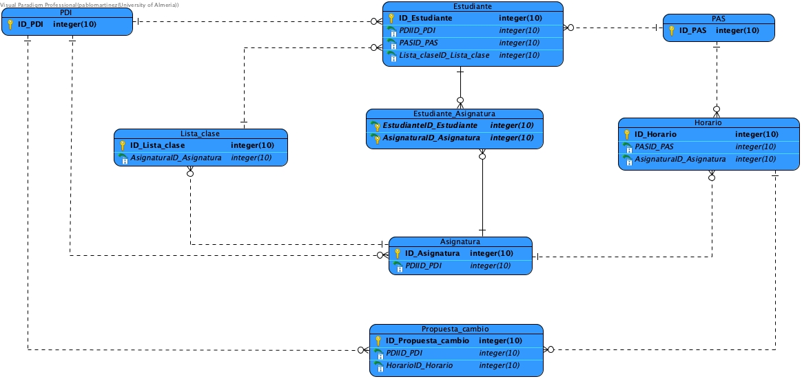

# Lab 1 - Definición de casos de uso y requisitos de información

## Supuesto 1: Horarios

En una universidad, el personal del PDI, el personal del PAS y los estudiantes pueden consultar horarios. Por su parte, el personal del PAS puede modificar horarios y dar de alta estudiantes. El personal de PDI puede proponer cambios en los horarios y dar de alta estudiantes. La funcionalidad de dar de alta estudiantes del PAS realiza una verificación de los datos del estudiante. Sin embargo, la funcionalidad de dar de alta estudiantes del PDI, además de verificar los datos también permite de forma excepcional realizar la búsqueda en las listas de clase de sus asignaturas.

  

### Requisitos del diagrama de casos de uso

| **Nombre:** | Proponer cambios en los horarios |
| :--- | :--- |
| **Codigo:** | CU-101 |
| **Autor:** | INRE Equipo Azul |
| **Fecha:** | 23/09/2025 |
| **Descripción:** | Permite al PDI proponer un cambio en un horario existente para su posterior revisión y aprobación. |
| **Actores:** | PDI |
| **Precondiciones:**| El actor debe estar autenticado en el sistema como PDI. |
| **Flujo Normal:** | 1.- El PDI selecciona la opción para proponer un cambio de horario.  2.- El sistema muestra el horario actual.  3.- El PDI introduce los cambios deseados y una justificación.  4.- El sistema registra la propuesta y la envía para su aprobación. |
| **Flujo Alternativo:** | 3.A- El PDI decide cancelar la operación y el sistema vuelve al menú principal. |
| **Poscondiciones:**| La propuesta de cambio de horario queda registrada en el sistema pendiente de aprobación. |
| **Artefactos relacionados:**|  |

### ---

| **Nombre:** | Dar alta estudiante |
| :--- | :--- |
| **Codigo:** | CU-102 |
| **Autor:** | INRE Equipo Azul |
| **Fecha:** | 23/09/2025 |
| **Descripción:** | Caso de uso general para dar de alta a un estudiante en el sistema. Incluye la verificación de los datos del estudiante. |
| **Actores:** | PDI, PAS |
| **Precondiciones:**| El actor debe estar autenticado en el sistema. |
| **Flujo Normal:** | 1.- El actor inicia el proceso de alta.  2.- El sistema solicita los datos del estudiante.  3.- El actor introduce los datos.  4.- Se ejecuta el caso de uso "Verificar datos del estudiante" (CU-105).  5.- El sistema confirma el alta del estudiante. |
| **Flujo Alternativo:** | 4.A- Si la verificación de datos falla, el sistema informa al actor y permite corregir los datos. |
| **Poscondiciones:**| El estudiante queda registrado en el sistema. |
| **Artefactos relacionados:**| CU-103, CU-104, CU-105 |

### ---

| **Nombre:** | Dar alta estudiante(PDI) |
| :--- | :--- |
| **Codigo:** | CU-103 |
| **Autor:** | INRE Equipo Azul |
| **Fecha:** | 23/09/2025 |
| **Descripción:** | Versión del caso de uso "Dar alta estudiante" para el PDI. Opcionalmente, **extiende** la funcionalidad para buscar en la lista de clase. |
| **Actores:** | PDI |
| **Precondiciones:**| El actor debe estar autenticado como PDI. |
| **Flujo Normal:** | 1.- El PDI inicia el proceso de alta.  2.- El sistema solicita los datos del estudiante.  3.- El PDI introduce los datos.  4.- Se ejecuta el caso de uso "Verificar datos del estudiante" (CU-105).  5.- El sistema confirma el alta. |
| **Flujo Alternativo:** | 3.A- De forma excepcional, el PDI puede ejecutar el caso de uso "Realizar busqueda en la lista de clase" (CU-106) para autocompletar datos. |
| **Poscondiciones:**| El estudiante queda registrado en el sistema. |
| **Artefactos relacionados:**| CU-102, CU-105, CU-106 |

### ---

| **Nombre:** | Dar alta estudiante(PAS) |
| :--- | :--- |
| **Codigo:** | CU-104 |
| **Autor:** | INRE Equipo Azul |
| **Fecha:** | 23/09/2025 |
| **Descripción:** | Versión del caso de uso "Dar alta estudiante" para el PAS. |
| **Actores:** | PAS |
| **Precondiciones:**| El actor debe estar autenticado como PAS. |
| **Flujo Normal:** | 1.- El PAS inicia el proceso de alta.  2.- El sistema solicita los datos del estudiante.  3.- El PAS introduce los datos.  4.- Se ejecuta el caso de uso "Verificar datos del estudiante" (CU-105).  5.- El sistema confirma el alta. |
| **Flujo Alternativo:** | 4.A- Si la verificación de datos falla, el sistema informa al actor y permite corregir los datos. |
| **Poscondiciones:**| El estudiante queda registrado en el sistema. |
| **Artefactos relacionados:**| CU-102, CU-105 |

### ---

| **Nombre:** | Verificar datos del estudiante |
| :--- | :--- |
| **Codigo:** | CU-105 |
| **Autor:** | INRE Equipo Azul |
| **Fecha:** | 23/09/2025 |
| **Descripción:** | Funcionalidad que se **incluye** en "Dar alta estudiante" para verificar que los datos del estudiante son correctos y válidos. |
| **Actores:** | (Sistema) |
| **Precondiciones:**| Se está ejecutando un caso de uso que lo incluye (CU-103 o CU-104). |
| **Flujo Normal:** | 1.- El sistema recibe los datos del estudiante.  2.- El sistema comprueba el formato y la validez de los datos contra la base de datos de la universidad.  3.- El sistema devuelve un resultado de validación exitoso. |
| **Flujo Alternativo:** | 2.A- Si los datos no son válidos, el sistema devuelve un resultado de error. |
| **Poscondiciones:**| Los datos del estudiante han sido validados. |
| **Artefactos relacionados:**| CU-102 |

### ---

| **Nombre:** | Realizar busqueda en la lista de clase |
| :--- | :--- |
| **Codigo:** | CU-106 |
| **Autor:** | INRE Equipo Azul |
| **Fecha:** | 23/09/2025 |
| **Descripción:** | Funcionalidad que **extiende** opcionalmente a "Dar alta estudiante(PDI)" para buscar a un estudiante en las listas de clase de las asignaturas del PDI. |
| **Actores:** | PDI |
| **Precondiciones:**| Se está ejecutando el caso de uso "Dar alta estudiante(PDI)" (CU-103). |
| **Flujo Normal:** | 1.- El PDI activa la búsqueda en la lista de clase.  2.- El sistema solicita el nombre del estudiante y la asignatura.  3.- El PDI introduce los datos.  4.- El sistema busca al estudiante y, si lo encuentra, autocompleta los datos en el formulario de alta. |
| **Flujo Alternativo:** | 4.A- Si el estudiante no se encuentra en la lista de clase, el sistema lo notifica. |
| **Poscondiciones:**| Los datos del estudiante se han recuperado de la lista de clase. |
| **Artefactos relacionados:**| CU-103 |

### ---

| **Nombre:** | Modificar horarios |
| :--- | :--- |
| **Codigo:** | CU-107 |
| **Autor:** | INRE Equipo Azul |
| **Fecha:** | 23/09/2025 |
| **Descripción:** | Permite al personal del PAS modificar directamente los horarios existentes. |
| **Actores:** | PAS |
| **Precondiciones:**| El actor debe estar autenticado como PAS. |
| **Flujo Normal:** | 1.- El PAS selecciona el horario que desea modificar.  2.- El sistema muestra la información del horario en un formulario editable.  3.- El PAS realiza las modificaciones.  4.- El PAS guarda los cambios y el sistema actualiza el horario. |
| **Flujo Alternativo:** | 3.A- El PAS cancela la modificación y los cambios no se guardan. |
| **Poscondiciones:**| El horario ha sido actualizado en el sistema. |
| **Artefactos relacionados:**|  |

### ---

| **Nombre:** | Consultar horario |
| :--- | :--- |
| **Codigo:** | CU-108 |
| **Autor:** | INRE Equipo Azul |
| **Fecha:** | 23/09/2025 |
| **Descripción:** | Caso de uso general que permite a los usuarios consultar horarios. Es especializado por los diferentes roles. |
| **Actores:** | PDI, PAS, Estudiante |
| **Precondiciones:**| El actor debe estar autenticado. |
| **Flujo Normal:** | 1.- El actor accede a la función de consulta de horarios.  2.- El sistema muestra las opciones de búsqueda (por curso, profesor, asignatura, etc.).  3.- El actor introduce sus criterios de búsqueda y el sistema muestra los resultados. |
| **Flujo Alternativo:** | 3.A- Si la búsqueda no produce resultados, el sistema muestra un mensaje informativo. |
| **Poscondiciones:**| El actor ha visualizado la información del horario solicitado. |
| **Artefactos relacionados:**| CU-109, CU-110, CU-111 |

### ---

| **Nombre:** | Consultar horario(PDI) |
| :--- | :--- |
| **Codigo:** | CU-109 |
| **Autor:** | INRE Equipo Azul |
| **Fecha:** | 23/09/2025 |
| **Descripción:** | Versión del caso de uso "Consultar horario" para el actor PDI. |
| **Actores:** | PDI |
| **Precondiciones:**| El actor debe estar autenticado como PDI. |
| **Flujo Normal:** | 1.- El PDI accede a la consulta de horarios.  2.- El sistema muestra por defecto los horarios de sus asignaturas.  3.- El PDI puede realizar búsquedas específicas.  4.- El sistema muestra los horarios solicitados. |
| **Flujo Alternativo:** | 3.A- Si la búsqueda no produce resultados, el sistema lo indica. |
| **Poscondiciones:**| El actor ha visualizado la información del horario. |
| **Artefactos relacionados:**| CU-108 |

### ---

| **Nombre:** | Consultar horario(PAS) |
| :--- | :--- |
| **Codigo:** | CU-110 |
| **Autor:** | INRE Equipo Azul |
| **Fecha:** | 23/09/2025 |
| **Descripción:** | Versión del caso de uso "Consultar horario" para el actor PAS. |
| **Actores:** | PAS |
| **Precondiciones:**| El actor debe estar autenticado como PAS. |
| **Flujo Normal:** | 1.- El PAS accede a la consulta de horarios.  2.- El sistema proporciona opciones de búsqueda avanzadas (por titulación, grupo, aula, etc.).  3.- El PAS introduce los criterios y el sistema muestra los resultados. |
| **Flujo Alternativo:** | 3.A- Si la búsqueda no produce resultados, el sistema lo indica. |
| **Poscondiciones:**| El actor ha visualizado la información del horario. |
| **Artefactos relacionados:**| CU-108 |

### ---

| **Nombre:** | Consultar horario(Estudiante) |
| :--- | :--- |
| **Codigo:** | CU-111 |
| **Autor:** | INRE Equipo Azul |
| **Fecha:** | 23/09/2025 |
| **Descripción:** | Versión del caso de uso "Consultar horario" para el actor Estudiante. |
| **Actores:** | Estudiante |
| **Precondiciones:**| El actor debe estar autenticado como Estudiante. |
| **Flujo Normal:** | 1.- El estudiante accede a la consulta de horarios.  2.- El sistema muestra el horario personal del estudiante según sus asignaturas matriculadas.  3.- El estudiante puede realizar búsquedas de otros horarios. |
| **Flujo Alternativo:** | 3.A- Si la búsqueda no produce resultados, el sistema lo indica. |
| **Poscondiciones:**| El actor ha visualizado la información del horario. |
| **Artefactos relacionados:**| CU-108 |
 

  

## Supuesto 2: Sistema de compras

En un sistema de compra, existen cuatro tipos de usuarios: comprador, vendedor, proveedor y administrador. Los compradores pueden agregar productos, consultar precios, finalizar la compra y consultar ofertas. Agregar productos implica marcar esos productos como bloqueados. Los vendedores también pueden consultar ofertas y consultar precios. Los proveedores pueden consultar precios, avisar de nuevos productos y consultar ofertas. Avisar de nuevos productos, de forma excepcional, realiza la incorporación de una oferta. Los proveedores también tienen una funcionalidad para avisar del fin de una oferta. Cuando se avisa del fin de una oferta, se ejecuta la funcionalidad de eliminar la oferta. Ambas funcionalidades de avisar del proveedor tienen en común que se encarga de enviar una notificación. Los administradores pueden consultar precios, consultar ofertas y eliminar productos. La funcionalidad de consultar precios incluye una funcionalidad de buscar productos que es similar a la funcionalidad de consultar productos de los compradores. Sin embargo, la funcionalidad de consultar productos añade una funcionalidad para verificar la disponibilidad. Para realizar una venta, un comprador y un vendedor participan de forma conjunta. En dicha operación, se lleva a cabo el acuerdo de un precio; excepcionalmente, durante la realización de la venta, se consultará el histórico de ventas.

  

### **Requisitos del diagrama de casos de uso**

| **Nombre:** | Consultar productos |
| :--- | :--- |
| **Codigo:** | CU-201 |
| **Autor:** | INRE Equipo Azul |
| **Fecha:** | 23/09/2025 |
| **Descripción:** | Permite a los compradores ver los productos disponibles en el sistema. Incluye la verificación de la disponibilidad del producto. |
| **Actores:** | Comprador |
| **Precondiciones:**| El actor debe haber iniciado sesión en el sistema. |
| **Flujo Normal:** | 1.- El comprador selecciona la opción de consultar productos.  2.- El sistema muestra una lista de los productos.  3.- El comprador selecciona un producto para ver los detalles.  4.- El sistema muestra la información del producto y ejecuta "Verificar disponibilidad" (CU-215). |
| **Flujo Alternativo:** | 2.A- Si no hay productos, el sistema muestra un mensaje indicándolo. |
| **Poscondiciones:**| El comprador ha visto la información y disponibilidad de un producto. |
| **Artefactos relacionados:**| CU-203, CU-219 |

### \---

| **Nombre:** | Consultar precios |
| :--- | :--- |
| **Codigo:** | CU-202 |
| **Autor:** | INRE Equipo Azul |
| **Fecha:** | 23/09/2025 |
| **Descripción:** | Caso de uso general para consultar los precios de los productos. Es utilizado por compradores, vendedores, proveedores y administradores. |
| **Actores:** | Comprador, Vendedor, Proveedor, Administrador |
| **Precondiciones:**| El actor debe estar autenticado en el sistema. |
| **Flujo Normal:** | 1.- El actor elige la opción de consultar precios.  2.- El sistema le permite buscar productos.  3.- El actor busca un producto.  4.- El sistema muestra el precio del producto. |
| **Flujo Alternativo:** | 3.A- Si el producto no se encuentra, el sistema muestra un mensaje. |
| **Poscondiciones:**| El actor ha consultado el precio de un producto. |
| **Artefactos relacionados:**| CU-203, CU-204, CU-205, CU-206 |

### \---

| **Nombre:** | Consultar precios (comprador) |
| :--- | :--- |
| **Codigo:** | CU-203 |
| **Autor:** | INRE Equipo Azul |
| **Fecha:** | 23/09/2025 |
| **Descripción:** | Versión del caso de uso "Consultar precios" para el actor Comprador. |
| **Actores:** | Comprador |
| **Precondiciones:**| El comprador debe estar autenticado. |
| **Flujo Normal:** | 1.- El comprador busca un producto.  2.- El sistema muestra el precio del producto. |
| **Flujo Alternativo:** | 1.A- Si el producto no existe, se notifica al comprador. |
| **Poscondiciones:**| El comprador conoce el precio de un producto. |
| **Artefactos relacionados:**| CU-201, CU-202 |

### \---

| **Nombre:** | Consultar precios (vendedor) |
| :--- | :--- |
| **Codigo:** | CU-204 |
| **Autor:** | INRE Equipo Azul |
| **Fecha:** | 23/09/2025 |
| **Descripción:** | Versión del caso de uso "Consultar precios" para el actor Vendedor. |
| **Actores:** | Vendedor |
| **Precondiciones:**| El vendedor debe estar autenticado. |
| **Flujo Normal:** | 1.- El vendedor busca un producto.  2.- El sistema muestra el precio del producto. |
| **Flujo Alternativo:** | 1.A- Si el producto no existe, se notifica al vendedor. |
| **Poscondiciones:**| El vendedor conoce el precio de un producto. |
| **Artefactos relacionados:**| CU-202 |

### \---

| **Nombre:** | Consultar precios (proveedor) |
| :--- | :--- |
| **Codigo:** | CU-205 |
| **Autor:** | INRE Equipo Azul |
| **Fecha:** | 23/09/2025 |
| **Descripción:** | Versión del caso de uso "Consultar precios" para el actor Proveedor. |
| **Actores:** | Proveedor |
| **Precondiciones:**| El proveedor debe estar autenticado. |
| **Flujo Normal:** | 1.- El proveedor busca un producto.  2.- El sistema muestra el precio del producto. |
| **Flujo Alternativo:** | 1.A- Si el producto no existe, se notifica al proveedor. |
| **Poscondiciones:**| El proveedor conoce el precio de un producto. |
| **Artefactos relacionados:**| CU-202 |

### \---

| **Nombre:** | Consultar precios (administrador) |
| :--- | :--- |
| **Codigo:** | CU-206 |
| **Autor:** | INRE Equipo Azul |
| **Fecha:** | 23/09/2025 |
| **Descripción:** | Versión del caso de uso "Consultar precios" para el actor Administrador, que **incluye** la funcionalidad de "Buscar productos". |
| **Actores:** | Administrador |
| **Precondiciones:**| El administrador debe estar autenticado. |
| **Flujo Normal:** | 1.- El administrador ejecuta "Buscar productos" (CU-216).  2.- El sistema muestra el precio del producto encontrado. |
| **Flujo Alternativo:** | 1.A- Si no se encuentra el producto, el sistema lo notifica. |
| **Poscondiciones:**| El administrador conoce el precio de un producto. |
| **Artefactos relacionados:**| CU-202, CU-220 |

### \---

| **Nombre:** | Consultar oferta |
| :--- | :--- |
| **Codigo:** | CU-207 |
| **Autor:** | INRE Equipo Azul |
| **Fecha:** | 23/09/2025 |
| **Descripción:** | Caso de uso general para que los usuarios puedan consultar las ofertas disponibles. |
| **Actores:** | Comprador, Vendedor, Proveedor, Administrador |
| **Precondiciones:**| El actor debe estar autenticado en el sistema. |
| **Flujo Normal:** | 1.- El actor accede a la sección de ofertas.  2.- El sistema muestra las ofertas disponibles.  3.- El actor selecciona una oferta para ver sus detalles. |
| **Flujo Alternativo:** | 2.A- Si no hay ofertas, el sistema muestra un mensaje. |
| **Poscondiciones:**| El actor ha visto las ofertas disponibles. |
| **Artefactos relacionados:**| CU-208, CU-209, CU-210, CU-211 |

### \---

| **Nombre:** | Consultar oferta (comprador) |
| :--- | :--- |
| **Codigo:** | CU-208 |
| **Autor:** | INRE Equipo Azul |
| **Fecha:** | 23/09/2025 |
| **Descripción:** | Versión del caso de uso "Consultar oferta" para el actor Comprador. |
| **Actores:** | Comprador |
| **Precondiciones:**| El comprador debe estar autenticado. |
| **Flujo Normal:** | 1.- El comprador accede a las ofertas.  2.- El sistema le muestra las ofertas. |
| **Flujo Alternativo:** | 2.A- Si no hay ofertas, se le notifica. |
| **Poscondiciones:**| El comprador conoce las ofertas. |
| **Artefactos relacionados:**| CU-207 |

### \---

| **Nombre:** | Consultar oferta (vendedor) |
| :--- | :--- |
| **Codigo:** | CU-209 |
| **Autor:** | INRE Equipo Azul |
| **Fecha:** | 23/09/2025 |
| **Descripción:** | Versión del caso de uso "Consultar oferta" para el actor Vendedor. |
| **Actores:** | Vendedor |
| **Precondiciones:**| El vendedor debe estar autenticado. |
| **Flujo Normal:** | 1.- El vendedor accede a las ofertas.  2.- El sistema le muestra las ofertas. |
| **Flujo Alternativo:** | 2.A- Si no hay ofertas, se le notifica. |
| **Poscondiciones:**| El vendedor conoce las ofertas. |
| **Artefactos relacionados:**| CU-207 |

### \---

| **Nombre:** | Consultar oferta (proveedor) |
| :--- | :--- |
| **Codigo:** | CU-210 |
| **Autor:** | INRE Equipo Azul |
| **Fecha:** | 23/09/2025 |
| **Descripción:** | Versión del caso de uso "Consultar oferta" para el actor Proveedor. |
| **Actores:** | Proveedor |
| **Precondiciones:**| El proveedor debe estar autenticado. |
| **Flujo Normal:** | 1.- El proveedor accede a las ofertas.  2.- El sistema le muestra las ofertas. |
| **Flujo Alternativo:** | 2.A- Si no hay ofertas, se le notifica. |
| **Poscondiciones:**| El proveedor conoce las ofertas. |
| **Artefactos relacionados:**| CU-207 |

### \---

| **Nombre:** | Consultar oferta (administrador) |
| :--- | :--- |
| **Codigo:** | CU-211 |
| **Autor:** | INRE Equipo Azul |
| **Fecha:** | 23/09/2025 |
| **Descripción:** | Versión del caso de uso "Consultar oferta" para el actor Administrador. |
| **Actores:** | Administrador |
| **Precondiciones:**| El administrador debe estar autenticado. |
| **Flujo Normal:** | 1.- El administrador accede a las ofertas.  2.- El sistema le muestra las ofertas. |
| **Flujo Alternativo:** | 2.A- Si no hay ofertas, se le notifica. |
| **Poscondiciones:**| El administrador conoce las ofertas. |
| **Artefactos relacionados:**| CU-207 |

### \---

| **Nombre:** | Avisar de nuevos productos |
| :--- | :--- |
| **Codigo:** | CU-212 |
| **Autor:** | INRE Equipo Azul |
| **Fecha:** | 23/09/2025 |
| **Descripción:** | Permite al proveedor notificar la llegada de nuevos productos. Opcionalmente, **extiende** la funcionalidad a "Incorporar oferta". **Incluye** el envío de una notificación. |
| **Actores:** | Proveedor |
| **Precondiciones:**| El proveedor debe estar autenticado. |
| **Flujo Normal:** | 1.- El proveedor avisa de un nuevo producto.  2.- El sistema registra el nuevo producto.  3.- El sistema ejecuta "Enviar notificación" (CU-217). |
| **Flujo Alternativo:** | 2.A- De forma excepcional, el proveedor puede ejecutar "Incorporar oferta" (CU-218). |
| **Poscondiciones:**| Se ha notificado y registrado un nuevo producto. |
| **Artefactos relacionados:**| CU-221, CU-222 |

### \---

| **Nombre:** | Avisar de fin de oferta |
| :--- | :--- |
| **Codigo:** | CU-213 |
| **Autor:** | INRE Equipo Azul |
| **Fecha:** | 23/09/2025 |
| **Descripción:** | Permite al proveedor notificar el fin de una oferta. **Incluye** las funcionalidades "Eliminar oferta" y "Enviar notificación". |
| **Actores:** | Proveedor |
| **Precondiciones:**| El proveedor debe estar autenticado. |
| **Flujo Normal:** | 1.- El proveedor avisa del fin de una oferta.  2.- El sistema ejecuta "Eliminar oferta" (CU-219).  3.- El sistema ejecuta "Enviar notificación" (CU-217). |
| **Flujo Alternativo:** | 2.A- Si la oferta no existe, el sistema lo notifica. |
| **Poscondiciones:**| La oferta ha sido eliminada y se ha enviado una notificación. |
| **Artefactos relacionados:**| CU-221, CU-223 |

### \---

| **Nombre:** | Eliminar producto |
| :--- | :--- |
| **Codigo:** | CU-214 |
| **Autor:** | INRE Equipo Azul |
| **Fecha:** | 23/09/2025 |
| **Descripción:** | Permite al administrador eliminar un producto del sistema. |
| **Actores:** | Administrador |
| **Precondiciones:**| El administrador debe estar autenticado. |
| **Flujo Normal:** | 1.- El administrador selecciona un producto.  2.- El administrador confirma la eliminación.  3.- El sistema elimina el producto. |
| **Flujo Alternativo:** | 2.A- El administrador cancela la operación. |
| **Poscondiciones:**| El producto ya no está disponible en el sistema. |
| **Artefactos relacionados:**| |

### \---

| **Nombre:** | Realizar venta |
| :--- | :--- |
| **Codigo:** | CU-215 |
| **Autor:** | INRE Equipo Azul |
| **Fecha:** | 23/09/2025 |
| **Descripción:** | Gestiona el proceso de venta entre un comprador y un vendedor. **Incluye** "Acordar un precio" y, excepcionalmente, **extiende** a "Consultar el histórico de ventas". |
| **Actores:** | Comprador, Vendedor |
| **Precondiciones:**| Comprador y vendedor deben estar autenticados. |
| **Flujo Normal:** | 1.- Comprador y vendedor inician la venta.  2.- Se ejecuta "Acordar un precio" (CU-221).  3.- Se confirma la transacción. |
| **Flujo Alternativo:** | 2.A- Durante la negociación, se puede ejecutar "Consultar el histórico de ventas" (CU-222). |
| **Poscondiciones:**| La venta se ha completado. |
| **Artefactos relacionados:**| CU-224, CU-225 |

### \---

| **Nombre:** | Agregar productos |
| :--- | :--- |
| **Codigo:** | CU-216 |
| **Autor:** | INRE Equipo Azul |
| **Fecha:** | 17/10/2025 |
| **Descripción:** | Permite a un comprador añadir productos a su cesta de la compra. **Incluye** la funcionalidad de "Marcar productos como bloqueados". |
| **Actores:** | Comprador |
| **Precondiciones:**| El comprador debe estar autenticado en el sistema. |
| **Flujo Normal:** | 1.- El comprador selecciona un producto y la cantidad que desea añadir.  2.- El comprador pulsa el botón para agregar a la cesta.  3.- El sistema ejecuta "Marcar productos como bloqueados" (CU-225) para asegurar la disponibilidad.  4.- El sistema confirma que el producto ha sido añadido a la cesta. |
| **Flujo Alternativo:** | 3.A- Si el producto no tiene stock suficiente, el sistema informa al comprador y no permite añadirlo. |
| **Poscondiciones:**| El producto seleccionado está en la cesta de la compra y su stock ha sido reservado temporalmente. |
| **Artefactos relacionados:**| CU-218 |

### \---

| **Nombre:** | Finalizar compra |
| :--- | :--- |
| **Codigo:** | CU-217 |
| **Autor:** | INRE Equipo Azul |
| **Fecha:** | 17/10/2025 |
| **Descripción:** | Permite al comprador completar el proceso de adquisición de los productos que tiene en su cesta. |
| **Actores:** | Comprador |
| **Precondiciones:**| El comprador debe estar autenticado y tener al menos un producto en la cesta. |
| **Flujo Normal:** | 1.- El comprador accede a su cesta y selecciona la opción para finalizar la compra.  2.- El sistema muestra un resumen del pedido y solicita la confirmación.  3.- El comprador confirma y el sistema procesa el pago.  4.- El sistema confirma la compra y actualiza el estado del pedido a "completado". |
| **Flujo Alternativo:** | 3.A- Si el proceso de pago falla, el sistema informa al comprador y le permite intentarlo de nuevo. |
| **Poscondiciones:**| Los productos de la cesta han sido comprados y el stock se descuenta de forma definitiva. |
| **Artefactos relacionados:**| |

### \---

| **Nombre:** | Marcar productos como bloqueados |
| :--- | :--- |
| **Codigo:** | CU-218 |
| **Autor:** | INRE Equipo Azul |
| **Fecha:** | 17/10/2025 |
| **Descripción:** | Funcionalidad **incluida** en "Agregar productos" que reserva temporalmente el stock de un producto cuando se añade a la cesta. |
| **Actores:** | (Sistema) |
| **Precondiciones:**| Se está ejecutando el caso de uso "Agregar productos". |
| **Flujo Normal:** | 1.- El sistema recibe la solicitud de añadir un producto a la cesta.  2.- El sistema reduce el stock disponible de ese producto en la cantidad solicitada y lo marca como "bloqueado" o "reservado". |
| **Flujo Alternativo:** | |
| **Poscondiciones:**| El stock del producto ha sido reservado para evitar que otro usuario lo compre. |
| **Artefactos relacionados:**| CU-216 |

### \---

| **Nombre:** | Verificar disponibilidad |
| :--- | :--- |
| **Codigo:** | CU-219 |
| **Autor:** | INRE Equipo Azul |
| **Fecha:** | 17/10/2025 |
| **Descripción:** | Funcionalidad que **extiende** a "Consultar productos" para comprobar si hay stock disponible. |
| **Actores:** | (Sistema) |
| **Precondiciones:**| Se está ejecutando el caso de uso "Consultar productos". |
| **Flujo Normal:** | 1.- El sistema comprueba el stock actual del producto consultado.  2.- El sistema muestra el estado de disponibilidad (Ej: "En stock", "Pocas unidades", "Agotado"). |
| **Flujo Alternativo:** | |
| **Poscondiciones:**| El comprador conoce la disponibilidad del producto. |
| **Artefactos relacionados:**| CU-201 |

### \---

| **Nombre:** | Buscar productos |
| :--- | :--- |
| **Codigo:** | CU-220 |
| **Autor:** | INRE Equipo Azul |
| **Fecha:** | 17/10/2025 |
| **Descripción:** | Funcionalidad **incluida** en "Consultar precios (administrador)" para encontrar productos en el sistema. |
| **Actores:** | (Sistema) |
| **Precondiciones:**| Se está ejecutando "Consultar precios (administrador)". |
| **Flujo Normal:** | 1.- El sistema presenta al administrador una interfaz de búsqueda con filtros avanzados.  2.- El administrador introduce los criterios de búsqueda.  3.- El sistema devuelve una lista de productos que coinciden. |
| **Flujo Alternativo:** | 3.A- Si no se encuentran productos, se muestra un mensaje. |
| **Poscondiciones:**| Se ha obtenido un listado de productos según los criterios del administrador. |
| **Artefactos relacionados:**| CU-206 |

### \---

| **Nombre:** | Enviar notificacion |
| :--- | :--- |
| **Codigo:** | CU-221 |
| **Autor:** | INRE Equipo Azul |
| **Fecha:** | 17/10/2025 |
| **Descripción:** | Funcionalidad **incluida** en "Avisar de nuevos productos" y "Avisar de fin de oferta" para comunicar eventos. |
| **Actores:** | (Sistema) |
| **Precondiciones:**| Se está ejecutando un caso de uso que lo incluye. |
| **Flujo Normal:** | 1.- El sistema identifica a los usuarios que deben ser notificados.  2.- El sistema genera y envía una notificación (por email, push, etc.) sobre el nuevo producto o el fin de la oferta. |
| **Flujo Alternativo:** | |
| **Poscondiciones:**| Los usuarios correspondientes han sido notificados. |
| **Artefactos relacionados:**| CU-212, CU-213 |

### \---

| **Nombre:** | Incorporar oferta |
| :--- | :--- |
| **Codigo:** | CU-222 |
| **Autor:** | INRE Equipo Azul |
| **Fecha:** | 17/10/2025 |
| **Descripción:** | Funcionalidad que **extiende** de forma excepcional a "Avisar de nuevos productos" para crear una oferta de lanzamiento. |
| **Actores:** | Proveedor |
| **Precondiciones:**| Se está ejecutando el caso de uso "Avisar de nuevos productos". |
| **Flujo Normal:** | 1.- Al avisar de un nuevo producto, el proveedor activa la opción de crear una oferta.  2.- El sistema solicita los detalles de la oferta (descuento, duración, etc.).  3.- El proveedor los introduce y el sistema crea y activa la oferta para el nuevo producto. |
| **Flujo Alternativo:** | 3.A- El proveedor decide no crear una oferta y cancela la operación. |
| **Poscondiciones:**| Se ha creado una nueva oferta asociada al nuevo producto. |
| **Artefactos relacionados:**| CU-212 |

### \---

| **Nombre:** | Eliminar oferta |
| :--- | :--- |
| **Codigo:** | CU-223 |
| **Autor:** | INRE Equipo Azul |
| **Fecha:** | 17/10/2025 |
| **Descripción:** | Funcionalidad **incluida** en "Avisar de fin de oferta" que desactiva o elimina una oferta del sistema. |
| **Actores:** | (Sistema) |
| **Precondiciones:**| Se está ejecutando "Avisar de fin de oferta". |
| **Flujo Normal:** | 1.- El sistema recibe el identificador de la oferta que ha finalizado.  2.- El sistema cambia el estado de la oferta a "inactiva" o la elimina de la base de datos. |
| **Flujo Alternativo:** | |
| **Poscondiciones:**| La oferta ya no está visible ni aplicable para los compradores. |
| **Artefactos relacionados:**| CU-213 |

### \---

| **Nombre:** | Acordar un precio |
| :--- | :--- |
| **Codigo:** | CU-224 |
| **Autor:** | INRE Equipo Azul |
| **Fecha:** | 17/10/2025 |
| **Descripción:** | Funcionalidad **incluida** en "Realizar venta" donde el comprador y el vendedor negocian y fijan un precio final. |
| **Actores:** | Comprador, Vendedor |
| **Precondiciones:**| Se está ejecutando el caso de uso "Realizar venta". |
| **Flujo Normal:** | 1.- El vendedor propone un precio inicial.  2.- El comprador puede aceptarlo o proponer una contraoferta.  3.- El proceso se repite hasta que ambas partes aceptan un precio.  4.- El precio acordado se fija para la transacción. |
| **Flujo Alternativo:** | 3.A- Si no se llega a un acuerdo, la venta puede ser cancelada. |
| **Poscondiciones:**| Se ha establecido un precio final para la venta. |
| **Artefactos relacionados:**| CU-215 |

### \---

| **Nombre:** | Consultar el historico de ventas |
| :--- | :--- |
| **Codigo:** | CU-225 |
| **Autor:** | INRE Equipo Azul |
| **Fecha:** | 17/10/2025 |
| **Descripción:** | Funcionalidad que **extiende** de forma excepcional a "Realizar venta" para consultar ventas anteriores del mismo producto o cliente. |
| **Actores:** | Vendedor |
| **Precondiciones:**| Se está ejecutando el caso de uso "Realizar venta". |
| **Flujo Normal:** | 1.- Durante la negociación del precio, el vendedor decide consultar el histórico.  2.- El sistema muestra un listado de ventas previas, incluyendo fechas y precios.  3.- El vendedor utiliza esta información para ajustar su estrategia de negociación. |
| **Flujo Alternativo:** | |
| **Poscondiciones:**| El vendedor ha obtenido información sobre ventas pasadas para facilitar la negociación actual. |
| **Artefactos relacionados:**| CU-215 |

 

  

### ---

| **INF-202** | **Usuario** |
| :--- | :--- |
| **Versión** | 1.0 (Octubre-2025) |
| **Autores** | INRE Equipo Azul |
| **Fuentes** | Descripción del Supuesto 2 |
| **Referencias** | <ul><li>Autenticación de todos los actores</li></ul> |
| **Descripción** | El sistema deberá almacenar la información base de autenticación y los datos comunes para todos los actores. |
| **Datos específicos** | <ul><li>idUsuario INT</li><li>nombreUsuario VARCHAR(45)</li><li>correoElectronico VARCHAR(45)</li><li>contraseña VARCHAR(45)</li></ul> |
| **Importancia** | Muy importante |
| **Estado** | Aceptado |
| **Comentarios** | Es la tabla "padre" de la que heredan los roles de Administrador, Proveedor, Vendedor y Comprador. |

### ---

| **INF-203** | **Administrador** |
| :--- | :--- |
| **Versión** | 1.0 (Octubre-2025) |
| **Autores** | INRE Equipo Azul |
| **Fuentes** | Descripción del Supuesto 2 |
| **Referencias** | <ul><li>Consultar precios (administrador)</li><li>Consultar oferta (administrador)</li><li>Eliminar producto</li></ul> |
| **Descripción** | El sistema deberá almacenar la referencia al rol de Administrador. |
| **Datos específicos** | <ul><li>idAdministrador INT</li></ul> |
| **Importancia** | Alta |
| **Estado** | Aceptado |
| **Comentarios** | Tabla de especialización. El 'idAdministrador' es una Clave Foránea (FK) que referencia a 'Usuario.idUsuario'. |

### ---

| **INF-204** | **Proveedor** |
| :--- | :--- |
| **Versión** | 1.0 (Octubre-2025) |
| **Autores** | INRE Equipo Azul |
| **Fuentes** | Descripción del Supuesto 2 |
| **Referencias** | <ul><li>Consultar precios (proveedor)</li\><li>Avisar de nuevos productos</li><li>Avisar de fin de oferta</li></ul> |
| **Descripción** | El sistema deberá almacenar la referencia al rol de Proveedor. |
| **Datos específicos** | <ul><li>idProveedor INT</li></ul> |
| **Importancia** | Alta |
| **Estado** | Aceptado |
| **Comentarios** | Tabla de especialización. El 'idProveedor' es una FK que referencia a 'Usuario.idUsuario'. Es el responsable de los productos y las ofertas. |

### ---

| **INF-205** | **Vendedor** |
| :--- | :--- |
| **Versión** | 1.0 (Octubre-2025) |
| **Autores** | INRE Equipo Azul |
| **Fuentes** | Descripción del Supuesto 2 |
| **Referencias** | <ul><li>Consultar precios (vendedor)</li><li>Realizar venta</li></ul> |
| **Descripción** | El sistema deberá almacenar la referencia al rol de Vendedor. |
| **Datos específicos** | <ul><li>idVendedor INT</li></ul> |
| **Importancia** | Alta |
| **Estado** | Aceptado |
| **Comentarios** | Tabla de especialización. El 'idVendedor' es una FK que referencia a 'Usuario.idUsuario'. Participa en la 'Venta'. |

### ---

| **INF-206** | **Comprador** |
| :--- | :--- |
| **Versión** | 1.0 (Octubre-2025) |
| **Autores** | INRE Equipo Azul |
| **Fuentes** | Descripción del Supuesto 2 |
| **Referencias** | <ul><li>Agregar productos</li><li>Finalizar compra</li><li>Realizar venta</li></ul> |
| **Descripción** | El sistema deberá almacenar la referencia al rol de Comprador. |
| **Datos específicos** | <ul><li>idComprador INT</li></ul> |
| **Importancia** | Muy importante |
| **Estado** | Aceptado |
| **Comentarios** | Tabla de especialización. El 'idComprador' es una FK que referencia a 'Usuario.idUsuario'. Participa en la 'Venta'. |

### ---

| **INF-201** | **Producto** |
| :--- | :--- |
| **Versión** | 1.0 (Octubre-2025) |
| **Autores** | INRE Equipo Azul |
| **Fuentes** | Descripción del Supuesto 2 |
| **Referencias** | <ul><li>Agregar productos</li><li>Consultar productos</li><li>Consultar precios</li><li>Eliminar producto</li></ul> |
| **Descripción** | El sistema deberá almacenar la información correspondiente a los productos que se gestionan en la tienda. |
| **Datos específicos** | <ul><li>idProducto INT</li><li>idProveedor INT</li><li>precio INT</li><li>stock INT</li></ul> |
| **Importancia** | Muy importante |
| **Estado** | Aceptado |
| **Comentarios** | Es la entidad principal sobre la que operan la mayoría de los casos de uso (comprar, consultar, gestionar). |

### ---

| **INF-207** | **Oferta** |
| :--- | :--- |
| **Versión** | 1.0 (Octubre-2025) |
| **Autores** | INRE Equipo Azul |
| **Fuentes** | Descripción del Supuesto 2 |
| **Referencias** | <ul><li>Consultar oferta</li><li>Avisar de fin de oferta</li><li>Incorporar oferta</li></ul> |
| **Descripción** | El sistema deberá almacenar la información de las ofertas o promociones creadas por los proveedores. |
| **Datos específicos** | <ul><li>idOferta INT</li><li>idProveedor INT</li></ul> |
| **Importancia** | Alta |
| **Estado** | Aceptado |
| **Comentarios** | Se relaciona con los productos a los que aplica a través de la tabla 'OfertaProducto'. |

### ---

| **INF-208** | **OfertaProducto** |
| :--- | :--- |
| **Versión** | 1.0 (Octubre-2025) |
| **Autores** | INRE Equipo Azul |
| **Fuentes** | Descripción del Supuesto 2 |
| **Referencias** | <ul><li>Consultar oferta</li><li>Incorporar oferta</li></ul> |
| **Descripción** | El sistema deberá almacenar la relación entre las ofertas y los productos. |
| **Datos específicos** | <ul><li>idOferta INT</li><li>idProducto INT</li></ul> |
| **Importancia** | Alta |
| **Estado** | Aceptado |
| **Comentarios** | Tabla asociativa (N:N) que permite que una oferta aplique a muchos productos y un producto esté en muchas ofertas. |

### ---

| **INF-209** | **Venta** |
| :--- | :--- |
| **Versión** | 1.0 (Octubre-2025) |
| **Autores** | INRE Equipo Azul |
| **Fuentes** | Descripción del Supuesto 2 |
| **Referencias** | <ul><li>Realizar venta</li><li>Finalizar compra</li><li>Consultar el historico de ventas</li></ul> |
| **Descripción** | El sistema deberá almacenar la cabecera de una transacción de venta, identificando al comprador y al vendedor. |
| **Datos específicos** | <ul><li>idVenta INT</li><li>idComprador INT</li><li>idVendedor INT</li></ul> |
| **Importancia** | Muy importante |
| **Estado** | Aceptado |
| **Comentarios** | Representa el registro de la transacción. Se complementa con 'DetallesVenta'. |

### ---

| **INF-210** | **DetallesVenta** |
| :--- | :--- |
| **Versión** | 1.0 (Octubre-2025) |
| **Autores** | INRE Equipo Azul |
| **Fuentes** | Descripción del Supuesto 2 |
| **Referencias** | <ul><li>Realizar venta</li><li>Consultar el historico de ventas</li></ul> |
| **Descripción** | El sistema deberá almacenar el detalle de los productos (y sus cantidades) vendidos en una transacción. |
| **Datos específicos** | <ul><li>idVenta INT</li><li>idProducto INT</li><li>cantidadVendida INT</li><li>precioTotal INT</li></ul> |
| **Importancia** | Muy importante |
| **Estado** | Aceptado |
| **Comentarios** | Tabla asociativa (N:N) entre 'Venta' y 'Producto'. Esencial para el histórico de ventas. |

## Supuesto 3: Compañia Hotelera

En una compañía hotelera, el administrador y el comercial pueden consultar reservas. El comercial realiza ofertas y gestiona nuevas reservas. El administrador gestiona nuevas peticiones y también realiza ofertas. La realización de ofertas por parte del comercial conlleva un recálculo de precios. Además, dicha realización de ofertas conlleva opcionalmente el bloqueo temporal de una reserva. Los clientes, los administradores y los comerciales pueden consultar disponibilidades y visualizar ofertas. La consulta de disponibilidades y la consulta de reservas tienen la funcionalidad común de buscar elementos. Por su parte, la consulta de disponibilidades conlleva una funcionalidad que muestra un calendario.

  

### Requisitos del diagrama de casos de uso

### Consultar Disponibilidad

| **Nombre:** | Consultar disponibilidad |
| :--- | :--- |
| **Codigo:** | CU-301 |
| **Autor:** | INRE Equipo Azul |
| **Fecha:** | 15/10/2025 |
| **Descripción:** | Permite consultar la disponibilidad de habitaciones. Este caso de uso **incluye** las funcionalidades "Buscar elemento" y "Mostrar calendario". |
| **Actores:** | Cliente, Comercial, Administrador |
| **Precondiciones:**| Ninguna para el cliente, pero el comercial y el administrador deben estar autenticados. |
| **Flujo Normal:** | 1.- El actor introduce las fechas para las que desea consultar la disponibilidad.  2.- Se ejecuta la funcionalidad incluida "Buscar elemento".  3.- Se ejecuta la funcionalidad incluida "Mostrar calendario" para visualizar los resultados. |
| **Flujo Alternativo:** | 2.A- Si no hay disponibilidad para las fechas seleccionadas, el sistema informa al actor y puede sugerir fechas alternativas. |
| **Poscondiciones:**| El actor conoce la disponibilidad para las fechas seleccionadas. |
| **Artefactos relacionados:**| CU-302, CU-303, CU-304, CU-319, CU-320 |

### ---

| **Nombre:** | Consultar disponibilidad(Cliente) |
| :--- | :--- |
| **Codigo:** | CU-302 |
| **Autor:** | INRE Equipo Azul |
| **Fecha:** | 15/10/2025 |
| **Descripción:** | Versión del caso de uso "Consultar disponibilidad" para el actor Cliente. |
| **Actores:** | Cliente |
| **Precondiciones:**| Ninguna. |
| **Flujo Normal:** | 1.- El cliente introduce las fechas deseadas.  2.- Se ejecuta la funcionalidad incluida "Buscar elemento".  3.- Se ejecuta la funcionalidad incluida "Mostrar calendario" con los resultados. |
| **Flujo Alternativo:** | 2.A- Si no hay disponibilidad, el sistema informa y sugiere alternativas. |
| **Poscondiciones:**| El cliente visualiza la disponibilidad para las fechas seleccionadas. |
| **Artefactos relacionados:**| CU-301 |

### ---

| **Nombre:** | Consultar disponibilidad(Comercial) |
| :--- | :--- |
| **Codigo:** | CU-303 |
| **Autor:** | INRE Equipo Azul |
| **Fecha:** | 15/10/2025 |
| **Descripción:** | Versión del caso de uso "Consultar disponibilidad" para el actor Comercial. |
| **Actores:** | Comercial |
| **Precondiciones:**| El actor debe estar autenticado en el sistema. |
| **Flujo Normal:** | 1.- El comercial introduce las fechas deseadas.  2.- Se ejecuta la funcionalidad incluida "Buscar elemento".  3.- Se ejecuta la funcionalidad incluida "Mostrar calendario" con los resultados. |
| **Flujo Alternativo:** | 2.A- Si no hay disponibilidad, el sistema informa y sugiere alternativas. |
| **Poscondiciones:**| El comercial visualiza la disponibilidad para las fechas seleccionadas. |
| **Artefactos relacionados:**| CU-301 |

### ---

| **Nombre:** | Consultar disponibilidad(Administrador) |
| :--- | :--- |
| **Codigo:** | CU-304 |
| **Autor:** | INRE Equipo Azul |
| **Fecha:** | 15/10/2025 |
| **Descripción:** | Versión del caso de uso "Consultar disponibilidad" para el actor Administrador. |
| **Actores:** | Administrador |
| **Precondiciones:**| El actor debe estar autenticado en el sistema. |
| **Flujo Normal:** | 1.- El administrador introduce las fechas deseadas.  2.- Se ejecuta la funcionalidad incluida "Buscar elemento".  3.- Se ejecuta la funcionalidad incluida "Mostrar calendario" con los resultados. |
| **Flujo Alternativo:** | 2.A- Si no hay disponibilidad, el sistema informa y sugiere alternativas. |
| **Poscondiciones:**| El administrador visualiza la disponibilidad para las fechas seleccionadas. |
| **Artefactos relacionados:**| CU-301 |

### ---

### Consultar Reserva

| **Nombre:** | Consultar reserva |
| :--- | :--- |
| **Codigo:** | CU-305 |
| **Autor:** | INRE Equipo Azul |
| **Fecha:** | 15/10/2025 |
| **Descripción:** | Permite consultar los detalles de una reserva existente. Este caso de uso **incluye** la funcionalidad "Buscar elemento". |
| **Actores:** | Comercial, Administrador |
| **Precondiciones:**| El actor debe estar autenticado en el sistema. |
| **Flujo Normal:** | 1.- El actor invoca la funcionalidad incluida "Buscar elemento" para encontrar la reserva por un criterio.  2.- El sistema muestra un listado de resultados.  3.- El actor selecciona la reserva deseada y el sistema muestra todos sus detalles. |
| **Flujo Alternativo:** | 2.A- Si la búsqueda no arroja resultados, el sistema lo notifica. |
| **Poscondiciones:**| El actor ha podido consultar la información de la reserva. |
| **Artefactos relacionados:**| CU-306, CU-307, CU-319 |

### ---

| **Nombre:** | Consultar reserva(Comercial) |
| :--- | :--- |
| **Codigo:** | CU-306 |
| **Autor:** | INRE Equipo Azul |
| **Fecha:** | 15/10/2025 |
| **Descripción:** | Versión del caso de uso "Consultar reserva" para el actor Comercial. |
| **Actores:** | Comercial |
| **Precondiciones:**| El actor debe estar autenticado en el sistema. |
| **Flujo Normal:** | 1.- El comercial invoca la funcionalidad incluida "Buscar elemento".  2.- El sistema muestra los resultados.  3.- El comercial selecciona la reserva para ver sus detalles. |
| **Flujo Alternativo:** | 2.A- Si la búsqueda no arroja resultados, el sistema lo notifica. |
| **Poscondiciones:**| El comercial ha consultado la información de la reserva. |
| **Artefactos relacionados:**| CU-305 |

### ---

| **Nombre:** | Consultar reserva(Administrador) |
| :--- | :--- |
| **Codigo:** | CU-307 |
| **Autor:** | INRE Equipo Azul |
| **Fecha:** | 15/10/2025 |
| **Descripción:** | Versión del caso de uso "Consultar reserva" para el actor Administrador. |
| **Actores:** | Administrador |
| **Precondiciones:**| El actor debe estar autenticado en el sistema. |
| **Flujo Normal:** | 1.- El administrador invoca la funcionalidad incluida "Buscar elemento".  2.- El sistema muestra los resultados.  3.- El administrador selecciona la reserva para ver sus detalles. |
| **Flujo Alternativo:** | 2.A- Si la búsqueda no arroja resultados, el sistema lo notifica. |
| **Poscondiciones:**| El administrador ha consultado la información de la reserva. |
| **Artefactos relacionados:**| CU-305 |

### ---

### Realizar Oferta

| **Nombre:** | Realizar oferta |
| :--- | :--- |
| **Codigo:** | CU-308 |
| **Autor:** | INRE Equipo Azul |
| **Fecha:** | 15/10/2025 |
| **Descripción:** | Permite crear y enviar una oferta a un cliente. |
| **Actores:** | Comercial, Administrador |
| **Precondiciones:**| El actor debe estar autenticado en el sistema. |
| **Flujo Normal:** | 1.- El actor selecciona la opción para realizar una oferta.  2.- El sistema solicita los detalles de la oferta.  3.- El actor confirma y el sistema genera y envía la oferta. |
| **Flujo Alternativo:** | 3.A- Si la oferta no puede ser procesada, el sistema muestra un error. |
| **Poscondiciones:**| La oferta es creada y registrada en el sistema. |
| **Artefactos relacionados:**| CU-309, CU-310 |

### ---

| **Nombre:** | Realizar oferta(Comercial) |
| :--- | :--- |
| **Codigo:** | CU-309 |
| **Autor:** | INRE Equipo Azul |
| **Fecha:** | 15/10/2025 |
| **Descripción:** | Versión del caso de uso "Realizar oferta" para el actor Comercial. **Extiende** a "Recalcular precios" y opcionalmente a "Bloquear temporalmente una reserva". |
| **Actores:** | Comercial |
| **Precondiciones:**| El actor debe estar autenticado en el sistema. |
| **Flujo Normal:** | 1.- El comercial selecciona la opción para realizar una oferta.  2.- El sistema pide los detalles.  3.- Se ejecuta la extensión para recalcular precios.  4.- El comercial confirma la oferta.  5.- El sistema genera y envía la oferta. |
| **Flujo Alternativo:** | 3.A- El comercial puede activar la extensión para bloquear temporalmente una reserva. |
| **Poscondiciones:**| La oferta es creada y registrada en el sistema. |
| **Artefactos relacionados:**| CU-308, CU-317, CU-318 |

### ---

| **Nombre:** | Realizar oferta(Administrador) |
| :--- | :--- |
| **Codigo:** | CU-310 |
| **Autor:** | INRE Equipo Azul |
| **Fecha:** | 15/10/2025 |
| **Descripción:** | Versión del caso de uso "Realizar oferta" para el actor Administrador. |
| **Actores:** | Administrador |
| **Precondiciones:**| El actor debe estar autenticado en el sistema. |
| **Flujo Normal:** | 1.- El administrador selecciona la opción para realizar una oferta.  2.- El sistema pide los detalles.  3.- El administrador confirma la oferta.  4.- El sistema genera y envía la oferta. |
| **Flujo Alternativo:** | 4.A- Si la oferta no puede ser procesada, el sistema muestra un error. |
| **Poscondiciones:**| La oferta es creada y registrada en el sistema. |
| **Artefactos relacionados:**| CU-308 |

### ---

### Visualizar Oferta

| **Nombre:** | Visualizar oferta |
| :--- | :--- |
| **Codigo:** | CU-311 |
| **Autor:** | INRE Equipo Azul |
| **Fecha:** | 15/10/2025 |
| **Descripción:** | Permite visualizar las ofertas disponibles. |
| **Actores:** | Cliente, Comercial, Administrador |
| **Precondiciones:**| Ninguna para el cliente, pero el comercial y el administrador deben estar autenticados. |
| **Flujo Normal:** | 1.- El actor accede a la sección de ofertas.  2.- El sistema muestra un listado con las ofertas vigentes.  3.- El actor puede seleccionar una oferta para ver sus detalles. |
| **Flujo Alternativo:** | 2.A- Si no hay ofertas vigentes, el sistema muestra un mensaje indicándolo. |
| **Poscondiciones:**| El actor ha podido consultar las ofertas y sus detalles. |
| **Artefactos relacionados:**| CU-312, CU-313, CU-314 |

### ---

| **Nombre:** | Visualizar oferta(Cliente) |
| :--- | :--- |
| **Codigo:** | CU-312 |
| **Autor:** | INRE Equipo Azul |
| **Fecha:** | 15/10/2025 |
| **Descripción:** | Versión del caso de uso "Visualizar oferta" para el actor Cliente. |
| **Actores:** | Cliente |
| **Precondiciones:**| Ninguna. |
| **Flujo Normal:** | 1.- El cliente accede a la sección de ofertas.  2.- El sistema muestra un listado con las ofertas vigentes.  3.- El cliente selecciona una oferta para ver sus detalles. |
| **Flujo Alternativo:** | 2.A- Si no hay ofertas vigentes, el sistema muestra un mensaje. |
| **Poscondiciones:**| El cliente ha podido consultar las ofertas. |
| **Artefactos relacionados:**| CU-311 |

### ---

| **Nombre:** | Visualizar oferta(Comercial) |
| :--- | :--- |
| **Codigo:** | CU-313 |
| **Autor:** | INRE Equipo Azul |
| **Fecha:** | 15/10/2025 |
| **Descripción:** | Versión del caso de uso "Visualizar oferta" para el actor Comercial. |
| **Actores:** | Comercial |
| **Precondiciones:**| El actor debe estar autenticado en el sistema. |
| **Flujo Normal:** | 1.- El comercial accede a la sección de ofertas.  2.- El sistema muestra un listado con las ofertas vigentes.  3.- El comercial selecciona una oferta para ver sus detalles. |
| **Flujo Alternativo:** | 2.A- Si no hay ofertas vigentes, el sistema muestra un mensaje. |
| **Poscondiciones:**| El comercial ha podido consultar las ofertas. |
| **Artefactos relacionados:**| CU-311 |

### ---

| **Nombre:** | Visualizar oferta(Administrador) |
| :--- | :--- |
| **Codigo:** | CU-314 |
| **Autor:** | INRE Equipo Azul |
| **Fecha:** | 15/10/2025 |
| **Descripción:** | Versión del caso de uso "Visualizar oferta" para el actor Administrador. |
| **Actores:** | Administrador |
| **Precondiciones:**| El actor debe estar autenticado en el sistema. |
| **Flujo Normal:** | 1.- El administrador accede a la sección de ofertas.  2.- El sistema muestra un listado con las ofertas vigentes.  3.- El administrador selecciona una oferta para ver sus detalles. |
| **Flujo Alternativo:** | 2.A- Si no hay ofertas vigentes, el sistema muestra un mensaje. |
| **Poscondiciones:**| El administrador ha podido consultar las ofertas. |
| **Artefactos relacionados:**| CU-311 |

### ---

### Otros Casos de Uso

| **Nombre:** | Gestionar nueva reserva |
| :--- | :--- |
| **Codigo:** | CU-315 |
| **Autor:** | INRE Equipo Azul |
| **Fecha:** | 15/10/2025 |
| **Descripción:** | Permite a un comercial gestionar una nueva reserva de hotel. |
| **Actores:** | Comercial |
| **Precondiciones:**| El comercial debe estar autenticado en el sistema. |
| **Flujo Normal:** | 1.- El comercial selecciona la opción para gestionar una nueva reserva.  2.- El sistema muestra un formulario para introducir los datos.  3.- El comercial completa el formulario y confirma.  4.- El sistema valida los datos, crea la reserva y muestra confirmación. |
| **Flujo Alternativo:** | 4.A- Si los datos son inválidos, el sistema muestra un error. |
| **Poscondiciones:**| La nueva reserva queda registrada en el sistema. |
| **Artefactos relacionados:**|  |

### ---

| **Nombre:** | Gestionar nueva petición |
| :--- | :--- |
| **Codigo:** | CU-316 |
| **Autor:** | INRE Equipo Azul |
| **Fecha:** | 15/10/2025 |
| **Descripción:** | Permite al administrador gestionar las peticiones de los clientes. |
| **Actores:** | Administrador |
| **Precondiciones:**| El administrador debe estar autenticado en el sistema. |
| **Flujo Normal:** | 1.- El administrador accede a la lista de peticiones.  2.- Selecciona una petición y el sistema muestra sus detalles.  3.- El administrador realiza las acciones y marca la petición como resuelta. |
| **Flujo Alternativo:** | 3.A- Si la petición no puede ser resuelta, puede cambiar su estado a "en progreso". |
| **Poscondiciones:**| La petición del cliente queda resuelta y registrada. |
| **Artefactos relacionados:**|  |

### ---

### Funcionalidades Incluidas / Extendidas

| **Nombre:** | Recalcular precios |
| :--- | :--- |
| **Codigo:** | CU-317 |
| **Autor:** | INRE Equipo Azul |
| **Fecha:** | 15/10/2025 |
| **Descripción:** | Funcionalidad que **extiende** a "Realizar oferta(Comercial)". |
| **Actores:** | (Sistema) |
| **Precondiciones:**| Se está ejecutando "Realizar oferta(Comercial)". |
| **Flujo Normal:** | 1.- El sistema recalcula los precios de la oferta en base a los parámetros introducidos. |
| **Flujo Alternativo:** | 1.A- Si un parámetro es inválido, el sistema notifica el error. |
| **Poscondiciones:**| Los precios de la oferta son actualizados. |
| **Artefactos relacionados:**| CU-309 |

### ---

| **Nombre:** | Bloquear temporalmente una reserva |
| :--- | :--- |
| **Codigo:** | CU-318 |
| **Autor:** | INRE Equipo Azul |
| **Fecha:** | 15/10/2025 |
| **Descripción:** | Funcionalidad que **extiende** opcionalmente a "Realizar oferta(Comercial)". |
| **Actores:** | (Sistema) |
| **Precondiciones:**| Se está ejecutando "Realizar oferta(Comercial)" y el comercial activó la opción. |
| **Flujo Normal:** | 1.- El sistema bloquea la disponibilidad de la habitación por un tiempo determinado. |
| **Flujo Alternativo:** | 1.A- Si la reserva no puede ser bloqueada, el sistema notifica al comercial. |
| **Poscondiciones:**| La habitación queda temporalmente no disponible. |
| **Artefactos relacionados:**| CU-309 |

### ---

| **Nombre:** | Buscar elemento |
| :--- | :--- |
| **Codigo:** | CU-319 |
| **Autor:** | INRE Equipo Azul |
| **Fecha:** | 15/10/2025 |
| **Descripción:** | Funcionalidad que se **incluye** en "Consultar disponibilidad" y "Consultar reserva". |
| **Actores:** | (Sistema) |
| **Precondiciones:**| Se está ejecutando un caso de uso que lo incluye. |
| **Flujo Normal:** | 1.- El sistema recibe los criterios de búsqueda.  2.- El sistema filtra y devuelve los resultados. |
| **Flujo Alternativo:** | 2.A- Si la búsqueda no arroja resultados, devuelve un conjunto vacío. |
| **Poscondiciones:**| Se obtienen los elementos que coinciden con la búsqueda. |
| **Artefactos relacionados:**| CU-301, CU-305 |

### ---

| **Nombre:** | Mostrar calendario |
| :--- | :--- |
| **Codigo:** | CU-320 |
| **Autor:** | INRE Equipo Azul |
| **Fecha:** | 15/10/2025 |
| **Descripción:** | Funcionalidad que se **incluye** en "Consultar disponibilidad". |
| **Actores:** | (Sistema) |
| **Precondiciones:**| Se está ejecutando el caso de uso "Consultar disponibilidad". |
| **Flujo Normal:** | 1.- El sistema presenta un calendario visual.  2.- Marca los días con y sin disponibilidad. |
| **Flujo Alternativo:** | 2.A- Si ocurre un error al cargar los datos, el sistema muestra un mensaje de error. |
| **Poscondiciones:**| El actor puede ver claramente la disponibilidad en el calendario. |
| **Artefactos relacionados:**| CU-301 |

 

  

## Supuesto 4: Fotografía Online

En una aplicación de fotografía online, los clientes pueden visualizar las fotos, donde de forma excepcional se puede realizar una denuncia sobre la foto. Al denunciar una foto, se ha de introducir una explicación sobre la denuncia. Los clientes también pueden llevar a cabo consultas sobre las fotos, operación que es un caso particular de visualizar las fotos. Los controladores de fotos pueden indicar que una foto debe ser revisada. Esta funcionalidad es un caso general de la funcionalidad de denunciar foto. Además, los controladores también pueden editar la información de las fotos. En esta aplicación también participan usuarios de tipo vendedor. Los vendedores pueden escribir a los clientes para hacerles ofertas sobre los productos de la aplicación. De forma excepcional, al hacer una oferta pueden reducir el precio de un producto. Los vendedores también pueden buscar detalles en las fotos, operación que es un caso particular de visualizar fotos. Pero esa búsqueda conlleva la verificación de los datos introducidos. Por otro lado, los gestores de la aplicación pueden ver ofertas, bloquear ofertas, emitir facturas y editar facturas. La emisión de facturas requiere la participación de un software de facturación. El administrador de la tienda puede ver ofertas, emitir facturas, editar facturas, bloquear ofertas, crear usuarios y editar usuarios. Esta funcionalidad de ver ofertas también la pueden realizar los clientes. Editar usuarios tiene características en común con editar facturas. Crear usuarios conlleva el envío de un email en el que es necesario el uso de un gestor de correo.

  

#### Aqui los requisitos del diagrama
#### Aqui los requisitos del diagrama

| **Nombre:** | Visualizar fotos |
| :--- | :--- |
| **Código:** |  CU_401 |
| **Autor:** | INRE Equipo Azul |
| **Fecha:** | 15/10/25 |
| **Descripción:** | Permite a Clientes y Vendedores ver las fotos disponibles en la aplicación. |
| **Actores:** | Cliente, Vendedor |
| **Precondiciones:** | El usuario debe estar autenticado en el sistema. |
| **Flujo Normal:** | 1.- El usuario accede a la sección de fotos. 2.- El sistema carga y muestra la galería de fotos. 3.- El usuario puede desplazarse o seleccionar una foto. |
| **Flujo Alternativo:** | .Si el usuario selecciona una foto eliminada/no existente, el sistema muestra un mensaje de error. |
| **Poscondiciones:** | El usuario ha visualizado el contenido de las fotos. |
| **Artefactos relacionados:** | CU_402, CU_409 |

---

| **Nombre:** | **Consultar fotos** |
| :--- | :--- |
| **Código:** | CU_402 |
| **Autor:** | INRE Equipo Azul |
| **Fecha:** | 15/10/25 |
| **Descripción:** | Permite a los Clientes aplicar filtros o criterios de búsqueda avanzados sobre el listado de fotos. Es un caso particular de Visualizar fotos. |
| **Actores:** | Cliente |
| **Precondiciones:** | El sistema está ejecutando Visualizar fotos(CU_400). |
| **Flujo Normal:** | 1.- El Cliente selecciona una opción de consulta (ej. aplicar filtro por fecha o tags). 2.- El sistema aplica la consulta. 3.- El sistema muestra el resultado filtrado. |
| **Flujo Alternativo:** | El sistema no encuentra fotos que coincidan con los criterios y notifica al Cliente. |
| **Poscondiciones:** | El listado de fotos mostrado al Cliente ha sido filtrado según su criterio. |
| **Artefactos relacionados:** | CU_401 |

---

| **Nombre:** | **Denunciar foto** |
| :--- | :--- |
| **Código:** | CU_403 |
| **Autor:** | INRE Equipo Azul |
| **Fecha:** | 15/10/25 |
| **Descripción:** | Permite a un Cliente reportar una foto. Esta acción requiere obligatoriamente introducir una explicación. |
| **Actores:** | Cliente |
| **Precondiciones:** | El Cliente está visualizando una foto. |
| **Flujo Normal:** | 1.- El Cliente selecciona "Denunciar foto". 2.- El sistema iniciala explicación de la denuncia. 3.- El Cliente envía la denuncia. 4.- El sistema registra la denuncia para su revisión por el Controlador. |
| **Flujo Alternativo:** |  El Cliente cancela el proceso antes de enviar el formulario; la denuncia no se registra. |
| **Poscondiciones:** | Una nueva denuncia ha sido registrada en el sistema. |
| **Artefactos relacionados:** | CU_404, CU_405  |

---

| **Nombre:** | **Explicación Denuncia** |
| :--- | :--- |
| **Código:** | CU_404 |
| **Autor:** | INRE Equipo Azul |
| **Fecha:** | 15/10/25 |
| **Descripción:** | Proceso de introducción de una explicación textual detallando el motivo de la denuncia. |
| **Actores:** | Cliente |
| **Precondiciones:** | Se ha denunciado una foto. |
| **Flujo Normal:** | 1.- El sistema presenta el campo de texto para la explicación. 2.- El Cliente introduce la explicación. 3.- El sistema valida que el texto no esté vacío. |
| **Flujo Alternativo:** |  El texto de la explicación excede el límite de caracteres; el sistema pide acortar el texto. |
| **Poscondiciones:** | Se ha capturado una explicación válida para la denuncia en curso. |
| **Artefactos relacionados:** | CU_403 |

---

| **Nombre:** | **Indicar revisión** |
| :--- | :--- |
| **Código:** | CU_405 |
| **Autor:** | INRE Equipo Azul |
| **Fecha:** | 15/10/25 |
| **Descripción:** | Permite al Controlador marcar que una foto debe ser sometida a un proceso de revisión. **Denunciar foto** es un caso particular de este CU. |
| **Actores:** | Controlador |
| **Precondiciones:** | El Controlador ha iniciado sesión y tiene acceso a las herramientas de gestión de fotos. |
| **Flujo Normal:** | 1.- El Controlador selecciona una foto pendiente. 2.- El Controlador selecciona la opción "Indicar revisión". 3.- El sistema marca la foto con el estado "Pendiente de Revisión". |
| **Flujo Alternativo:** |  El Controlador intenta marcar una foto que ya tiene el estado "Revisión en curso"; el sistema muestra una advertencia. |
| **Poscondiciones:** | El estado de la foto ha sido marcado como "Revisión Pendiente". |
| **Artefactos relacionados:** | CU_403 |

---

| **Nombre:** | **Editar información** |
| :--- | :--- |
| **Código:** | CU_406 |
| **Autor:** | INRE Equipo Azul |
| **Fecha:** | 15/10/25 |
| **Descripción:** | Permite al Controlador modificar los metadatos o la información asociada a una foto. |
| **Actores:** | Controlador |
| **Precondiciones:** | El Controlador ha seleccionado la foto a editar. |
| **Flujo Normal:** | 1.- El Controlador accede al formulario de edición de metadatos de la foto. 2.- El Controlador modifica uno o más campos (ej. tags, descripción). 3.- El sistema guarda los cambios y actualiza la información de la foto. |
| **Flujo Alternativo:** | El Controlador introduce un valor en un formato incorrecto (ej. texto en un campo numérico); el sistema rechaza el guardado y resalta el error. |
| **Poscondiciones:** | La información de la foto ha sido actualizada en la base de datos. |
| **Artefactos relacionados:** |  |

---

| **Nombre:** | **Realizar oferta** |
| :--- | :--- |
| **Código:** | CU_407 |
| **Autor:** | INRE Equipo Azul |
| **Fecha:** | 15/10/25 |
| **Descripción:** | Permite a los Vendedores escribir a los Clientes para proponerles una oferta sobre los productos de la aplicación. |
| **Actores:** | Vendedor |
| **Precondiciones:** | El Vendedor tiene un producto asociado y un Cliente objetivo. |
| **Flujo Normal:** | 1.- El Vendedor inicia la creación de una oferta. 2.- El Vendedor introduce el producto, el precio y el Cliente. 3.- El sistema valida la información y registra la oferta. |
| **Flujo Alternativo:** |  El sistema detecta que el producto en oferta no tiene stock; el Vendedor debe modificar la oferta o cancelar. |
| **Poscondiciones:** | La oferta ha sido registrada y notificada al Cliente. |
| **Artefactos relacionados:** | CU_408  |

---

| **Nombre:** | **Reducir precio** |
| :--- | :--- |
| **Código:** | CU_408 |
| **Autor:** | INRE Equipo Azul |
| **Fecha:** | 15/10/25 |
| **Descripción:** | Funcionalidad excepcional que permite al Vendedor aplicar un descuento al precio estándar al realizar una oferta. |
| **Actores:** | Vendedor |
| **Precondiciones:** | El Vendedor está en el proceso de realizando una oferta. |
| **Flujo Normal:** | 1.- El Vendedor accede al punto de extensión 'reducir precio'. 2.- El Vendedor introduce un precio más bajo que el estándar. 3.- El sistema valida el precio (ej. debe ser positivo). |
| **Flujo Alternativo:** |  El precio introducido está por debajo del mínimo permitido (ej. costo); el sistema rechaza el precio. |
| **Poscondiciones:** | El precio de la oferta se ha establecido con una reducción. |
| **Artefactos relacionados:** | CU_407 |

---

| **Nombre:** | **Buscar detalles** |
| :--- | :--- |
| **Código:** | CU_409 |
| **Autor:** | INRE Equipo Azul |
| **Fecha:** | 15/10/25 |
| **Descripción:** | Permite a los Vendedores realizar una búsqueda avanzada de detalles dentro de una foto. Conlleva la verificación de los datos introducidos. Es un caso particular de Visualizar fotos. |
| **Actores:** | Vendedor |
| **Precondiciones:** | El Vendedor ha seleccionado una foto y el sistema inicia la verificación de datos. |
| **Flujo Normal:** | 1.- El Vendedor inicia la búsqueda detallada. 2.- El sistema inicia la verificación de datos. 3.- El sistema ejecuta la búsqueda y muestra los detalles encontrados. |
| **Flujo Alternativo:** |  No se encuentran los detalles buscados en la foto; el sistema notifica la ausencia de resultados. |
| **Poscondiciones:** | Los detalles de la foto han sido presentados al Vendedor. |
| **Artefactos relacionados:** | CU_401, CU_410  |

---

| **Nombre:** | **Verificar datos** |
| :--- | :--- |
| **Código:** | CU_4010 |
| **Autor:** | INRE Equipo Azul |
| **Fecha:** | 15/10/25 |
| **Descripción:** | Proceso de comprobación de la validez y consistencia de los datos introducidos durante la búsqueda de detalles. |
| **Actores:** | Vendedor |
| **Precondiciones:** | Se han buscado detalles previamente |
| **Flujo Normal:** | 1.- El sistema recibe los parámetros de búsqueda. 2.- El sistema ejecuta las rutinas de validación. 3.- El sistema confirma que los datos son válidos. |
| **Flujo Alternativo:** |  Uno o más parámetros de búsqueda son inválidos; el sistema detiene la búsqueda y devuelve un error |
| **Poscondiciones:** | Se ha confirmado la validez de los datos de búsqueda. |
| **Artefactos relacionados:** | CU_409 |

---

| **Nombre:** | **Ver ofertas (Gestor)** |
| :--- | :--- |
| **Código:** | CU_411 |
| **Autor:** | INRE Equipo Azul |
| **Fecha:** | 15/10/25 |
| **Descripción:** | Permite al Gestor visualizar todas las ofertas activas, bloqueadas y finalizadas del sistema. |
| **Actores:** | Gestor |
| **Precondiciones:** | El Gestor ha iniciado sesión con el rol apropiado. |
| **Flujo Normal:** | 1.- El Gestor selecciona la opción "Ver ofertas". 2.- El sistema carga y muestra el listado completo de ofertas. 3.- El Gestor puede ordenar o filtrar el listado. |
| **Flujo Alternativo:** |  El Gestor no tiene los permisos para ver todas las ofertas; el sistema solo muestra un subconjunto o niega el acceso. |
| **Poscondiciones:** | El Gestor ha visualizado la información de las ofertas del sistema. |
| **Artefactos relacionados:** | CU_415  |

---

| **Nombre:** | **Bloquear ofertas** |
| :--- | :--- |
| **Código:** | CU_412 |
| **Autor:** | INRE Equipo Azul |
| **Fecha:** | 15/10/25 |
| **Descripción:** | Permite al Gestor o Administrador inhabilitar o cancelar una oferta para que deje de ser visible o aceptable por el Cliente. |
| **Actores:** | Gestor, Administrador |
| **Precondiciones:** | El actor ha identificado una oferta activa. |
| **Flujo Normal:** | 1.- El actor selecciona la oferta y elige "Bloquear". 2.- El sistema solicita confirmación. 3.- El sistema cambia el estado de la oferta a "Bloqueada". |
| **Flujo Alternativo:** |  La oferta ya ha sido aceptada o expiró; el sistema niega la acción y sugiere anular la venta (si aplica). |
| **Poscondiciones:** | La oferta seleccionada pasa al estado "Bloqueada". |
| **Artefactos relacionados:** |  |

---

| **Nombre:** | **Emitir facturas** |
| :--- | :--- |
| **Código:** | CU_413 |
| **Autor:** | INRE Equipo Azul |
| **Fecha:** | 15/10/25 |
| **Descripción:** | Genera un documento de factura para una venta completada. Esta operación requiere la intervención de un sistema externo de facturación. |
| **Actores:** | Gestor, Administrador, Software de facturación (actor externo) |
| **Precondiciones:** | Existe una venta completada pendiente de facturar. |
| **Flujo Normal:** | 1.- El actor selecciona la venta y elige "Emitir factura". 2.- El sistema envía los datos de la venta al Software de facturación. 3.- El sistema recibe la factura generada y la asocia a la venta. |
| **Flujo Alternativo:** |  El software externo no responde o devuelve un error; el sistema notifica y permite reintentar. |
| **Poscondiciones:** | Se ha generado una factura y se ha asociado a la venta. |
| **Artefactos relacionados:** |  |

---

| **Nombre:** | **Editar facturas** |
| :--- | :--- |
| **Código:** | CU_414 |
| **Autor:** | INRE Equipo Azul |
| **Fecha:** | 15/10/25 |
| **Descripción:** | Permite al Gestor o Administrador modificar los datos de una factura ya emitida (ej. corrección de datos fiscales). |
| **Actores:** | Gestor, Administrador |
| **Precondiciones:** | El actor ha seleccionado una factura. |
| **Flujo Normal:** | 1.- El actor accede al formulario de edición de la factura. 2.- El actor realiza las modificaciones (ej. dirección, nombre). 3.- El sistema valida y guarda la factura editada. |
| **Flujo Alternativo:** |  La factura tiene un estado que impide la edición directa; el sistema requiere generar una nota de crédito/débito. |
| **Poscondiciones:** | Los datos de la factura han sido actualizados. |
| **Artefactos relacionados:** | CU_418  |

---

| **Nombre:** | **Ver ofertas** |
| :--- | :--- |
| **Código:** | CU_415 |
| **Autor:** | INRE Equipo Azul |
| **Fecha:** | 15/10/25 |
| **Descripción:** | Permite al Cliente y al Administrador visualizar las ofertas (las recibidas o todas, respectivamente). |
| **Actores:** | Cliente, Administrador |
| **Precondiciones:** | El usuario está autenticado en el sistema. |
| **Flujo Normal:** | 1.- El usuario accede a la sección de ofertas. 2.- El sistema muestra el listado de ofertas pertinentes (propias para el Cliente). 3.- El usuario puede seleccionar una oferta. |
| **Flujo Alternativo:** |  El sistema muestra un mensaje indicando que no hay ofertas disponibles para el usuario en ese momento. |
| **Poscondiciones:** | El usuario ha revisado las ofertas disponibles. |
| **Artefactos relacionados:** | CU_411  |

---

| **Nombre:** | **Crear usuarios** |
| :--- | :--- |
| **Código:** | CU_416 |
| **Autor:** | INRE Equipo Azul |
| **Fecha:** | 15/10/25 |
| **Descripción:** | Permite al Administrador dar de alta un nuevo usuario en el sistema. Conlleva la notificación por correo electrónico. |
| **Actores:** | Administrador |
| **Precondiciones:** | El Administrador ha iniciado sesión. |
| **Flujo Normal:** | 1.- El Administrador introduce los datos del nuevo usuario. 2.- El sistema valida los datos y registra el usuario. 3.- El sistema inicia el envío de Email |
| **Flujo Alternativo:** |  Ya existe un usuario con el mismo email o DNI; el sistema rechaza la creación y notifica al Administrador. |
| **Poscondiciones:** | Se ha creado un nuevo registro de usuario y se ha enviado un email de bienvenida. |
| **Artefactos relacionados:** | CU_417 , CU_418  |

---

| **Nombre:** | **Enviar e-mail** |
| :--- | :--- |
| **Código:** | CU_417 |
| **Autor:** | INRE Equipo Azul |
| **Fecha:** | 15/10/25 |
| **Descripción:** | Proceso de envío de un correo electrónico (ej. bienvenida, confirmación de cuenta), utilizando un gestor de correo externo. |
| **Actores:** | Gestor de correo (actor externo) |
| **Precondiciones:** | Se ha creado un usuario. |
| **Flujo Normal:** | 1.- El sistema prepara el contenido del email. 2.- El sistema interactúa con el Gestor de correo externo. 3.- El sistema recibe la confirmación de envío. |
| **Flujo Alternativo:** |  La dirección de correo es incorrecta o el envío rebota; el sistema registra un estado de "email fallido" para el usuario. |
| **Poscondiciones:** | Se ha intentado o completado el envío del correo electrónico al nuevo usuario. |
| **Artefactos relacionados:** | CU_416  |

---

| **Nombre:** | **Editar usuarios** |
| :--- | :--- |
| **Código:** | CU_418 |
| **Autor:** | INRE Equipo Azul |
| **Fecha:** | 15/10/25 |
| **Descripción:** | Permite al Administrador modificar los datos de cualquier usuario (rol, información de contacto, etc.). Comparte características con Editar facturas. |
| **Actores:** | Administrador |
| **Precondiciones:** | El Administrador ha seleccionado un usuario existente. |
| **Flujo Normal:** | 1.- El Administrador accede al formulario de edición del usuario. 2.- El Administrador modifica los datos necesarios. 3.- El sistema valida y guarda los cambios en el perfil del usuario. |
| **Flujo Alternativo:** | El Administrador intenta rebajar su propio rol a uno inferior; el sistema rechaza la operación por seguridad. |
| **Poscondiciones:** | Los datos del usuario han sido actualizados. |
| **Artefactos relacionados:** | CU_414  |

 

## Supuesto 5: Gestión de Incidencias

En un sistema de gestión de incidencias, los técnicos y los operadores pueden dar de alta incidencias, para lo cual, de forma excepcional se enviará un correo (en esta operación participa un sistema de gestión de correo). Los técnicos también atienden llamadas telefónicas y realizan informes sobre las incidencias. Por su parte, los operadores atienden llamadas telefónicas, marcan incidencias como duplicadas y ordenan incidencias. La forma de atender llamadas de los técnicos y los operadores no es exactamente igual, pero tiene similitudes. De forma específica, cuando los técnicos atienden llamadas, comprueban datos de la incidencia en el sistema. Cuando los operadores atienden llamadas, introducen nuevos datos de la incidencia. Los administradores del sistema gestionan categorías de incidencias, consultan incidencias y ordenan incidencias. La ordenación por parte de los administradores conlleva la adición de un comentario. Los técnicos y los operadores también pueden consultar incidencias. La consulta de incidencias por parte técnicos, operadores y administradores puede conllevar, de forma excepcional, la edición de los datos de la incidencia. Los usuarios invitados también pueden consultar incidencias, pero sin la posible edición de los datos. Además, los invitados informan sobre posibles incidencias, se pueden registrar para ver notificaciones y pueden acceder a un listado del histórico de notificaciones. El informe de posibles incidencias conlleva el dar de alta la localización en un mapa, la incorporación de una explicación completa en formato textual y la subida de una foto.

  

### Requisitos del diagrama de casos de uso

| **Nombre:** | Dar de Alta Incidencia |
| :--- | :--- |
| **Codigo:** | CU-501 |
| **Autor:** | INRE Equipo Azul |
| **Fecha:** | 16/10/2025 |
| **Descripción:** | Caso de uso general para dar de alta una nueva incidencia en el sistema. Opcionalmente, se extiende para enviar un correo de notificación. |
| **Actores:** | Técnico, Operador |
| **Precondiciones:**| El actor debe estar autenticado en el sistema. |
| **Flujo Normal:** | 1.- El actor inicia el proceso para dar de alta una incidencia.  2.- El sistema solicita la información requerida.  3.- El actor introduce los datos de la incidencia.  4.- El sistema valida y registra la nueva incidencia. |
| **Flujo Alternativo:** | 3.A- De forma excepcional, el actor puede ejecutar el caso de uso "Enviar correo" (CU-502) para notificar la alta. |
| **Poscondiciones:**| La incidencia queda registrada en el sistema. |
| **Artefactos relacionados:**| CU-502, CU-503, CU-504 |

### ---

| **Nombre:** | Enviar correo |
| :--- | :--- |
| **Codigo:** | CU-502 |
| **Autor:** | INRE Equipo Azul |
| **Fecha:** | 16/10/2025 |
| **Descripción:** | Funcionalidad que **extiende** opcionalmente a "Dar de Alta Incidencia" para enviar una notificación por correo. |
| **Actores:** | Gestor de correos |
| **Precondiciones:**| Se está ejecutando el caso de uso "Dar de Alta Incidencia". |
| **Flujo Normal:** | 1.- El sistema invoca al gestor de correos con los detalles de la incidencia.  2.- El gestor de correos envía la notificación a los interesados. |
| **Flujo Alternativo:** | 2.A- Si el envío del correo falla, el sistema registra el error pero continúa el flujo principal. |
| **Poscondiciones:**| Se ha enviado un correo electrónico notificando la nueva incidencia. |
| **Artefactos relacionados:**| CU-501 |

### ---

| **Nombre:** | Dar de Alta Incidencia (Técnicos) |
| :--- | :--- |
| **Codigo:** | CU-503 |
| **Autor:** | INRE Equipo Azul |
| **Fecha:** | 16/10/2025 |
| **Descripción:** | Versión del caso de uso "Dar de Alta Incidencia" para el actor Técnico. |
| **Actores:** | Técnico |
| **Precondiciones:**| El actor debe estar autenticado como Técnico. |
| **Flujo Normal:** | 1.- El técnico inicia el alta de la incidencia.  2.- El sistema pide los datos.  3.- El técnico introduce los detalles.  4.- El sistema registra la incidencia. |
| **Flujo Alternativo:** | 3.A- Opcionalmente, se ejecuta "Enviar correo" (CU-502). |
| **Poscondiciones:**| La incidencia queda registrada en el sistema. |
| **Artefactos relacionados:**| CU-501, CU-502 |

### ---

| **Nombre:** | Dar de Alta Incidencia (Operadores) |
| :--- | :--- |
| **Codigo:** | CU-504 |
| **Autor:** | INRE Equipo Azul |
| **Fecha:** | 16/10/2025 |
| **Descripción:** | Versión del caso de uso "Dar de Alta Incidencia" para el actor Operador. |
| **Actores:** | Operador |
| **Precondiciones:**| El actor debe estar autenticado como Operador. |
| **Flujo Normal:** | 1.- El operador inicia el alta de la incidencia.  2.- El sistema pide los datos.  3.- El operador introduce los detalles.  4.- El sistema registra la incidencia. |
| **Flujo Alternativo:** | 3.A- Opcionalmente, se ejecuta "Enviar correo" (CU-502). |
| **Poscondiciones:**| La incidencia queda registrada en el sistema. |
| **Artefactos relacionados:**| CU-501, CU-502 |

### ---

| **Nombre:** | Atender llamadas |
| :--- | :--- |
| **Codigo:** | CU-505 |
| **Autor:** | INRE Equipo Azul |
| **Fecha:** | 16/10/2025 |
| **Descripción:** | Caso de uso general para la atención de llamadas relacionadas con incidencias. |
| **Actores:** | Técnico, Operador |
| **Precondiciones:**| El actor debe estar autenticado. |
| **Flujo Normal:** | 1.- El actor recibe una llamada sobre una incidencia.  2.- El actor busca la incidencia en el sistema.  3.- El actor gestiona la llamada según su rol. |
| **Flujo Alternativo:** | 2.A- Si la incidencia no se encuentra, el actor puede proceder a darla de alta. |
| **Poscondiciones:**| La llamada ha sido atendida y la incidencia correspondiente actualizada si es necesario. |
| **Artefactos relacionados:**| CU-506, CU-507 |

### ---

| **Nombre:** | Atender llamadas (Técnicos) |
| :--- | :--- |
| **Codigo:** | CU-506 |
| **Autor:** | INRE Equipo Azul |
| **Fecha:** | 16/10/2025 |
| **Descripción:** | Versión de "Atender llamadas" para el Técnico, que **incluye** la comprobación de datos de la incidencia. |
| **Actores:** | Técnico |
| **Precondiciones:**| El actor debe estar autenticado como Técnico. |
| **Flujo Normal:** | 1.- El técnico atiende la llamada.  2.- El sistema solicita el identificador de la incidencia.  3.- El técnico lo introduce y se ejecuta "Comprobar datos de incidencia" (CU-508).  4.- El técnico resuelve la consulta. |
| **Flujo Alternativo:** | 3.A- Si los datos son incorrectos, el sistema lo notifica. |
| **Poscondiciones:**| La consulta de la llamada ha sido resuelta. |
| **Artefactos relacionados:**| CU-505, CU-508 |

### ---

| **Nombre:** | Atender llamadas (Operadores) |
| :--- | :--- |
| **Codigo:** | CU-507 |
| **Autor:** | INRE Equipo Azul |
| **Fecha:** | 16/10/2025 |
| **Descripción:** | Versión de "Atender llamadas" para el Operador, que **extiende** la funcionalidad para introducir nuevos datos. |
| **Actores:** | Operador |
| **Precondiciones:**| El actor debe estar autenticado como Operador. |
| **Flujo Normal:** | 1.- El operador atiende la llamada y busca la incidencia.  2.- El operador actualiza la información verbalmente. |
| **Flujo Alternativo:** | 1.A- Si es necesario, se ejecuta la extensión "Introducir nuevos datos incidencia" (CU-509). |
| **Poscondiciones:**| La llamada ha sido gestionada. |
| **Artefactos relacionados:**| CU-505, CU-509 |

### ---

| **Nombre:** | Comprobar datos de incidencia |
| :--- | :--- |
| **Codigo:** | CU-508 |
| **Autor:** | INRE Equipo Azul |
| **Fecha:** | 16/10/2025 |
| **Descripción:** | Funcionalidad **incluida** en "Atender llamadas (Técnicos)" para verificar los datos de una incidencia. |
| **Actores:** | (Sistema) |
| **Precondiciones:**| Se está ejecutando "Atender llamadas (Técnicos)". |
| **Flujo Normal:** | 1.- El sistema recibe el identificador de la incidencia.  2.- El sistema busca y muestra los datos de la incidencia. |
| **Flujo Alternativo:** | 2.A- Si la incidencia no existe, el sistema devuelve un error. |
| **Poscondiciones:**| Los datos de la incidencia han sido verificados y mostrados. |
| **Artefactos relacionados:**| CU-506 |

### ---

| **Nombre:** | Introducir nuevos datos incidencia |
| :--- | :--- |
| **Codigo:** | CU-509 |
| **Autor:** | INRE Equipo Azul |
| **Fecha:** | 16/10/2025 |
| **Descripción:** | Funcionalidad que **extiende** a "Atender llamadas (Operadores)" para añadir información a una incidencia. |
| **Actores:** | Operador |
| **Precondiciones:**| Se está ejecutando "Atender llamadas (Operadores)". |
| **Flujo Normal:** | 1.- El operador activa la opción para añadir nuevos datos.  2.- El sistema muestra los campos para añadir la nueva información.  3.- El operador introduce los datos y los guarda. |
| **Flujo Alternativo:** | 3.A- El operador cancela la operación y no se guardan cambios. |
| **Poscondiciones:**| La incidencia ha sido actualizada con nueva información. |
| **Artefactos relacionados:**| CU-507 |

### ---

| **Nombre:** | Consultar incidencias (comun editores) |
| :--- | :--- |
| **Codigo:** | CU-510 |
| **Autor:** | INRE Equipo Azul |
| **Fecha:** | 16/10/2025 |
| **Descripción:** | Permite a los usuarios con permisos de edición consultar incidencias, con la opción de editar sus datos. |
| **Actores:** | Técnico, Operador, Administrador |
| **Precondiciones:**| El actor debe estar autenticado en el sistema. |
| **Flujo Normal:** | 1.- El actor busca y selecciona una incidencia.  2.- El sistema muestra los detalles de la incidencia. |
| **Flujo Alternativo:** | 2.A- De forma excepcional, el actor puede ejecutar el caso de uso "Editar datos de la incidencia" (CU-511). |
| **Poscondiciones:**| El actor ha consultado la información de la incidencia. |
| **Artefactos relacionados:**| CU-511, CU-512, CU-513, CU-514, CU-530 |

### ---

| **Nombre:** | Editar datos de la incidencia |
| :--- | :--- |
| **Codigo:** | CU-511 |
| **Autor:** | INRE Equipo Azul |
| **Fecha:** | 16/10/2025 |
| **Descripción:** | Funcionalidad que **extiende** opcionalmente a "Consultar incidencias (comun editores)" para modificar los datos de una incidencia. |
| **Actores:** | Técnico, Operador, Administrador |
| **Precondiciones:**| Se está ejecutando el caso de uso "Consultar incidencias (comun editores)". |
| **Flujo Normal:** | 1.- El actor elige la opción para editar.  2.- El sistema presenta un formulario con los datos editables.  3.- El actor modifica los datos y guarda los cambios. |
| **Flujo Alternativo:** | 3.A- El actor cancela la edición y los datos no se modifican. |
| **Poscondiciones:**| Los datos de la incidencia han sido actualizados. |
| **Artefactos relacionados:**| CU-510 |

### ---

| **Nombre:** | Consultar incidencias (Técnicos) |
| :--- | :--- |
| **Codigo:** | CU-512 |
| **Autor:** | INRE Equipo Azul |
| **Fecha:** | 16/10/2025 |
| **Descripción:** | Versión del caso de uso "Consultar incidencias" para el actor Técnico. |
| **Actores:** | Técnico |
| **Precondiciones:**| El actor debe estar autenticado como Técnico. |
| **Flujo Normal:** | 1.- El técnico accede a la consulta de incidencias.  2.- El sistema muestra por defecto las incidencias asignadas al técnico.  3.- El técnico puede realizar búsquedas. |
| **Flujo Alternativo:** | 3.A- Opcionalmente, el técnico puede editar la incidencia (CU-511). |
| **Poscondiciones:**| El actor ha visualizado la información de la incidencia. |
| **Artefactos relacionados:**| CU-510 |

### ---

| **Nombre:** | Consultar incidencias (Operadores) |
| :--- | :--- |
| **Codigo:** | CU-513 |
| **Autor:** | INRE Equipo Azul |
| **Fecha:** | 16/10/2025 |
| **Descripción:** | Versión del caso de uso "Consultar incidencias" para el actor Operador. |
| **Actores:** | Operador |
| **Precondiciones:**| El actor debe estar autenticado como Operador. |
| **Flujo Normal:** | 1.- El operador accede a la consulta de incidencias.  2.- El sistema muestra un panel con filtros de búsqueda.  3.- El operador busca y visualiza las incidencias. |
| **Flujo Alternativo:** | 3.A- Opcionalmente, el operador puede editar la incidencia (CU-511). |
| **Poscondiciones:**| El actor ha visualizado la información de la incidencia. |
| **Artefactos relacionados:**| CU-510 |

### ---

| **Nombre:** | Consultar incidencias (Administradores) |
| :--- | :--- |
| **Codigo:** | CU-514 |
| **Autor:** | INRE Equipo Azul |
| **Fecha:** | 16/10/2025 |
| **Descripción:** | Versión del caso de uso "Consultar incidencias" para el actor Administrador. |
| **Actores:** | Administrador |
| **Precondiciones:**| El actor debe estar autenticado como Administrador. |
| **Flujo Normal:** | 1.- El administrador accede a la consulta de incidencias.  2.- El sistema proporciona opciones de búsqueda avanzadas.  3.- El administrador busca y visualiza las incidencias. |
| **Flujo Alternativo:** | 3.A- Opcionalmente, el administrador puede editar la incidencia (CU-511). |
| **Poscondiciones:**| El actor ha visualizado la información de la incidencia. |
| **Artefactos relacionados:**| CU-510 |

### ---

| **Nombre:** | Realizar informe |
| :--- | :--- |
| **Codigo:** | CU-515 |
| **Autor:** | INRE Equipo Azul |
| **Fecha:** | 16/10/2025 |
| **Descripción:** | Permite a un técnico generar un informe detallado sobre una incidencia. |
| **Actores:** | Técnico |
| **Precondiciones:**| El actor debe estar autenticado como Técnico y la incidencia sobre la que se informa debe existir. |
| **Flujo Normal:** | 1.- El técnico selecciona una incidencia para realizar un informe.  2.- El sistema presenta una plantilla para el informe.  3.- El técnico rellena los campos con el análisis, las acciones realizadas y las conclusiones.  4.- El técnico guarda el informe, que queda asociado a la incidencia. |
| **Flujo Alternativo:** | 3.A- El técnico cancela la creación del informe. |
| **Poscondiciones:**| Se ha generado y almacenado un nuevo informe en el sistema. |
| **Artefactos relacionados:**| |

### ---

| **Nombre:** | Marcar incidencias como duplicada |
| :--- | :--- |
| **Codigo:** | CU-516 |
| **Autor:** | INRE Equipo Azul |
| **Fecha:** | 16/10/2025 |
| **Descripción:** | Permite a un operador marcar una incidencia como duplicada de otra ya existente. |
| **Actores:** | Operador |
| **Precondiciones:**| El actor debe estar autenticado como Operador. Deben existir al menos dos incidencias que puedan ser relacionadas. |
| **Flujo Normal:** | 1.- El operador selecciona la incidencia que quiere marcar como duplicada.  2.- El sistema solicita el identificador de la incidencia original.  3.- El operador lo introduce y el sistema vincula ambas incidencias.  4.- La incidencia duplicada cambia su estado a "cerrada" o "duplicada". |
| **Flujo Alternativo:** | 3.A- Si el identificador de la incidencia original no es válido, el sistema muestra un error. |
| **Poscondiciones:**| Una incidencia ha sido marcada como duplicada y vinculada a la original. |
| **Artefactos relacionados:**| |

### ---

| **Nombre:** | Ordenan incidencias |
| :--- | :--- |
| **Codigo:** | CU-517 |
| **Autor:** | INRE Equipo Azul |
| **Fecha:** | 16/10/2025 |
| **Descripción:** | Caso de uso general que permite a operadores y administradores ordenar las incidencias según diferentes criterios. |
| **Actores:** | Operador, Administrador |
| **Precondiciones:**| El actor debe estar autenticado. |
| **Flujo Normal:** | 1.- El actor accede a la vista de listado de incidencias.  2.- El actor selecciona un criterio de ordenación (prioridad, fecha, estado, etc.).  3.- El sistema reorganiza el listado de incidencias según el criterio seleccionado. |
| **Flujo Alternativo:** | |
| **Poscondiciones:**| El listado de incidencias se muestra en el orden deseado. |
| **Artefactos relacionados:**| CU-518, CU-519 |

### ---

| **Nombre:** | Ordenan incidencias (Operadores) |
| :--- | :--- |
| **Codigo:** | CU-518 |
| **Autor:** | INRE Equipo Azul |
| **Fecha:** | 16/10/2025 |
| **Descripción:** | Versión del caso de uso "Ordenan incidencias" para el actor Operador. |
| **Actores:** | Operador |
| **Precondiciones:**| El actor debe estar autenticado como Operador. |
| **Flujo Normal:** | 1.- El operador accede al listado de incidencias.  2.- El operador aplica un filtro de ordenación.  3.- El sistema actualiza la vista. |
| **Flujo Alternativo:** | |
| **Poscondiciones:**| Las incidencias se muestran ordenadas. |
| **Artefactos relacionados:**| CU-517 |

### ---

| **Nombre:** | Ordenan incidencias (Administradores) |
| :--- | :--- |
| **Codigo:** | CU-519 |
| **Autor:** | INRE Equipo Azul |
| **Fecha:** | 16/10/2025 |
| **Descripción:** | Versión de "Ordenan incidencias" para el Administrador, que **incluye** la funcionalidad de "Añadir comentario". |
| **Actores:** | Administrador |
| **Precondiciones:**| El actor debe estar autenticado como Administrador. |
| **Flujo Normal:** | 1.- El administrador ordena las incidencias.  2.- Se ejecuta el caso de uso "Añadir comentario" (CU-520) para justificar la ordenación.  3.- El sistema guarda el orden y el comentario. |
| **Flujo Alternativo:** | |
| **Poscondiciones:**| Las incidencias se han ordenado y se ha añadido un comentario explicativo. |
| **Artefactos relacionados:**| CU-517, CU-520 |

### ---

| **Nombre:** | Añadir comentario |
| :--- | :--- |
| **Codigo:** | CU-520 |
| **Autor:** | INRE Equipo Azul |
| **Fecha:** | 16/10/2025 |
| **Descripción:** | Funcionalidad que se **incluye** en "Ordenan incidencias (Administradores)" para agregar un comentario. |
| **Actores:** | (Sistema) |
| **Precondiciones:**| Se está ejecutando "Ordenan incidencias (Administradores)". |
| **Flujo Normal:** | 1.- El sistema solicita al administrador que introduzca un comentario.  2.- El administrador escribe y guarda el comentario.  3.- El comentario queda registrado. |
| **Flujo Alternativo:** | 2.A- El administrador decide no añadir un comentario y continúa. |
| **Poscondiciones:**| Se ha añadido un comentario a la acción de ordenación. |
| **Artefactos relacionados:**| CU-519 |

### ---

| **Nombre:** | Gestionar categorías incidencias |
| :--- | :--- |
| **Codigo:** | CU-521 |
| **Autor:** | INRE Equipo Azul |
| **Fecha:** | 16/10/2025 |
| **Descripción:** | Permite al administrador crear, editar y eliminar las categorías de las incidencias. |
| **Actores:** | Administrador |
| **Precondiciones:**| El actor debe estar autenticado como Administrador. |
| **Flujo Normal:** | 1.- El administrador accede a la sección de gestión de categorías.  2.- El sistema muestra las categorías existentes.  3.- El administrador puede crear una nueva, modificar o eliminar una existente.  4.- El sistema aplica los cambios en la base de datos. |
| **Flujo Alternativo:** | 3.A- Si se intenta eliminar una categoría en uso, el sistema lo impide y muestra una notificación. |
| **Poscondiciones:**| El listado de categorías de incidencias ha sido actualizado. |
| **Artefactos relacionados:**| |

### ---

| **Nombre:** | Consultar incidencia (invitados) |
| :--- | :--- |
| **Codigo:** | CU-522 |
| **Autor:** | INRE Equipo Azul |
| **Fecha:** | 16/10/2025 |
| **Descripción:** | Permite a los usuarios invitados consultar incidencias públicas con información limitada y sin opción a edición. |
| **Actores:** | Invitado |
| **Precondiciones:**| Ninguna. |
| **Flujo Normal:** | 1.- El invitado accede al portal público de incidencias.  2.- El sistema muestra una lista de incidencias públicas.  3.- El invitado puede usar un buscador básico para filtrar los resultados.  4.- El invitado selecciona una incidencia para ver su estado y descripción general. |
| **Flujo Alternativo:** | 3.A- Si la búsqueda no arroja resultados, el sistema lo indica. |
| **Poscondiciones:**| El invitado ha consultado el estado de una incidencia pública. |
| **Artefactos relacionados:**| CU-530 |

### ---

| **Nombre:** | Informar incidencias |
| :--- | :--- |
| **Codigo:** | CU-523 |
| **Autor:** | INRE Equipo Azul |
| **Fecha:** | 16/10/2025 |
| **Descripción:** | Permite a un usuario invitado informar sobre una posible incidencia. **Incluye** dar de alta la localización, añadir una explicación y subir una foto. |
| **Actores:** | Invitado |
| **Precondiciones:**| Ninguna. |
| **Flujo Normal:** | 1.- El invitado selecciona la opción para informar de una incidencia.  2.- Se ejecuta "Dar de alta la localizacion de un mapa" (CU-524).  3.- Se ejecuta "Dar explicación completa en formato textual" (CU-525).  4.- Se ejecuta "Subir foto" (CU-526).  5.- El invitado envía el informe y el sistema crea un borrador de incidencia para su revisión. |
| **Flujo Alternativo:** | 5.A- El invitado cancela el proceso. |
| **Poscondiciones:**| Se ha enviado un informe de una posible incidencia para que sea validada por un operador. |
| **Artefactos relacionados:**| CU-524, CU-525, CU-526 |

### ---

| **Nombre:** | Dar de alta la localizacion de un mapa |
| :--- | :--- |
| **Codigo:** | CU-524 |
| **Autor:** | INRE Equipo Azul |
| **Fecha:** | 16/10/2025 |
| **Descripción:** | Funcionalidad **incluida** en "Informar incidencias" para especificar la ubicación del suceso. |
| **Actores:** | (Sistema) |
| **Precondiciones:**| Se está ejecutando "Informar incidencias". |
| **Flujo Normal:** | 1.- El sistema muestra un mapa interactivo.  2.- El invitado selecciona la ubicación exacta en el mapa.  3.- El sistema guarda las coordenadas. |
| **Flujo Alternativo:** | |
| **Poscondiciones:**| La localización de la incidencia ha sido registrada. |
| **Artefactos relacionados:**| CU-523 |

### ---

| **Nombre:** | Dar explicación completa en formato textual |
| :--- | :--- |
| **Codigo:** | CU-525 |
| **Autor:** | INRE Equipo Azul |
| **Fecha:** | 16/10/2025 |
| **Descripción:** | Funcionalidad **incluida** en "Informar incidencias" para detallar lo ocurrido. |
| **Actores:** | (Sistema) |
| **Precondiciones:**| Se está ejecutando "Informar incidencias". |
| **Flujo Normal:** | 1.- El sistema muestra un campo de texto.  2.- El invitado escribe la descripción de la incidencia.  3.- El sistema guarda el texto. |
| **Flujo Alternativo:** | |
| **Poscondiciones:**| La descripción de la incidencia ha sido registrada. |
| **Artefactos relacionados:**| CU-523 |

### ---

| **Nombre:** | Subir foto |
| :--- | :--- |
| **Codigo:** | CU-526 |
| **Autor:** | INRE Equipo Azul |
| **Fecha:** | 16/10/2025 |
| **Descripción:** | Funcionalidad **incluida** en "Informar incidencias" para adjuntar una imagen como evidencia. |
| **Actores:** | (Sistema) |
| **Precondiciones:**| Se está ejecutando "Informar incidencias". |
| **Flujo Normal:** | 1.- El sistema muestra un botón para seleccionar un archivo.  2.- El invitado selecciona una foto de su dispositivo.  3.- El sistema adjunta la foto al informe. |
| **Flujo Alternativo:** | |
| **Poscondiciones:**| Se ha adjuntado una foto al informe de la incidencia. |
| **Artefactos relacionados:**| CU-523 |

### ---

| **Nombre:** | Registrarse |
| :--- | :--- |
| **Codigo:** | CU-527 |
| **Autor:** | INRE Equipo Azul |
| **Fecha:** | 16/10/2025 |
| **Descripción:** | Permite a un invitado crear una cuenta de usuario en el sistema. **Incluye** la funcionalidad "Ver notificaciones". |
| **Actores:** | Invitado |
| **Precondiciones:**| Ninguna. |
| **Flujo Normal:** | 1.- El invitado accede al formulario de registro.  2.- El invitado introduce sus datos personales y credenciales.  3.- El sistema valida los datos y crea la cuenta.  4.- El nuevo usuario puede ahora "Ver notificaciones" (CU-528). |
| **Flujo Alternativo:** | 3.A- Si los datos no son válidos (ej. email ya existe), el sistema muestra un error. |
| **Poscondiciones:**| El invitado se ha convertido en un usuario registrado del sistema. |
| **Artefactos relacionados:**| CU-528 |

### ---

| **Nombre:** | Ver notificaciones |
| :--- | :--- |
| **Codigo:** | CU-528 |
| **Autor:** | INRE Equipo Azul |
| **Fecha:** | 16/10/2025 |
| **Descripción:** | Funcionalidad **incluida** en "Registrarse", que permite a los usuarios ver las notificaciones de sus incidencias. |
| **Actores:** | (Sistema) |
| **Precondiciones:**| Se está ejecutando el caso de uso "Registrarse" o el usuario ya está registrado. |
| **Flujo Normal:** | 1.- El usuario accede a su panel personal.  2.- El sistema muestra una lista con las últimas notificaciones. |
| **Flujo Alternativo:** | |
| **Poscondiciones:**| El usuario ha visualizado sus notificaciones. |
| **Artefactos relacionados:**| CU-527 |

### ---

| **Nombre:** | Acceder a listado historico de notificaciones |
| :--- | :--- |
| **Codigo:** | CU-529 |
| **Autor:** | INRE Equipo Azul |
| **Fecha:** | 16/10/2025 |
| **Descripción:** | Permite a los usuarios registrados consultar el historial completo de sus notificaciones. |
| **Actores:** | Invitado (ya registrado) |
| **Precondiciones:**| El actor debe estar autenticado en el sistema. |
| **Flujo Normal:** | 1.- El usuario accede a la sección de historial de notificaciones.  2.- El sistema muestra un listado completo y paginado de todas las notificaciones recibidas.  3.- El usuario puede navegar y buscar en su historial. |
| **Flujo Alternativo:** | |
| **Poscondiciones:**| El usuario ha consultado su historial de notificaciones. |
| **Artefactos relacionados:**| |

### ---

| **Nombre:** | Consultar Incidencias |
| :--- | :--- |
| **Codigo:** | CU-530 |
| **Autor:** | INRE Equipo Azul |
| **Fecha:** | 16/10/2025 |
| **Descripción:** | Caso de uso general que permite a los diferentes actores del sistema buscar y visualizar las incidencias según sus permisos. |
| **Actores:** | Técnico, Operador, Administrador, Invitado |
| **Precondiciones:**| El actor debe estar autenticado (excepto el Invitado). |
| **Flujo Normal:** | 1.- El actor accede a la funcionalidad para consultar incidencias.  2.- El sistema muestra una interfaz de búsqueda.  3.- El actor introduce los criterios de búsqueda y el sistema muestra un listado de incidencias que coinciden.  4.- El actor selecciona una incidencia para ver sus detalles. |
| **Flujo Alternativo:** | 3.A- Si la búsqueda no produce resultados, el sistema muestra un mensaje informativo. |
| **Poscondiciones:**| El actor ha visualizado la información de las incidencias solicitadas. |
| **Artefactos relacionados:**| CU-510, CU-522 |
