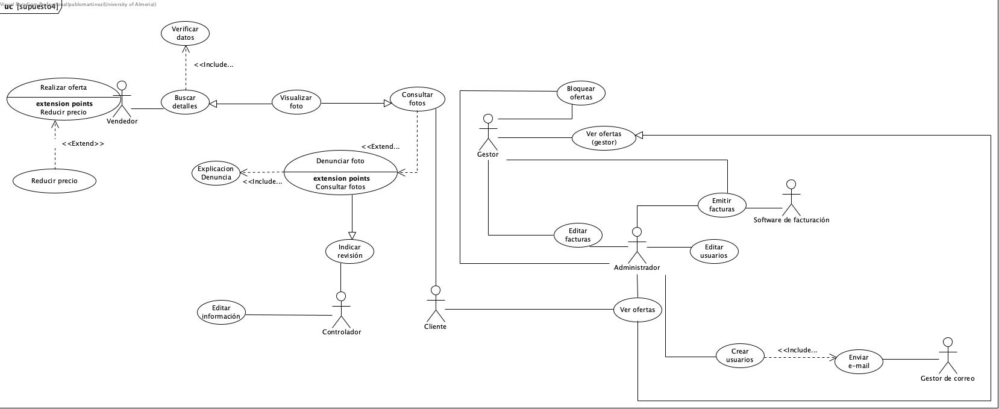

# Lab 1 - Definición de casos de uso y requisitos de información

## Supuesto 1: Horarios

En una universidad, el personal del PDI, el personal del PAS y los estudiantes pueden consultar horarios. Por su parte, el personal del PAS puede modificar horarios y dar de alta estudiantes. El personal de PDI puede proponer cambios en los horarios y dar de alta estudiantes. La funcionalidad de dar de alta estudiantes del PAS realiza una verificación de los datos del estudiante. Sin embargo, la funcionalidad de dar de alta estudiantes del PDI, además de verificar los datos también permite de forma excepcional realizar la búsqueda en las listas de clase de sus asignaturas.

  

### Requisitos del diagrama de casos de uso

| **Nombre:** | Proponer cambios en los horarios |
| :--- | :--- |
| **Codigo:** | CU-101 |
| **Autor:** | INRE Equipo Azul |
| **Fecha:** | 23/09/2025 |
| **Descripción:** | Permite al PDI proponer un cambio en un horario existente para su posterior revisión y aprobación. |
| **Actores:** | PDI |
| **Precondiciones:**| El actor debe estar autenticado en el sistema como PDI. |
| **Flujo Normal:** | 1.- El PDI selecciona la opción para proponer un cambio de horario.  2.- El sistema muestra el horario actual.  3.- El PDI introduce los cambios deseados y una justificación.  4.- El sistema registra la propuesta y la envía para su aprobación. |
| **Flujo Alternativo:** | 3.A- El PDI decide cancelar la operación y el sistema vuelve al menú principal. |
| **Poscondiciones:**| La propuesta de cambio de horario queda registrada en el sistema pendiente de aprobación. |
| **Artefactos relacionados:**|  |

### ---

| **Nombre:** | Dar alta estudiante |
| :--- | :--- |
| **Codigo:** | CU-102 |
| **Autor:** | INRE Equipo Azul |
| **Fecha:** | 23/09/2025 |
| **Descripción:** | Caso de uso general para dar de alta a un estudiante en el sistema. Incluye la verificación de los datos del estudiante. |
| **Actores:** | PDI, PAS |
| **Precondiciones:**| El actor debe estar autenticado en el sistema. |
| **Flujo Normal:** | 1.- El actor inicia el proceso de alta.  2.- El sistema solicita los datos del estudiante.  3.- El actor introduce los datos.  4.- Se ejecuta el caso de uso "Verificar datos del estudiante" (CU-105).  5.- El sistema confirma el alta del estudiante. |
| **Flujo Alternativo:** | 4.A- Si la verificación de datos falla, el sistema informa al actor y permite corregir los datos. |
| **Poscondiciones:**| El estudiante queda registrado en el sistema. |
| **Artefactos relacionados:**| CU-103, CU-104, CU-105 |

### ---

| **Nombre:** | Dar alta estudiante(PDI) |
| :--- | :--- |
| **Codigo:** | CU-103 |
| **Autor:** | INRE Equipo Azul |
| **Fecha:** | 23/09/2025 |
| **Descripción:** | Versión del caso de uso "Dar alta estudiante" para el PDI. Opcionalmente, **extiende** la funcionalidad para buscar en la lista de clase. |
| **Actores:** | PDI |
| **Precondiciones:**| El actor debe estar autenticado como PDI. |
| **Flujo Normal:** | 1.- El PDI inicia el proceso de alta.  2.- El sistema solicita los datos del estudiante.  3.- El PDI introduce los datos.  4.- Se ejecuta el caso de uso "Verificar datos del estudiante" (CU-105).  5.- El sistema confirma el alta. |
| **Flujo Alternativo:** | 3.A- De forma excepcional, el PDI puede ejecutar el caso de uso "Realizar busqueda en la lista de clase" (CU-106) para autocompletar datos. |
| **Poscondiciones:**| El estudiante queda registrado en el sistema. |
| **Artefactos relacionados:**| CU-102, CU-105, CU-106 |

### ---

| **Nombre:** | Dar alta estudiante(PAS) |
| :--- | :--- |
| **Codigo:** | CU-104 |
| **Autor:** | INRE Equipo Azul |
| **Fecha:** | 23/09/2025 |
| **Descripción:** | Versión del caso de uso "Dar alta estudiante" para el PAS. |
| **Actores:** | PAS |
| **Precondiciones:**| El actor debe estar autenticado como PAS. |
| **Flujo Normal:** | 1.- El PAS inicia el proceso de alta.  2.- El sistema solicita los datos del estudiante.  3.- El PAS introduce los datos.  4.- Se ejecuta el caso de uso "Verificar datos del estudiante" (CU-105).  5.- El sistema confirma el alta. |
| **Flujo Alternativo:** | 4.A- Si la verificación de datos falla, el sistema informa al actor y permite corregir los datos. |
| **Poscondiciones:**| El estudiante queda registrado en el sistema. |
| **Artefactos relacionados:**| CU-102, CU-105 |

### ---

| **Nombre:** | Verificar datos del estudiante |
| :--- | :--- |
| **Codigo:** | CU-105 |
| **Autor:** | INRE Equipo Azul |
| **Fecha:** | 23/09/2025 |
| **Descripción:** | Funcionalidad que se **incluye** en "Dar alta estudiante" para verificar que los datos del estudiante son correctos y válidos. |
| **Actores:** | (Sistema) |
| **Precondiciones:**| Se está ejecutando un caso de uso que lo incluye (CU-103 o CU-104). |
| **Flujo Normal:** | 1.- El sistema recibe los datos del estudiante.  2.- El sistema comprueba el formato y la validez de los datos contra la base de datos de la universidad.  3.- El sistema devuelve un resultado de validación exitoso. |
| **Flujo Alternativo:** | 2.A- Si los datos no son válidos, el sistema devuelve un resultado de error. |
| **Poscondiciones:**| Los datos del estudiante han sido validados. |
| **Artefactos relacionados:**| CU-102 |

### ---

| **Nombre:** | Realizar busqueda en la lista de clase |
| :--- | :--- |
| **Codigo:** | CU-106 |
| **Autor:** | INRE Equipo Azul |
| **Fecha:** | 23/09/2025 |
| **Descripción:** | Funcionalidad que **extiende** opcionalmente a "Dar alta estudiante(PDI)" para buscar a un estudiante en las listas de clase de las asignaturas del PDI. |
| **Actores:** | PDI |
| **Precondiciones:**| Se está ejecutando el caso de uso "Dar alta estudiante(PDI)" (CU-103). |
| **Flujo Normal:** | 1.- El PDI activa la búsqueda en la lista de clase.  2.- El sistema solicita el nombre del estudiante y la asignatura.  3.- El PDI introduce los datos.  4.- El sistema busca al estudiante y, si lo encuentra, autocompleta los datos en el formulario de alta. |
| **Flujo Alternativo:** | 4.A- Si el estudiante no se encuentra en la lista de clase, el sistema lo notifica. |
| **Poscondiciones:**| Los datos del estudiante se han recuperado de la lista de clase. |
| **Artefactos relacionados:**| CU-103 |

### ---

| **Nombre:** | Modificar horarios |
| :--- | :--- |
| **Codigo:** | CU-107 |
| **Autor:** | INRE Equipo Azul |
| **Fecha:** | 23/09/2025 |
| **Descripción:** | Permite al personal del PAS modificar directamente los horarios existentes. |
| **Actores:** | PAS |
| **Precondiciones:**| El actor debe estar autenticado como PAS. |
| **Flujo Normal:** | 1.- El PAS selecciona el horario que desea modificar.  2.- El sistema muestra la información del horario en un formulario editable.  3.- El PAS realiza las modificaciones.  4.- El PAS guarda los cambios y el sistema actualiza el horario. |
| **Flujo Alternativo:** | 3.A- El PAS cancela la modificación y los cambios no se guardan. |
| **Poscondiciones:**| El horario ha sido actualizado en el sistema. |
| **Artefactos relacionados:**|  |

### ---

| **Nombre:** | Consultar horario |
| :--- | :--- |
| **Codigo:** | CU-108 |
| **Autor:** | INRE Equipo Azul |
| **Fecha:** | 23/09/2025 |
| **Descripción:** | Caso de uso general que permite a los usuarios consultar horarios. Es especializado por los diferentes roles. |
| **Actores:** | PDI, PAS, Estudiante |
| **Precondiciones:**| El actor debe estar autenticado. |
| **Flujo Normal:** | 1.- El actor accede a la función de consulta de horarios.  2.- El sistema muestra las opciones de búsqueda (por curso, profesor, asignatura, etc.).  3.- El actor introduce sus criterios de búsqueda y el sistema muestra los resultados. |
| **Flujo Alternativo:** | 3.A- Si la búsqueda no produce resultados, el sistema muestra un mensaje informativo. |
| **Poscondiciones:**| El actor ha visualizado la información del horario solicitado. |
| **Artefactos relacionados:**| CU-109, CU-110, CU-111 |

### ---

| **Nombre:** | Consultar horario(PDI) |
| :--- | :--- |
| **Codigo:** | CU-109 |
| **Autor:** | INRE Equipo Azul |
| **Fecha:** | 23/09/2025 |
| **Descripción:** | Versión del caso de uso "Consultar horario" para el actor PDI. |
| **Actores:** | PDI |
| **Precondiciones:**| El actor debe estar autenticado como PDI. |
| **Flujo Normal:** | 1.- El PDI accede a la consulta de horarios.  2.- El sistema muestra por defecto los horarios de sus asignaturas.  3.- El PDI puede realizar búsquedas específicas.  4.- El sistema muestra los horarios solicitados. |
| **Flujo Alternativo:** | 3.A- Si la búsqueda no produce resultados, el sistema lo indica. |
| **Poscondiciones:**| El actor ha visualizado la información del horario. |
| **Artefactos relacionados:**| CU-108 |

### ---

| **Nombre:** | Consultar horario(PAS) |
| :--- | :--- |
| **Codigo:** | CU-110 |
| **Autor:** | INRE Equipo Azul |
| **Fecha:** | 23/09/2025 |
| **Descripción:** | Versión del caso de uso "Consultar horario" para el actor PAS. |
| **Actores:** | PAS |
| **Precondiciones:**| El actor debe estar autenticado como PAS. |
| **Flujo Normal:** | 1.- El PAS accede a la consulta de horarios.  2.- El sistema proporciona opciones de búsqueda avanzadas (por titulación, grupo, aula, etc.).  3.- El PAS introduce los criterios y el sistema muestra los resultados. |
| **Flujo Alternativo:** | 3.A- Si la búsqueda no produce resultados, el sistema lo indica. |
| **Poscondiciones:**| El actor ha visualizado la información del horario. |
| **Artefactos relacionados:**| CU-108 |

### ---

| **Nombre:** | Consultar horario(Estudiante) |
| :--- | :--- |
| **Codigo:** | CU-111 |
| **Autor:** | INRE Equipo Azul |
| **Fecha:** | 23/09/2025 |
| **Descripción:** | Versión del caso de uso "Consultar horario" para el actor Estudiante. |
| **Actores:** | Estudiante |
| **Precondiciones:**| El actor debe estar autenticado como Estudiante. |
| **Flujo Normal:** | 1.- El estudiante accede a la consulta de horarios.  2.- El sistema muestra el horario personal del estudiante según sus asignaturas matriculadas.  3.- El estudiante puede realizar búsquedas de otros horarios. |
| **Flujo Alternativo:** | 3.A- Si la búsqueda no produce resultados, el sistema lo indica. |
| **Poscondiciones:**| El actor ha visualizado la información del horario. |
| **Artefactos relacionados:**| CU-108 |
 

## Supuesto 2: Sistema de compras

En un sistema de compra, existen cuatro tipos de usuarios: comprador, vendedor, proveedor y administrador. Los compradores pueden agregar productos, consultar precios, finalizar la compra y consultar ofertas. Agregar productos implica marcar esos productos como bloqueados. Los vendedores también pueden consultar ofertas y consultar precios. Los proveedores pueden consultar precios, avisar de nuevos productos y consultar ofertas. Avisar de nuevos productos, de forma excepcional, realiza la incorporación de una oferta. Los proveedores también tienen una funcionalidad para avisar del fin de una oferta. Cuando se avisa del fin de una oferta, se ejecuta la funcionalidad de eliminar la oferta. Ambas funcionalidades de avisar del proveedor tienen en común que se encarga de enviar una notificación. Los administradores pueden consultar precios, consultar ofertas y eliminar productos. La funcionalidad de consultar precios incluye una funcionalidad de buscar productos que es similar a la funcionalidad de consultar productos de los compradores. Sin embargo, la funcionalidad de consultar productos añade una funcionalidad para verificar la disponibilidad. Para realizar una venta, un comprador y un vendedor participan de forma conjunta. En dicha operación, se lleva a cabo el acuerdo de un precio; excepcionalmente, durante la realización de la venta, se consultará el histórico de ventas.

  

| **Nombre:** | Consultar productos |
| :--- | :--- |
| **Codigo:** | CU-201 |
| **Autor:** | INRE Equipo Azul |
| **Fecha:** | 15/10/2025 |
| **Descripción:** | Permite a los compradores ver los productos disponibles en el sistema. Incluye la verificación de la disponibilidad del producto. |
| **Actores:** | Comprador |
| **Precondiciones:**| El actor debe haber iniciado sesión en el sistema. |
| **Flujo Normal:** | 1.- El comprador selecciona la opción de consultar productos.  2.- El sistema muestra una lista de los productos.  3.- El comprador selecciona un producto para ver los detalles.  4.- El sistema muestra la información del producto y ejecuta "Verificar disponibilidad" (CU-215). |
| **Flujo Alternativo:** | 2.A- Si no hay productos, el sistema muestra un mensaje indicándolo. |
| **Poscondiciones:**| El comprador ha visto la información y disponibilidad de un producto. |
| **Artefactos relacionados:**| CU-215 |

### ---

| **Nombre:** | Consultar precios |
| :--- | :--- |
| **Codigo:** | CU-202 |
| **Autor:** | INRE Equipo Azul |
| **Fecha:** | 15/10/2025 |
| **Descripción:** | Caso de uso general para consultar los precios de los productos. Es utilizado por compradores, vendedores, proveedores y administradores. |
| **Actores:** | Comprador, Vendedor, Proveedor, Administrador |
| **Precondiciones:**| El actor debe estar autenticado en el sistema. |
| **Flujo Normal:** | 1.- El actor elige la opción de consultar precios.  2.- El sistema le permite buscar productos.  3.- El actor busca un producto.  4.- El sistema muestra el precio del producto. |
| **Flujo Alternativo:** | 3.A- Si el producto no se encuentra, el sistema muestra un mensaje. |
| **Poscondiciones:**| El actor ha consultado el precio de un producto. |
| **Artefactos relacionados:**| CU-203, CU-204, CU-205, CU-206 |

### ---

| **Nombre:** | Consultar precios (comprador) |
| :--- | :--- |
| **Codigo:** | CU-203 |
| **Autor:** | INRE Equipo Azul |
| **Fecha:** | 15/10/2025 |
| **Descripción:** | Versión del caso de uso "Consultar precios" para el actor Comprador. |
| **Actores:** | Comprador |
| **Precondiciones:**| El comprador debe estar autenticado. |
| **Flujo Normal:** | 1.- El comprador busca un producto.  2.- El sistema muestra el precio del producto. |
| **Flujo Alternativo:** | 1.A- Si el producto no existe, se notifica al comprador. |
| **Poscondiciones:**| El comprador conoce el precio de un producto. |
| **Artefactos relacionados:**| CU-202 |

### ---

| **Nombre:** | Consultar precios (vendedor) |
| :--- | :--- |
| **Codigo:** | CU-204 |
| **Autor:** | INRE Equipo Azul |
| **Fecha:** | 15/10/2025 |
| **Descripción:** | Versión del caso de uso "Consultar precios" para el actor Vendedor. |
| **Actores:** | Vendedor |
| **Precondiciones:**| El vendedor debe estar autenticado. |
| **Flujo Normal:** | 1.- El vendedor busca un producto.  2.- El sistema muestra el precio del producto. |
| **Flujo Alternativo:** | 1.A- Si el producto no existe, se notifica al vendedor. |
| **Poscondiciones:**| El vendedor conoce el precio de un producto. |
| **Artefactos relacionados:**| CU-202 |

### ---

| **Nombre:** | Consultar precios (proveedor) |
| :--- | :--- |
| **Codigo:** | CU-205 |
| **Autor:** | INRE Equipo Azul |
| **Fecha:** | 15/10/2025 |
| **Descripción:** | Versión del caso de uso "Consultar precios" para el actor Proveedor. |
| **Actores:** | Proveedor |
| **Precondiciones:**| El proveedor debe estar autenticado. |
| **Flujo Normal:** | 1.- El proveedor busca un producto.  2.- El sistema muestra el precio del producto. |
| **Flujo Alternativo:** | 1.A- Si el producto no existe, se notifica al proveedor. |
| **Poscondiciones:**| El proveedor conoce el precio de un producto. |
| **Artefactos relacionados:**| CU-202 |

### ---

| **Nombre:** | Consultar precios (administrador) |
| :--- | :--- |
| **Codigo:** | CU-206 |
| **Autor:** | INRE Equipo Azul |
| **Fecha:** | 15/10/2025 |
| **Descripción:** | Versión del caso de uso "Consultar precios" para el actor Administrador, que **incluye** la funcionalidad de "Buscar productos". |
| **Actores:** | Administrador |
| **Precondiciones:**| El administrador debe estar autenticado. |
| **Flujo Normal:** | 1.- El administrador ejecuta "Buscar productos" (CU-216).  2.- El sistema muestra el precio del producto encontrado. |
| **Flujo Alternativo:** | 1.A- Si no se encuentra el producto, el sistema lo notifica. |
| **Poscondiciones:**| El administrador conoce el precio de un producto. |
| **Artefactos relacionados:**| CU-202, CU-216 |

### ---

| **Nombre:** | Consultar oferta |
| :--- | :--- |
| **Codigo:** | CU-207 |
| **Autor:** | INRE Equipo Azul |
| **Fecha:** | 15/10/2025 |
| **Descripción:** | Caso de uso general para que los usuarios puedan consultar las ofertas disponibles. |
| **Actores:** | Comprador, Vendedor, Proveedor, Administrador |
| **Precondiciones:**| El actor debe estar autenticado en el sistema. |
| **Flujo Normal:** | 1.- El actor accede a la sección de ofertas.  2.- El sistema muestra las ofertas disponibles.  3.- El actor selecciona una oferta para ver sus detalles. |
| **Flujo Alternativo:** | 2.A- Si no hay ofertas, el sistema muestra un mensaje. |
| **Poscondiciones:**| El actor ha visto las ofertas disponibles. |
| **Artefactos relacionados:**| CU-208, CU-209, CU-210, CU-211 |

### ---

| **Nombre:** | Consultar oferta (comprador) |
| :--- | :--- |
| **Codigo:** | CU-208 |
| **Autor:** | INRE Equipo Azul |
| **Fecha:** | 15/10/2025 |
| **Descripción:** | Versión del caso de uso "Consultar oferta" para el actor Comprador. |
| **Actores:** | Comprador |
| **Precondiciones:**| El comprador debe estar autenticado. |
| **Flujo Normal:** | 1.- El comprador accede a las ofertas.  2.- El sistema le muestra las ofertas. |
| **Flujo Alternativo:** | 2.A- Si no hay ofertas, se le notifica. |
| **Poscondiciones:**| El comprador conoce las ofertas. |
| **Artefactos relacionados:**| CU-207 |

### ---

| **Nombre:** | Consultar oferta (vendedor) |
| :--- | :--- |
| **Codigo:** | CU-209 |
| **Autor:** | INRE Equipo Azul |
| **Fecha:** | 15/10/2025 |
| **Descripción:** | Versión del caso de uso "Consultar oferta" para el actor Vendedor. |
| **Actores:** | Vendedor |
| **Precondiciones:**| El vendedor debe estar autenticado. |
| **Flujo Normal:** | 1.- El vendedor accede a las ofertas.  2.- El sistema le muestra las ofertas. |
| **Flujo Alternativo:** | 2.A- Si no hay ofertas, se le notifica. |
| **Poscondiciones:**| El vendedor conoce las ofertas. |
| **Artefactos relacionados:**| CU-207 |

### ---

| **Nombre:** | Consultar oferta (proveedor) |
| :--- | :--- |
| **Codigo:** | CU-210 |
| **Autor:** | INRE Equipo Azul |
| **Fecha:** | 15/10/2025 |
| **Descripción:** | Versión del caso de uso "Consultar oferta" para el actor Proveedor. |
| **Actores:** | Proveedor |
| **Precondiciones:**| El proveedor debe estar autenticado. |
| **Flujo Normal:** | 1.- El proveedor accede a las ofertas.  2.- El sistema le muestra las ofertas. |
| **Flujo Alternativo:** | 2.A- Si no hay ofertas, se le notifica. |
| **Poscondiciones:**| El proveedor conoce las ofertas. |
| **Artefactos relacionados:**| CU-207 |

### ---

| **Nombre:** | Consultar oferta (administrador) |
| :--- | :--- |
| **Codigo:** | CU-211 |
| **Autor:** | INRE Equipo Azul |
| **Fecha:** | 15/10/2025 |
| **Descripción:** | Versión del caso de uso "Consultar oferta" para el actor Administrador. |
| **Actores:** | Administrador |
| **Precondiciones:**| El administrador debe estar autenticado. |
| **Flujo Normal:** | 1.- El administrador accede a las ofertas.  2.- El sistema le muestra las ofertas. |
| **Flujo Alternativo:** | 2.A- Si no hay ofertas, se le notifica. |
| **Poscondiciones:**| El administrador conoce las ofertas. |
| **Artefactos relacionados:**| CU-207 |

### ---

| **Nombre:** | Avisar de nuevos productos |
| :--- | :--- |
| **Codigo:** | CU-212 |
| **Autor:** | INRE Equipo Azul |
| **Fecha:** | 15/10/2025 |
| **Descripción:** | Permite al proveedor notificar la llegada de nuevos productos. Opcionalmente, **extiende** la funcionalidad a "Incorporar oferta". **Incluye** el envío de una notificación. |
| **Actores:** | Proveedor |
| **Precondiciones:**| El proveedor debe estar autenticado. |
| **Flujo Normal:** | 1.- El proveedor avisa de un nuevo producto.  2.- El sistema registra el nuevo producto.  3.- El sistema ejecuta "Enviar notificación" (CU-217). |
| **Flujo Alternativo:** | 2.A- De forma excepcional, el proveedor puede ejecutar "Incorporar oferta" (CU-218). |
| **Poscondiciones:**| Se ha notificado y registrado un nuevo producto. |
| **Artefactos relacionados:**| CU-217, CU-218 |

### ---

| **Nombre:** | Avisar de fin de oferta |
| :--- | :--- |
| **Codigo:** | CU-213 |
| **Autor:** | INRE Equipo Azul |
| **Fecha:** | 15/10/2025 |
| **Descripción:** | Permite al proveedor notificar el fin de una oferta. **Incluye** las funcionalidades "Eliminar oferta" y "Enviar notificación". |
| **Actores:** | Proveedor |
| **Precondiciones:**| El proveedor debe estar autenticado. |
| **Flujo Normal:** | 1.- El proveedor avisa del fin de una oferta.  2.- El sistema ejecuta "Eliminar oferta" (CU-219).  3.- El sistema ejecuta "Enviar notificación" (CU-217). |
| **Flujo Alternativo:** | 2.A- Si la oferta no existe, el sistema lo notifica. |
| **Poscondiciones:**| La oferta ha sido eliminada y se ha enviado una notificación. |
| **Artefactos relacionados:**| CU-217, CU-219 |

### ---

| **Nombre:** | Eliminar producto |
| :--- | :--- |
| **Codigo:** | CU-214 |
| **Autor:** | INRE Equipo Azul |
| **Fecha:** | 15/10/2025 |
| **Descripción:** | Permite al administrador eliminar un producto del sistema. |
| **Actores:** | Administrador |
| **Precondiciones:**| El administrador debe estar autenticado. |
| **Flujo Normal:** | 1.- El administrador selecciona un producto.  2.- El administrador confirma la eliminación.  3.- El sistema elimina el producto. |
| **Flujo Alternativo:** | 2.A- El administrador cancela la operación. |
| **Poscondiciones:**| El producto ya no está disponible en el sistema. |
| **Artefactos relacionados:**| |

### ---

| **Nombre:** | Realizar venta |
| :--- | :--- |
| **Codigo:** | CU-220 |
| **Autor:** | INRE Equipo Azul |
| **Fecha:** | 15/10/2025 |
| **Descripción:** | Gestiona el proceso de venta entre un comprador y un vendedor. **Incluye** "Acordar un precio" y, excepcionalmente, **extiende** a "Consultar el histórico de ventas". |
| **Actores:** | Comprador, Vendedor |
| **Precondiciones:**| Comprador y vendedor deben estar autenticados. |
| **Flujo Normal:** | 1.- Comprador y vendedor inician la venta.  2.- Se ejecuta "Acordar un precio" (CU-221).  3.- Se confirma la transacción. |
| **Flujo Alternativo:** | 2.A- Durante la negociación, se puede ejecutar "Consultar el histórico de ventas" (CU-222). |
| **Poscondiciones:**| La venta se ha completado. |
| **Artefactos relacionados:**| CU-221, CU-222 |

 

## Supuesto 3: Compañia Hotelera

En una compañía hotelera, el administrador y el comercial pueden consultar reservas. El comercial realiza ofertas y gestiona nuevas reservas. El administrador gestiona nuevas peticiones y también realiza ofertas. La realización de ofertas por parte del comercial conlleva un recálculo de precios. Además, dicha realización de ofertas conlleva opcionalmente el bloqueo temporal de una reserva. Los clientes, los administradores y los comerciales pueden consultar disponibilidades y visualizar ofertas. La consulta de disponibilidades y la consulta de reservas tienen la funcionalidad común de buscar elementos. Por su parte, la consulta de disponibilidades conlleva una funcionalidad que muestra un calendario.

  

### Requisitos del diagrama de casos de uso

### Consultar Disponibilidad

| **Nombre:** | Consultar disponibilidad |
| :--- | :--- |
| **Codigo:** | CU-301 |
| **Autor:** | INRE Equipo Azul |
| **Fecha:** | 15/10/2025 |
| **Descripción:** | Permite consultar la disponibilidad de habitaciones. Este caso de uso **incluye** las funcionalidades "Buscar elemento" y "Mostrar calendario". |
| **Actores:** | Cliente, Comercial, Administrador |
| **Precondiciones:**| Ninguna para el cliente, pero el comercial y el administrador deben estar autenticados. |
| **Flujo Normal:** | 1.- El actor introduce las fechas para las que desea consultar la disponibilidad.  2.- Se ejecuta la funcionalidad incluida "Buscar elemento".  3.- Se ejecuta la funcionalidad incluida "Mostrar calendario" para visualizar los resultados. |
| **Flujo Alternativo:** | 2.A- Si no hay disponibilidad para las fechas seleccionadas, el sistema informa al actor y puede sugerir fechas alternativas. |
| **Poscondiciones:**| El actor conoce la disponibilidad para las fechas seleccionadas. |
| **Artefactos relacionados:**| CU-302, CU-303, CU-304, CU-319, CU-320 |

### ---

| **Nombre:** | Consultar disponibilidad(Cliente) |
| :--- | :--- |
| **Codigo:** | CU-302 |
| **Autor:** | INRE Equipo Azul |
| **Fecha:** | 15/10/2025 |
| **Descripción:** | Versión del caso de uso "Consultar disponibilidad" para el actor Cliente. |
| **Actores:** | Cliente |
| **Precondiciones:**| Ninguna. |
| **Flujo Normal:** | 1.- El cliente introduce las fechas deseadas.  2.- Se ejecuta la funcionalidad incluida "Buscar elemento".  3.- Se ejecuta la funcionalidad incluida "Mostrar calendario" con los resultados. |
| **Flujo Alternativo:** | 2.A- Si no hay disponibilidad, el sistema informa y sugiere alternativas. |
| **Poscondiciones:**| El cliente visualiza la disponibilidad para las fechas seleccionadas. |
| **Artefactos relacionados:**| CU-301 |

### ---

| **Nombre:** | Consultar disponibilidad(Comercial) |
| :--- | :--- |
| **Codigo:** | CU-303 |
| **Autor:** | INRE Equipo Azul |
| **Fecha:** | 15/10/2025 |
| **Descripción:** | Versión del caso de uso "Consultar disponibilidad" para el actor Comercial. |
| **Actores:** | Comercial |
| **Precondiciones:**| El actor debe estar autenticado en el sistema. |
| **Flujo Normal:** | 1.- El comercial introduce las fechas deseadas.  2.- Se ejecuta la funcionalidad incluida "Buscar elemento".  3.- Se ejecuta la funcionalidad incluida "Mostrar calendario" con los resultados. |
| **Flujo Alternativo:** | 2.A- Si no hay disponibilidad, el sistema informa y sugiere alternativas. |
| **Poscondiciones:**| El comercial visualiza la disponibilidad para las fechas seleccionadas. |
| **Artefactos relacionados:**| CU-301 |

### ---

| **Nombre:** | Consultar disponibilidad(Administrador) |
| :--- | :--- |
| **Codigo:** | CU-304 |
| **Autor:** | INRE Equipo Azul |
| **Fecha:** | 15/10/2025 |
| **Descripción:** | Versión del caso de uso "Consultar disponibilidad" para el actor Administrador. |
| **Actores:** | Administrador |
| **Precondiciones:**| El actor debe estar autenticado en el sistema. |
| **Flujo Normal:** | 1.- El administrador introduce las fechas deseadas.  2.- Se ejecuta la funcionalidad incluida "Buscar elemento".  3.- Se ejecuta la funcionalidad incluida "Mostrar calendario" con los resultados. |
| **Flujo Alternativo:** | 2.A- Si no hay disponibilidad, el sistema informa y sugiere alternativas. |
| **Poscondiciones:**| El administrador visualiza la disponibilidad para las fechas seleccionadas. |
| **Artefactos relacionados:**| CU-301 |

### ---

### Consultar Reserva

| **Nombre:** | Consultar reserva |
| :--- | :--- |
| **Codigo:** | CU-305 |
| **Autor:** | INRE Equipo Azul |
| **Fecha:** | 15/10/2025 |
| **Descripción:** | Permite consultar los detalles de una reserva existente. Este caso de uso **incluye** la funcionalidad "Buscar elemento". |
| **Actores:** | Comercial, Administrador |
| **Precondiciones:**| El actor debe estar autenticado en el sistema. |
| **Flujo Normal:** | 1.- El actor invoca la funcionalidad incluida "Buscar elemento" para encontrar la reserva por un criterio.  2.- El sistema muestra un listado de resultados.  3.- El actor selecciona la reserva deseada y el sistema muestra todos sus detalles. |
| **Flujo Alternativo:** | 2.A- Si la búsqueda no arroja resultados, el sistema lo notifica. |
| **Poscondiciones:**| El actor ha podido consultar la información de la reserva. |
| **Artefactos relacionados:**| CU-306, CU-307, CU-319 |

### ---

| **Nombre:** | Consultar reserva(Comercial) |
| :--- | :--- |
| **Codigo:** | CU-306 |
| **Autor:** | INRE Equipo Azul |
| **Fecha:** | 15/10/2025 |
| **Descripción:** | Versión del caso de uso "Consultar reserva" para el actor Comercial. |
| **Actores:** | Comercial |
| **Precondiciones:**| El actor debe estar autenticado en el sistema. |
| **Flujo Normal:** | 1.- El comercial invoca la funcionalidad incluida "Buscar elemento".  2.- El sistema muestra los resultados.  3.- El comercial selecciona la reserva para ver sus detalles. |
| **Flujo Alternativo:** | 2.A- Si la búsqueda no arroja resultados, el sistema lo notifica. |
| **Poscondiciones:**| El comercial ha consultado la información de la reserva. |
| **Artefactos relacionados:**| CU-305 |

### ---

| **Nombre:** | Consultar reserva(Administrador) |
| :--- | :--- |
| **Codigo:** | CU-307 |
| **Autor:** | INRE Equipo Azul |
| **Fecha:** | 15/10/2025 |
| **Descripción:** | Versión del caso de uso "Consultar reserva" para el actor Administrador. |
| **Actores:** | Administrador |
| **Precondiciones:**| El actor debe estar autenticado en el sistema. |
| **Flujo Normal:** | 1.- El administrador invoca la funcionalidad incluida "Buscar elemento".  2.- El sistema muestra los resultados.  3.- El administrador selecciona la reserva para ver sus detalles. |
| **Flujo Alternativo:** | 2.A- Si la búsqueda no arroja resultados, el sistema lo notifica. |
| **Poscondiciones:**| El administrador ha consultado la información de la reserva. |
| **Artefactos relacionados:**| CU-305 |

### ---

### Realizar Oferta

| **Nombre:** | Realizar oferta |
| :--- | :--- |
| **Codigo:** | CU-308 |
| **Autor:** | INRE Equipo Azul |
| **Fecha:** | 15/10/2025 |
| **Descripción:** | Permite crear y enviar una oferta a un cliente. |
| **Actores:** | Comercial, Administrador |
| **Precondiciones:**| El actor debe estar autenticado en el sistema. |
| **Flujo Normal:** | 1.- El actor selecciona la opción para realizar una oferta.  2.- El sistema solicita los detalles de la oferta.  3.- El actor confirma y el sistema genera y envía la oferta. |
| **Flujo Alternativo:** | 3.A- Si la oferta no puede ser procesada, el sistema muestra un error. |
| **Poscondiciones:**| La oferta es creada y registrada en el sistema. |
| **Artefactos relacionados:**| CU-309, CU-310 |

### ---

| **Nombre:** | Realizar oferta(Comercial) |
| :--- | :--- |
| **Codigo:** | CU-309 |
| **Autor:** | INRE Equipo Azul |
| **Fecha:** | 15/10/2025 |
| **Descripción:** | Versión del caso de uso "Realizar oferta" para el actor Comercial. **Extiende** a "Recalcular precios" y opcionalmente a "Bloquear temporalmente una reserva". |
| **Actores:** | Comercial |
| **Precondiciones:**| El actor debe estar autenticado en el sistema. |
| **Flujo Normal:** | 1.- El comercial selecciona la opción para realizar una oferta.  2.- El sistema pide los detalles.  3.- Se ejecuta la extensión para recalcular precios.  4.- El comercial confirma la oferta.  5.- El sistema genera y envía la oferta. |
| **Flujo Alternativo:** | 3.A- El comercial puede activar la extensión para bloquear temporalmente una reserva. |
| **Poscondiciones:**| La oferta es creada y registrada en el sistema. |
| **Artefactos relacionados:**| CU-308, CU-317, CU-318 |

### ---

| **Nombre:** | Realizar oferta(Administrador) |
| :--- | :--- |
| **Codigo:** | CU-310 |
| **Autor:** | INRE Equipo Azul |
| **Fecha:** | 15/10/2025 |
| **Descripción:** | Versión del caso de uso "Realizar oferta" para el actor Administrador. |
| **Actores:** | Administrador |
| **Precondiciones:**| El actor debe estar autenticado en el sistema. |
| **Flujo Normal:** | 1.- El administrador selecciona la opción para realizar una oferta.  2.- El sistema pide los detalles.  3.- El administrador confirma la oferta.  4.- El sistema genera y envía la oferta. |
| **Flujo Alternativo:** | 4.A- Si la oferta no puede ser procesada, el sistema muestra un error. |
| **Poscondiciones:**| La oferta es creada y registrada en el sistema. |
| **Artefactos relacionados:**| CU-308 |

### ---

### Visualizar Oferta

| **Nombre:** | Visualizar oferta |
| :--- | :--- |
| **Codigo:** | CU-311 |
| **Autor:** | INRE Equipo Azul |
| **Fecha:** | 15/10/2025 |
| **Descripción:** | Permite visualizar las ofertas disponibles. |
| **Actores:** | Cliente, Comercial, Administrador |
| **Precondiciones:**| Ninguna para el cliente, pero el comercial y el administrador deben estar autenticados. |
| **Flujo Normal:** | 1.- El actor accede a la sección de ofertas.  2.- El sistema muestra un listado con las ofertas vigentes.  3.- El actor puede seleccionar una oferta para ver sus detalles. |
| **Flujo Alternativo:** | 2.A- Si no hay ofertas vigentes, el sistema muestra un mensaje indicándolo. |
| **Poscondiciones:**| El actor ha podido consultar las ofertas y sus detalles. |
| **Artefactos relacionados:**| CU-312, CU-313, CU-314 |

### ---

| **Nombre:** | Visualizar oferta(Cliente) |
| :--- | :--- |
| **Codigo:** | CU-312 |
| **Autor:** | INRE Equipo Azul |
| **Fecha:** | 15/10/2025 |
| **Descripción:** | Versión del caso de uso "Visualizar oferta" para el actor Cliente. |
| **Actores:** | Cliente |
| **Precondiciones:**| Ninguna. |
| **Flujo Normal:** | 1.- El cliente accede a la sección de ofertas.  2.- El sistema muestra un listado con las ofertas vigentes.  3.- El cliente selecciona una oferta para ver sus detalles. |
| **Flujo Alternativo:** | 2.A- Si no hay ofertas vigentes, el sistema muestra un mensaje. |
| **Poscondiciones:**| El cliente ha podido consultar las ofertas. |
| **Artefactos relacionados:**| CU-311 |

### ---

| **Nombre:** | Visualizar oferta(Comercial) |
| :--- | :--- |
| **Codigo:** | CU-313 |
| **Autor:** | INRE Equipo Azul |
| **Fecha:** | 15/10/2025 |
| **Descripción:** | Versión del caso de uso "Visualizar oferta" para el actor Comercial. |
| **Actores:** | Comercial |
| **Precondiciones:**| El actor debe estar autenticado en el sistema. |
| **Flujo Normal:** | 1.- El comercial accede a la sección de ofertas.  2.- El sistema muestra un listado con las ofertas vigentes.  3.- El comercial selecciona una oferta para ver sus detalles. |
| **Flujo Alternativo:** | 2.A- Si no hay ofertas vigentes, el sistema muestra un mensaje. |
| **Poscondiciones:**| El comercial ha podido consultar las ofertas. |
| **Artefactos relacionados:**| CU-311 |

### ---

| **Nombre:** | Visualizar oferta(Administrador) |
| :--- | :--- |
| **Codigo:** | CU-314 |
| **Autor:** | INRE Equipo Azul |
| **Fecha:** | 15/10/2025 |
| **Descripción:** | Versión del caso de uso "Visualizar oferta" para el actor Administrador. |
| **Actores:** | Administrador |
| **Precondiciones:**| El actor debe estar autenticado en el sistema. |
| **Flujo Normal:** | 1.- El administrador accede a la sección de ofertas.  2.- El sistema muestra un listado con las ofertas vigentes.  3.- El administrador selecciona una oferta para ver sus detalles. |
| **Flujo Alternativo:** | 2.A- Si no hay ofertas vigentes, el sistema muestra un mensaje. |
| **Poscondiciones:**| El administrador ha podido consultar las ofertas. |
| **Artefactos relacionados:**| CU-311 |

### ---

### Otros Casos de Uso

| **Nombre:** | Gestionar nueva reserva |
| :--- | :--- |
| **Codigo:** | CU-315 |
| **Autor:** | INRE Equipo Azul |
| **Fecha:** | 15/10/2025 |
| **Descripción:** | Permite a un comercial gestionar una nueva reserva de hotel. |
| **Actores:** | Comercial |
| **Precondiciones:**| El comercial debe estar autenticado en el sistema. |
| **Flujo Normal:** | 1.- El comercial selecciona la opción para gestionar una nueva reserva.  2.- El sistema muestra un formulario para introducir los datos.  3.- El comercial completa el formulario y confirma.  4.- El sistema valida los datos, crea la reserva y muestra confirmación. |
| **Flujo Alternativo:** | 4.A- Si los datos son inválidos, el sistema muestra un error. |
| **Poscondiciones:**| La nueva reserva queda registrada en el sistema. |
| **Artefactos relacionados:**|  |

### ---

| **Nombre:** | Gestionar nueva petición |
| :--- | :--- |
| **Codigo:** | CU-316 |
| **Autor:** | INRE Equipo Azul |
| **Fecha:** | 15/10/2025 |
| **Descripción:** | Permite al administrador gestionar las peticiones de los clientes. |
| **Actores:** | Administrador |
| **Precondiciones:**| El administrador debe estar autenticado en el sistema. |
| **Flujo Normal:** | 1.- El administrador accede a la lista de peticiones.  2.- Selecciona una petición y el sistema muestra sus detalles.  3.- El administrador realiza las acciones y marca la petición como resuelta. |
| **Flujo Alternativo:** | 3.A- Si la petición no puede ser resuelta, puede cambiar su estado a "en progreso". |
| **Poscondiciones:**| La petición del cliente queda resuelta y registrada. |
| **Artefactos relacionados:**|  |

### ---

### Funcionalidades Incluidas / Extendidas

| **Nombre:** | Recalcular precios |
| :--- | :--- |
| **Codigo:** | CU-317 |
| **Autor:** | INRE Equipo Azul |
| **Fecha:** | 15/10/2025 |
| **Descripción:** | Funcionalidad que **extiende** a "Realizar oferta(Comercial)". |
| **Actores:** | (Sistema) |
| **Precondiciones:**| Se está ejecutando "Realizar oferta(Comercial)". |
| **Flujo Normal:** | 1.- El sistema recalcula los precios de la oferta en base a los parámetros introducidos. |
| **Flujo Alternativo:** | 1.A- Si un parámetro es inválido, el sistema notifica el error. |
| **Poscondiciones:**| Los precios de la oferta son actualizados. |
| **Artefactos relacionados:**| CU-309 |

### ---

| **Nombre:** | Bloquear temporalmente una reserva |
| :--- | :--- |
| **Codigo:** | CU-318 |
| **Autor:** | INRE Equipo Azul |
| **Fecha:** | 15/10/2025 |
| **Descripción:** | Funcionalidad que **extiende** opcionalmente a "Realizar oferta(Comercial)". |
| **Actores:** | (Sistema) |
| **Precondiciones:**| Se está ejecutando "Realizar oferta(Comercial)" y el comercial activó la opción. |
| **Flujo Normal:** | 1.- El sistema bloquea la disponibilidad de la habitación por un tiempo determinado. |
| **Flujo Alternativo:** | 1.A- Si la reserva no puede ser bloqueada, el sistema notifica al comercial. |
| **Poscondiciones:**| La habitación queda temporalmente no disponible. |
| **Artefactos relacionados:**| CU-309 |

### ---

| **Nombre:** | Buscar elemento |
| :--- | :--- |
| **Codigo:** | CU-319 |
| **Autor:** | INRE Equipo Azul |
| **Fecha:** | 15/10/2025 |
| **Descripción:** | Funcionalidad que se **incluye** en "Consultar disponibilidad" y "Consultar reserva". |
| **Actores:** | (Sistema) |
| **Precondiciones:**| Se está ejecutando un caso de uso que lo incluye. |
| **Flujo Normal:** | 1.- El sistema recibe los criterios de búsqueda.  2.- El sistema filtra y devuelve los resultados. |
| **Flujo Alternativo:** | 2.A- Si la búsqueda no arroja resultados, devuelve un conjunto vacío. |
| **Poscondiciones:**| Se obtienen los elementos que coinciden con la búsqueda. |
| **Artefactos relacionados:**| CU-301, CU-305 |

### ---

| **Nombre:** | Mostrar calendario |
| :--- | :--- |
| **Codigo:** | CU-320 |
| **Autor:** | INRE Equipo Azul |
| **Fecha:** | 15/10/2025 |
| **Descripción:** | Funcionalidad que se **incluye** en "Consultar disponibilidad". |
| **Actores:** | (Sistema) |
| **Precondiciones:**| Se está ejecutando el caso de uso "Consultar disponibilidad". |
| **Flujo Normal:** | 1.- El sistema presenta un calendario visual.  2.- Marca los días con y sin disponibilidad. |
| **Flujo Alternativo:** | 2.A- Si ocurre un error al cargar los datos, el sistema muestra un mensaje de error. |
| **Poscondiciones:**| El actor puede ver claramente la disponibilidad en el calendario. |
| **Artefactos relacionados:**| CU-301 |
## Supuesto 4: Fotografía Online

En una aplicación de fotografía online, los clientes pueden visualizar las fotos, donde de forma excepcional se puede realizar una denuncia sobre la foto. Al denunciar una foto, se ha de introducir una explicación sobre la denuncia. Los clientes también pueden llevar a cabo consultas sobre las fotos, operación que es un caso particular de visualizar las fotos. Los controladores de fotos pueden indicar que una foto debe ser revisada. Esta funcionalidad es un caso general de la funcionalidad de denunciar foto. Además, los controladores también pueden editar la información de las fotos. En esta aplicación también participan usuarios de tipo vendedor. Los vendedores pueden escribir a los clientes para hacerles ofertas sobre los productos de la aplicación. De forma excepcional, al hacer una oferta pueden reducir el precio de un producto. Los vendedores también pueden buscar detalles en las fotos, operación que es un caso particular de visualizar fotos. Pero esa búsqueda conlleva la verificación de los datos introducidos. Por otro lado, los gestores de la aplicación pueden ver ofertas, bloquear ofertas, emitir facturas y editar facturas. La emisión de facturas requiere la participación de un software de facturación. El administrador de la tienda puede ver ofertas, emitir facturas, editar facturas, bloquear ofertas, crear usuarios y editar usuarios. Esta funcionalidad de ver ofertas también la pueden realizar los clientes. Editar usuarios tiene características en común con editar facturas. Crear usuarios conlleva el envío de un email en el que es necesario el uso de un gestor de correo.

  

#### Aqui los requisitos del diagrama

 

## Supuesto 5: Gestión de Incidencias

En un sistema de gestión de incidencias, los técnicos y los operadores pueden dar de alta incidencias, para lo cual, de forma excepcional se enviará un correo (en esta operación participa un sistema de gestión de correo). Los técnicos también atienden llamadas telefónicas y realizan informes sobre las incidencias. Por su parte, los operadores atienden llamadas telefónicas, marcan incidencias como duplicadas y ordenan incidencias. La forma de atender llamadas de los técnicos y los operadores no es exactamente igual, pero tiene similitudes. De forma específica, cuando los técnicos atienden llamadas, comprueban datos de la incidencia en el sistema. Cuando los operadores atienden llamadas, introducen nuevos datos de la incidencia. Los administradores del sistema gestionan categorías de incidencias, consultan incidencias y ordenan incidencias. La ordenación por parte de los administradores conlleva la adición de un comentario. Los técnicos y los operadores también pueden consultar incidencias. La consulta de incidencias por parte técnicos, operadores y administradores puede conllevar, de forma excepcional, la edición de los datos de la incidencia. Los usuarios invitados también pueden consultar incidencias, pero sin la posible edición de los datos. Además, los invitados informan sobre posibles incidencias, se pueden registrar para ver notificaciones y pueden acceder a un listado del histórico de notificaciones. El informe de posibles incidencias conlleva el dar de alta la localización en un mapa, la incorporación de una explicación completa en formato textual y la subida de una foto.

  

#### Aqui los requisitos del diagrama
